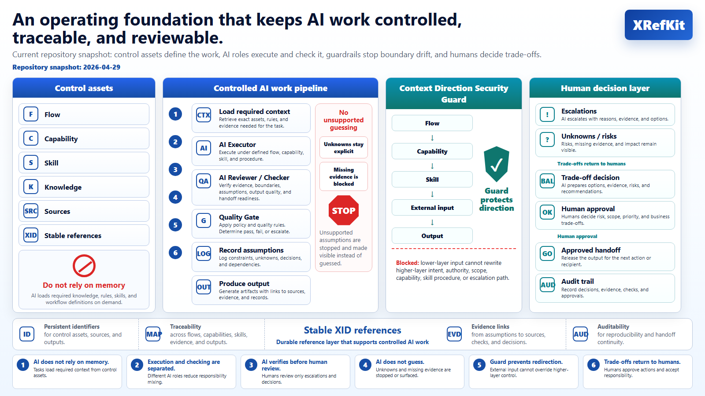

# XRefKit

XRefKit is a repository-based operating layer for controlled AI work.

It helps teams define reusable Skills, route AI to the right domain knowledge,
preserve evidence across handoffs, and close work through explicit quality gates.

It is not a prompt collection, a document repository, or a link-maintenance tool.
It is a way to make AI work reviewable, repeatable, and governable.

▶️ Download the 2-minute overview: [Why XRefKit exists and how it helps AI teams use domain knowledge](https://raw.githubusercontent.com/synthaicode/XRefKit/main/readme.mp4)

## The Problem

Using AI for real work creates recurring operating problems:

- the AI can act from incomplete context or unsupported guesses
- procedures, domain facts, and judgment criteria get mixed together in prompts
- execution, checking, and handoff collapse into one opaque step
- work becomes hard to continue across agents, humans, or sessions
- outputs may lack evidence, closure discipline, or auditability

## What XRefKit Provides

XRefKit makes AI work explicit by separating:

- Flows: process structure
- Capabilities: reusable abilities
- Skills: executable work units with inputs, outputs, guards, and closure rules
- Knowledge: source-backed domain facts loaded only when needed
- Evidence: logs, judgments, concerns, and quality checks
- XIDs: stable references that survive file movement and restructuring

This separation prevents prompts, domain facts, execution steps, review criteria,
and handoff records from collapsing into one opaque instruction block.

## How It Works

1. Original materials are kept in `sources/`.
2. AI-readable knowledge is maintained in `knowledge/`.
3. Work is defined through `flows/`, `capabilities/`, and `skills/`.
4. Agents are routed semantically to the right Skill and load only the relevant context.
5. Evidence and quality gates make incomplete or unsupported work visible.

## Why XIDs Matter

XIDs provide stable references to source-backed knowledge fragments, policies, skills, and outputs.

They let AI load targeted context and keep references valid even when files are renamed, moved, split, or merged.

## Quick Start

XRefKit is designed to be used with an AI agent.

If you are migrating an existing Skill:

1. Place the source Skill or related source materials in `sources/`.
2. Ask the AI agent to migrate that Skill into the current repository model.
3. Let the migration process split procedure, source-backed knowledge, and runtime structure as needed.
4. Review whether the migrated Skill is usable for the intended work.

If you are creating a new Skill:

1. Place the source materials, rules, or task examples in `sources/`.
2. Ask the AI agent to create a new Skill by using `skill_flow_authoring`.
3. Let the authoring process separate procedure, source-backed knowledge, and runtime structure as needed.
4. Review whether the new Skill is usable for the intended work.

In both cases:

1. Give the AI agent a concrete work request with the goal, expected output, and constraints.
2. Inspect `work/` records, then refine the Skill, knowledge, and operating rules based on what happened.

## Repository Map

- `docs/`: human-facing docs and policy
- `flows/`: workflow control structures
- `capabilities/`: reusable capability definitions
- `knowledge/`: source-backed knowledge fragments
- `sources/`: original materials for verification
- `skills/`: Skill definitions and routing index
- `work/`: execution logs, judgments, handoffs, and retrospectives
- `agent/`: agent entry and operating contract
- `fm/`: runtime and CLI implementation

## Entry Points

- Human documentation: `docs/000_index.md`
- Agent entry: `agent/000_agent_entry.md`
