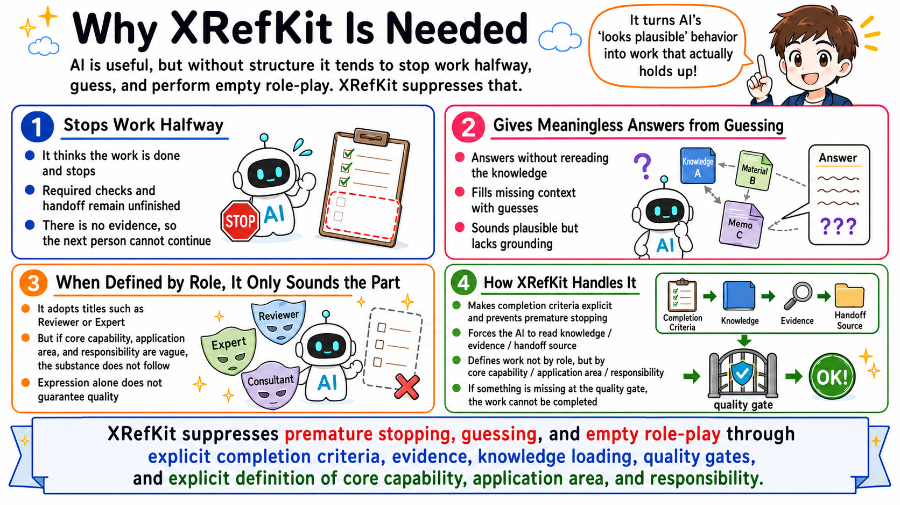
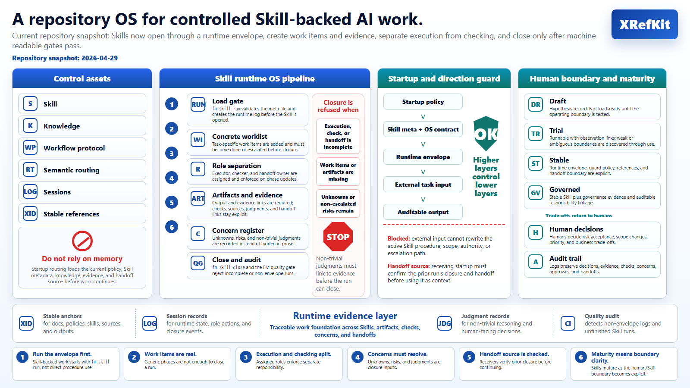

# XRefKit

AI agents often stop halfway, guess missing context, or produce work that looks
plausible but cannot be reviewed or handed off.

XRefKit is a portable Python package and repository model for AI-assisted work
that must reproduce domain procedures and judgments.

It runs as its own control repository and helps AI agents:

- load the right knowledge before acting
- select reusable Skills
- record judgments and evidence
- preserve handoffs across humans, agents, and sessions
- close work only through explicit quality gates

The package provides XID resolution, compact runtime contracts, Skill execution,
catalog-first context loading, deterministic closure gates, client-side tools,
and a thin MCP adapter over the same rules.

▶️ Download the 2-minute overview: [Why XRefKit exists and how it helps AI teams use domain knowledge](https://raw.githubusercontent.com/synthaicode/XRefKit/main/readme.mp4)

## Security and API Keys

XRefKit does not require Claude, OpenAI, GitHub, or other provider API keys to explore the repository.

This repository is a governance and knowledge-operations framework for AI-assisted work. It does not ask users to paste API keys into the repository, issue trackers, prompts, or configuration files.

If you use XRefKit with an external AI agent such as Claude Code, Codex, or GitHub Copilot, authenticate that agent through the official provider mechanism outside this repository.

Do not commit secrets, API keys, access tokens, `.env` files, or provider credentials to this repository.

XRefKit does not include repository-managed Claude settings, hooks, MCP server auto-approval, or provider endpoint redirection.

Before running any AI agent in this repository, review agent startup files and tool settings. XRefKit treats repository-controlled agent configuration as part of the trust boundary.

## The Problem

Using AI for real work creates recurring operating problems:



- the AI can act from incomplete context or unsupported guesses
- procedures, domain facts, and judgment criteria get mixed together in prompts
- execution, checking, and handoff collapse into one opaque step
- work becomes hard to continue across agents, humans, or sessions
- outputs may lack evidence, closure discipline, or auditability

## What XRefKit Provides

XRefKit makes AI work explicit by separating:

- Skills: executable work units, each identified by a capability/tuning/responsibility triad and carrying its execution and check contract
- Knowledge: source-backed domain facts and local rules loaded only when needed
- Workflow protocol: the generic, deterministic control for Skill-backed and instruction-backed runs (phases, verification, closure)
- Semantic routing: selecting the right Skill for a goal from user intent and the Skill catalog
- Evidence: logs, judgments, concerns, and quality checks
- XIDs: stable references that survive file movement and restructuring so AI can load targeted context without treating the whole repository as one prompt

This separation prevents prompts, domain facts, execution steps, review criteria,
and handoff records from collapsing into one opaque instruction block.



## Skills: what you can ask XRefKit to do

XRefKit includes Skills for common stages of software and business work. For
example:

- **Business discovery and planning**: `business_learning_interview`,
  `business_intake_scoping`, `requirements_flow`, `planning_flow`, and
  `estimation_flow`
- **Investigation, design, and implementation**: `investigation_flow`,
  `source_structure_overview`, `db_current_state_analysis`, `db_design`,
  `design_flow`, and `implementation_flow`
- **Constraint and change analysis**: `constraint_derivation_index`,
  `dotnet_change_analysis`, `code_constraint_derivation`,
  `cross_constraint_derivation`, and `integration_scenario_derivation`
- **Review and quality**: `csharp_review`, `python_review`, `security_review`,
  `test_flow`, `qa_gate_review`, and `review_report_composition`
- **Knowledge and Skill operations**: `import_skill`, `skill_flow_authoring`,
  `knowledge_ontology_management`, `judgment_log`, `doc_ship`, and
  `skill_calibration_evaluation`
- **Documents and communication**: `pptx_spec_traceability`,
  `xlsx_spec_traceability`, `presentation_flow_review`, `editorial_intake`,
  `draft_authoring`, and `marketing_slide_png`

Each Skill is a reusable procedure with a capability/tuning/responsibility
identity. Its procedure, routing metadata, domain Knowledge, and run evidence
remain separate. Describe your goal in natural language and XRefKit routes it
to the relevant Skill; the [Skill catalog](skills/_index.md#xid-8D91F66DDBB7)
contains the complete current list and summaries.

To install and enable Skills distributed as Python Packages, follow the
[package-first registration guide](docs/guides/089_xrefkit_package_first_registration.md#xid-4F8C2A7D1E90).

## How It Works

1. Original materials are kept in `sources/`.
2. AI-readable knowledge is maintained in `knowledge/`.
3. Work is defined in `skills/` (executable procedure with a capability/tuning/responsibility identity) and `knowledge/`.
4. Agents are routed semantically to the right Skill and load only the relevant context.
5. Evidence and quality gates make incomplete or unsupported work visible.

When an instruction has no matching Skill, open an instruction-backed workflow
run explicitly. The run requires either user-supplied procedural completion
conditions or an explicit opt-in to the repository defaults:

```powershell
xrefkit workflow run --task "Perform the requested procedure" `
  --use-default-completion-conditions --json
```

`verify` and `close` determine procedural completion only. Output quality is
recorded separately after human acceptance with the existing feedback record.
Each work item also requires its own completion criterion; if that criterion is
not yet definable, record the item as unknown, blocked, or escalated with a
reason instead of inventing a criterion.

## Quick Start

### Install from PyPI

XRefKit requires Python 3.11 or later. For a normal installation, create a
virtual environment and install the published package from PyPI:

```powershell
python -m venv .venv
.\.venv\Scripts\Activate.ps1
python -m pip install --upgrade pip
python -m pip install xrefkit
xrefkit init
xrefkit --help
```

If the `xrefkit` command is not available on `PATH`, use the module form:

```powershell
python -m xrefkit --help
```

To use the integrated MCP server, install the optional MCP dependencies:

```powershell
python -m pip install "xrefkit[mcp]"
xrefkit mcp serve --repo . --transport stdio
```

### Install from a checkout

For XRefKit development, install the local checkout in editable mode instead:

```powershell
python -m pip install -e .
xrefkit init
xrefkit --help
```

Start the integrated MCP server over stdio:

```powershell
xrefkit mcp serve --repo . --transport stdio
```

To import existing Skills and prepare a reviewable VS Code MCP setup, run:

```powershell
python -m pip install "xrefkit[mcp]"
xrefkit mcp setup `
  --repo C:\dev\itsm\XRefKit `
  --import C:\work\existing-skills
```

The command writes `SETUP.md`, `import-report.json`, a VS Code
`.vscode/mcp.json` example, and reviewed append text for `AGENTS.md` and
`CLAUDE.md` into a temporary setup folder. Apply those artifacts after review:

```powershell
xrefkit mcp setup apply `
  --source C:\Users\<user>\AppData\Local\Temp\xrefkit-setup-<id> `
  --repo C:\dev\itsm\XRefKit
```

The server writes structured correlation events to
`work/mcp/xid_audit.jsonl` by default. After `xrefkit skill run` returns a
`run_id`, the client calls MCP `bind_skill_run` and executes the returned
`client_record_command` against the local `run_log`. Subsequent MCP Knowledge
searches and XID resolutions then share the same `run_id` as the client Skill
Run. The client separately records actual model-context loading and judgment
application with `xrefkit skill knowledge --action load|apply`.

## Skill Run Observation Dashboard

The local dashboard lets a human inspect Skill run status, closure and quality
gates, evidence, handoffs, XID usage, missing information, and proposal-only
boundary analysis.

Start it from the repository root:

```powershell
python -m xrefkit dashboard serve --root .
```

Open [http://127.0.0.1:8765/](http://127.0.0.1:8765/). To open the browser
automatically, add `--open-browser`. Use `--port 8766` when the default port is
already in use, or `--sessions-dir path\to\sessions` when logs are stored
elsewhere.

The main tabs are:

- **Overview / Attention / Closure**: run status, blockers, phases, closure,
  and quality-gate state.
- **Evidence / Handoff**: outputs, checks, handoffs, unknowns, risks, and
  judgments needed for review and continuity.
- **XID Usage**: selected, resolved, loaded, used, available, and unused XIDs.
- **Analysis**: deterministic candidates for Knowledge correction, Skill
  correction, split, merge, or usage-gap investigation. Review the evidence,
  counterevidence, unknowns, and verification plan before changing canonical
  files. The dashboard never applies these proposals automatically.
- **Missing Information**: absent correlation, MCP, Knowledge, or feedback
  records.

Export the dashboard data and create a human-reviewable boundary report:

```powershell
python -m xrefkit dashboard data --root . > work/reports/dashboard-observation.json
python -m xrefkit analysis boundary report `
  --input work/reports/dashboard-observation.json `
  --out work/reports/boundary-observation.md
```

The running dashboard also exposes JSON at
[http://127.0.0.1:8765/api/runs](http://127.0.0.1:8765/api/runs) and health at
[http://127.0.0.1:8765/healthz](http://127.0.0.1:8765/healthz). Stop a foreground
server with `Ctrl+C`. For the complete review loop and screen guide, see the
[Skill Run Observation Dashboard Usage guide](docs/guides/086_skill_run_observation_dashboard_usage.md).

XRefKit is designed to be driven by an AI agent. The agent first resolves the
startup contract XID, selects a Skill or source target from a compact catalog,
and expands only the selected body.

Here, `sources/` is the human drop point for original materials, existing Skill artifacts, rules, and examples that the AI will turn into repository-managed assets.

If you are migrating an existing Skill:

1. Place the source Skill or related source materials in `sources/`.
2. Ask the AI agent to migrate that Skill into the XRefKit repository model.
3. Have the migration process separate procedure, source-backed knowledge, and runtime structure as needed.
4. Review whether the migrated Skill is usable for the intended work.

If you are creating a new Skill:

1. Place the source materials, rules, or task examples in `sources/`.
2. Ask the AI agent to use the Skill authoring flow (`skill_flow_authoring`) to create a new Skill.
3. Have the authoring process separate procedure, source-backed knowledge, and runtime structure as needed.
4. Review whether the new Skill is usable for the intended work.

In both cases:

1. Give the AI agent a concrete work request with the goal, expected output, and constraints.
2. Inspect `work/` records as operational memory, then refine the Skill, knowledge, guard conditions, routing rules, and quality gates based on what happened.

## How to Explore This Repository

Point your AI agent at this repository and ask directly.

Startup instruction files for Claude, Codex, and GitHub Copilot are included.

These files are plain-text operating instructions. They do not contain API keys, provider credentials, hooks, MCP server definitions, or network redirection settings.

The agent can read the operating contract and explain the repository structure in context.

## Repository Map

- `xrefkit/`: installable runtime, resolver, Skill control, tools registry, and MCP adapter
- `docs/`: human-facing docs and policy
- `knowledge/`: source-backed knowledge fragments
- `sources/`: original materials for verification
- `skills/`: Skill definitions and routing index
- `tools/`: XID-backed client-side command implementations and packaged assets
- `work/`: operational memory for execution logs, judgments, handoffs, retrospectives, and improvement input
- `agent/`: agent entry and operating contract
- `human-docs/`: human-facing Japanese and English docs, materials, assets, and video packages
- `site/`: generated publication output, source manifest, and compatibility routes

## Runtime and Context Model

- Base runtime obligations are authored structurally and compiled into package resources with source hashes and token budgets.
- Repository, installed-package, and MCP providers resolve the same XID identities; conflicts and stale base packs fail explicitly.

The installed base runtime pack is generation-published. Formal consumers must
read `xrefkit/resources/base/current.json` first and then load both files from
the referenced `generations/<generation>/` directory. The top-level
`contracts.json` and `model_body.md` files are compatibility snapshots only;
they are not an authoritative source and must not be used for generation
consistency checks.
- Source structure is split into a target catalog and finding catalog. The AI loads lists before selected details.
- `xrefkit catalog maintain --apply-safe` promotes only unambiguous candidate findings; conflicts remain in a review queue.
- MCP exposes the shared resolver and catalogs. It does not own independent domain rules or execute client tools.

## Entry Points

- Human documentation: `docs/000_index.md`
- Human-facing language trees: `human-docs/ja/000_index.md`, `human-docs/en/`
- Agent entry: `agent/000_agent_entry.md`
