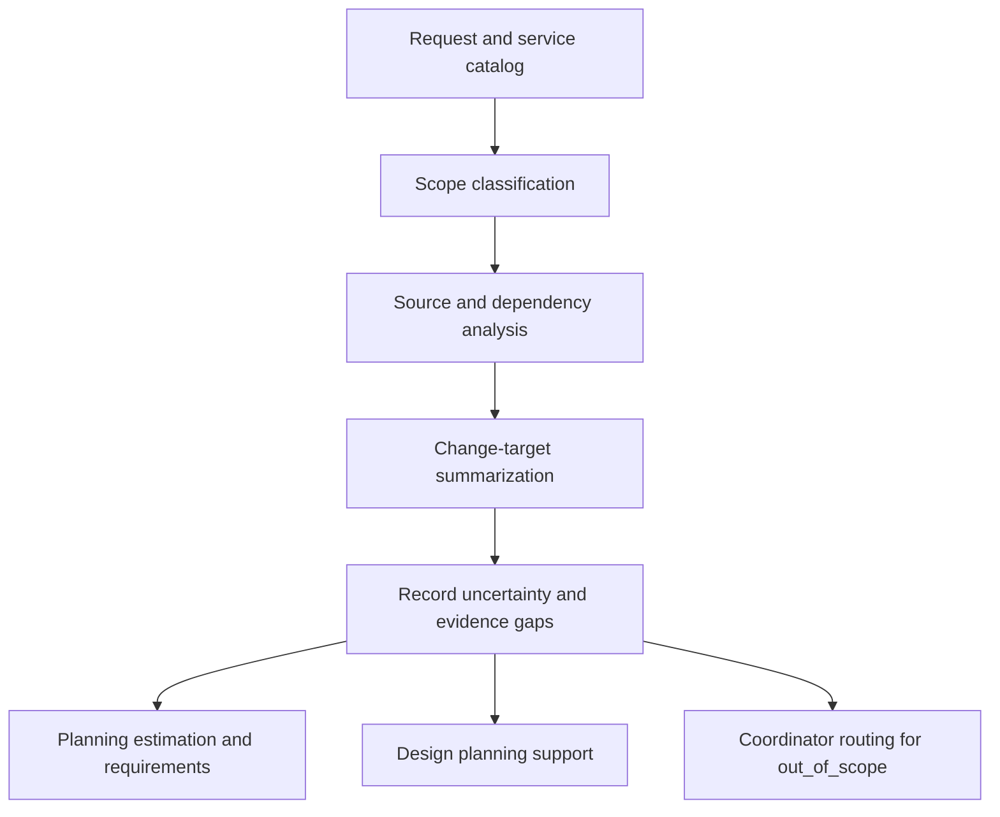

<!-- xid: 8B31F02A4001 -->

# Investigation Workflow

This workflow defines how investigation work is orchestrated before estimation, requirements, or design.

This page follows the shared [Workflow page schema](018_workflow_page_schema.md#xid-6D2E4A9C0B71). The sections below focus on workflow-specific content.

## Purpose

Narrow the affected scope, inspect the relevant implementation area, and hand off a structured change-target summary.

## Group Interaction

| Item | Value |
|------|------|
| Owner group | Planning Group with Design Group support when technical investigation is needed |
| Input from | request intake, domain references, repository and design materials |
| Output to | Planning Group estimation work, requirements work, and Design Group planning support |
| Main handoff artifacts | in-scope service list, change viewpoints, test viewpoints, change target list, uncertainty list |
| Escalation path | out-of-scope items go to Coordinator routing; unresolved evidence stays `unknown` for later confirmation |

## Flow Diagram

## Business Activities and Supporting Capabilities

- Service catalog analysis:
  - supported by [CAP-INV-001 Scope Classification](../capabilities/investigation/100_cap_inv_001_service_catalog_analysis.md#xid-867B78FF702F)
- Source and dependency analysis:
  - supported by [CAP-INV-002 Change Impact Enumeration](../capabilities/investigation/110_cap_inv_002_source_dependency_analysis.md#xid-E994FCDA8CD1)
- Change-target summarization:
  - supported by [CAP-INV-003 Structured Investigation Summary](../capabilities/investigation/120_cap_inv_003_change_target_summary.md#xid-6AB17163C9BF)

## Sequence

1. Start with the request and available service catalog.
2. Perform service catalog analysis by applying [CAP-INV-001 Scope Classification](../capabilities/investigation/100_cap_inv_001_service_catalog_analysis.md#xid-867B78FF702F).
3. Perform source and dependency analysis by applying [CAP-INV-002 Change Impact Enumeration](../capabilities/investigation/110_cap_inv_002_source_dependency_analysis.md#xid-E994FCDA8CD1).
4. Perform change-target summarization by applying [CAP-INV-003 Structured Investigation Summary](../capabilities/investigation/120_cap_inv_003_change_target_summary.md#xid-6AB17163C9BF).
5. Record uncertainty and evidence gaps before handoff.

## Inputs

- request
- service catalog or equivalent domain reference
- repository paths, source code, and design materials when available

## Outputs

- in-scope service list
- out-of-scope service list with reasons
- change viewpoints
- test viewpoints
- change target list
- consolidated uncertainty list

## Control Rules

- Investigation does not decide implementation policy.
- Investigation does not decide design policy.
- Every investigation coverage area must be recorded explicitly.
- Missing evidence must be recorded as `unknown`.
- Non-applicable coverage areas must be recorded as `out_of_scope` with reasons.
- Out-of-scope items must preserve reasons for later escalation.
- Investigation is not complete until no coverage area remains unrecorded.

## Required Knowledge

- [Investigation coverage checklist](../knowledge/investigation/100_investigation_coverage_checklist.md#xid-91E2A7C56101)
- [Common source analysis criteria](../knowledge/source_analysis/100_common_source_analysis_criteria.md#xid-5F21C8A41001)
- [Custom framework common criteria](../knowledge/source_analysis/110_custom_framework_common_criteria.md#xid-5F21C8A41002)
- [C# custom framework analysis criteria](../knowledge/csharp/110_custom_framework_analysis_criteria.md#xid-30E6A4F6F3AB)

## Related Skills

- [investigation_flow](../skills/investigation_flow/SKILL.md#xid-9C0115875B0C)
- [management_table_control](../skills/management_table_control/SKILL.md#xid-D6DDBAC513BF)
