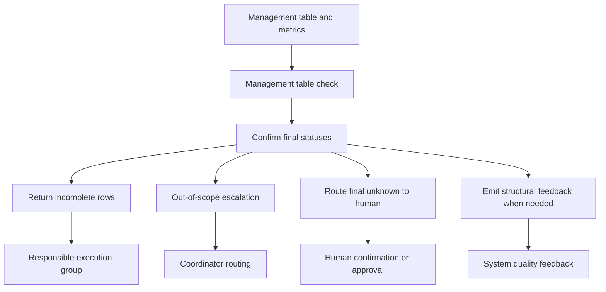

<!-- xid: 8B31F02A4003 -->

# Closure Workflow

This workflow defines how work is checked for leaks, confirmed for closure, and escalated when scope cannot be completed inside the current boundary.

## Purpose

Prevent silent leaks and ensure unresolved or out-of-scope items are explicitly handed off.

## Group Interaction

| Item | Value |
|------|------|
| Owner group | Quality Group for closure checking, Coordinator for out-of-scope reassignment routing |
| Input from | any workflow that produces management rows, metrics, unresolved items, or out-of-scope items |
| Output to | responsible execution group for rework, Coordinator routing, human confirmation or approval path, or final handoff record |
| Main handoff artifacts | leak detection result, return instructions, closure confirmation, escalation record, unknown escalation record, structural quality feedback record |
| Escalation path | all remaining `out_of_scope` rows go to Coordinator routing; unresolved final `unknown` rows go to human confirmation or approval; recurring or upstream-origin leaks go to the system quality feedback loop |

## Flow Diagram

## Sequence

1. Inspect the management table and supporting metrics.
2. Run [CAP-QA-004 Management Table Check](../capabilities/quality/110_cap_qa_004_management_table_check.md#xid-AFEB172B97D8).
3. Confirm that all rows end in `done`, `unknown`, or `out_of_scope`.
4. Return leaked or incomplete rows for follow-up.
5. Run [CAP-MGT-003 Out-of-Scope Escalation](../capabilities/management/120_cap_mgt_003_out_of_scope_escalation.md#xid-1E3B2AA5B328) for remaining out-of-scope items.
6. Route unresolved final `unknown` rows to human confirmation or approval.
7. When leaks indicate structural recurrence or upstream failure, emit a system quality feedback record.
8. Preserve closure confirmation and escalation records.

## Inputs

- management table
- metrics log when confidence or context must be interpreted
- unresolved and out-of-scope lists

## Outputs

- leak detection result
- return instructions
- closure confirmation result
- escalation record
- unknown escalation record
- structural quality feedback record

## Control Rules

- `missing` is not a valid final state.
- Low-confidence results must not be treated as normal completion.
- Out-of-scope reasons must be preserved without rewriting them away.
- Closure requires explicit handling of unresolved and out-of-scope items.
- `unknown` may move across groups, but unresolved final `unknown` must be escalated to a human.
- Final closure with remaining `unknown` requires explicit human acknowledgment or approval.
- Repeated or structurally similar leaks must not be handled only as local return instructions; they must also trigger upstream feedback.

## Related

- [System quality feedback loop](043_system_quality_feedback_loop.md#xid-8B31F02A4012)
- [management_table_control](../skills/management_table_control/SKILL.md#xid-D6DDBAC513BF)

