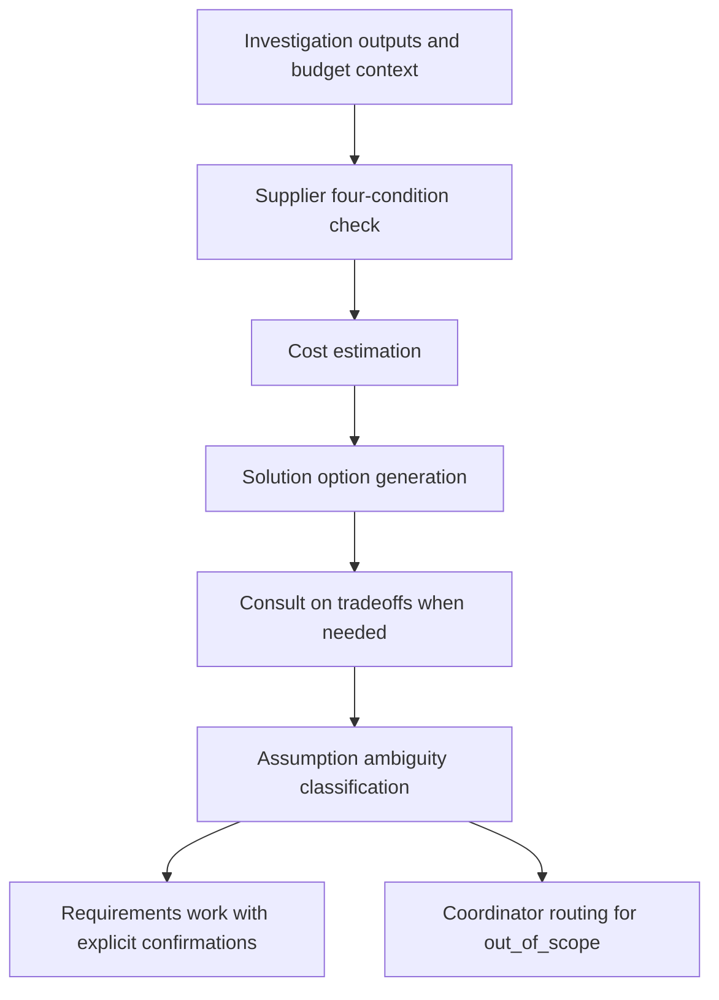

<!-- xid: 8B31F02A4004 -->

# Estimation Workflow

This workflow defines how supplier checks, cost estimation, solution-option generation, and assumption classification are orchestrated.

This page follows the shared [Workflow page schema](018_workflow_page_schema.md#xid-6D2E4A9C0B71). The sections below focus on workflow-specific content.

## Purpose

Prepare grounded options and unresolved assumption lists before requirements work begins.
Consult on option differences, assumption gaps, and direction tradeoffs before requirement drafting begins.

## Group Interaction

| Item | Value |
|------|------|
| Owner group | Planning Group |
| Input from | investigation outputs, supplier definitions, budget context |
| Output to | Planning Group requirements work |
| Main handoff artifacts | supplier comparison result, cost patterns, solution options, ambiguity classification, unresolved assumptions |
| Escalation path | supplier or budget items outside boundary go to Coordinator routing; unresolved assumptions move forward as explicit confirmation items |

## Flow Diagram

## Business Activities and Supporting Capabilities

- Supplier four-condition check:
  - supported by [CAP-SUP-001 External Service Condition Comparison](../capabilities/supply/100_cap_sup_001_supplier_four_condition_check.md#xid-2DC9A90A6508)
- Cost estimation:
  - supported by [CAP-SUP-002 Cost Pattern Projection](../capabilities/supply/110_cap_sup_002_cost_estimation.md#xid-754A17D69C7C)
- Solution option generation:
  - supported by [CAP-EST-001 Solution Option Structuring](../capabilities/estimation/100_cap_est_001_solution_option_generation.md#xid-BDB6B54A3571)
- Assumption ambiguity classification:
  - supported by [CAP-EST-002 Assumption Ambiguity Classification](../capabilities/estimation/110_cap_est_002_assumption_ambiguity_classification.md#xid-B362EA06B9C2)

## Sequence

1. Perform supplier four-condition check by applying [CAP-SUP-001 External Service Condition Comparison](../capabilities/supply/100_cap_sup_001_supplier_four_condition_check.md#xid-2DC9A90A6508).
2. Perform cost estimation by applying [CAP-SUP-002 Cost Pattern Projection](../capabilities/supply/110_cap_sup_002_cost_estimation.md#xid-754A17D69C7C).
3. Perform solution option generation by applying [CAP-EST-001 Solution Option Structuring](../capabilities/estimation/100_cap_est_001_solution_option_generation.md#xid-BDB6B54A3571).
4. Consult on option differences, tradeoffs, and assumption impacts when option comparison requires stakeholder or human clarification.
5. Perform assumption ambiguity classification by applying [CAP-EST-002 Assumption Ambiguity Classification](../capabilities/estimation/110_cap_est_002_assumption_ambiguity_classification.md#xid-B362EA06B9C2).
6. Hand off unresolved assumptions for confirmation.

## Related Skills

- [estimation_flow](../skills/estimation_flow/SKILL.md#xid-FB65EC653F0F)
- [management_table_control](../skills/management_table_control/SKILL.md#xid-D6DDBAC513BF)

