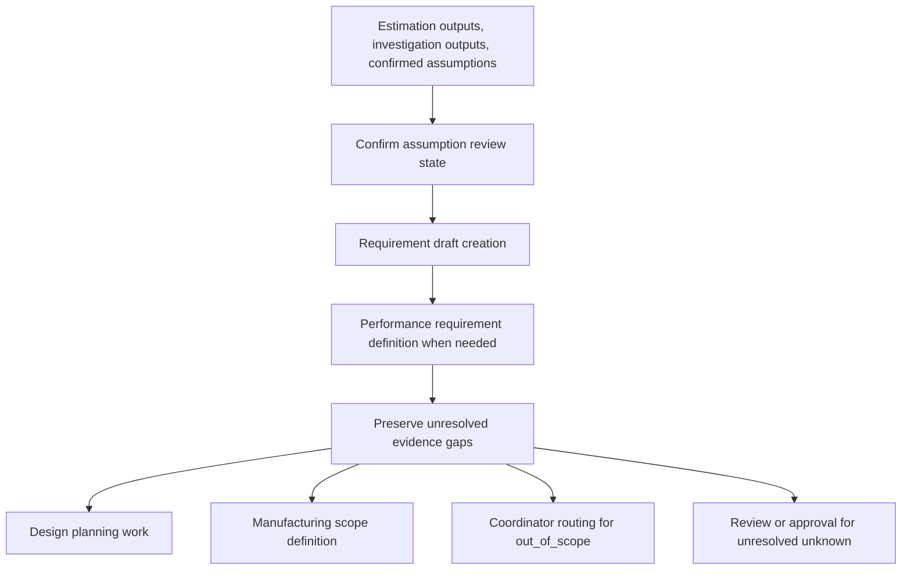

<!-- xid: 8B31F02A4005 -->

# Requirements Workflow

This workflow defines how requirement drafts are produced from confirmed assumptions and investigation outputs.

This page follows the shared [Workflow page schema](018_workflow_page_schema.md#xid-6D2E4A9C0B71). The sections below focus on workflow-specific content.

## Purpose

Convert confirmed assumptions into draft requirements and related performance conditions.

## Group Interaction

| Item | Value |
|------|------|
| Owner group | Planning Group with Design Group support for performance and technical clarification |
| Input from | estimation outputs, investigation outputs, confirmed assumptions |
| Output to | Design Group planning work and later Manufacturing scope definition |
| Main handoff artifacts | requirement draft, performance requirement definition, unresolved evidence list |
| Escalation path | unresolved requirement questions remain `unknown` for review or approval; out-of-scope items go to Coordinator routing |

## Flow Diagram

## Business Activities and Supporting Capabilities

- Requirement draft creation:
  - supported by [CAP-REQ-001 Requirement Structuring](../capabilities/requirements/100_cap_req_001_requirement_draft_creation.md#xid-BC408337F2A2)
- Performance requirement definition:
  - supported by [CAP-REQ-002 Performance Constraint Structuring](../capabilities/requirements/110_cap_req_002_performance_requirement_definition.md#xid-D67FAD650F8C)

## Sequence

1. Confirm unresolved assumptions have been reviewed.
2. Perform requirement draft creation by applying [CAP-REQ-001 Requirement Structuring](../capabilities/requirements/100_cap_req_001_requirement_draft_creation.md#xid-BC408337F2A2).
3. Perform performance requirement definition by applying [CAP-REQ-002 Performance Constraint Structuring](../capabilities/requirements/110_cap_req_002_performance_requirement_definition.md#xid-D67FAD650F8C) when needed.
4. Preserve unresolved evidence gaps for later review or approval.

## Related Skills

- [requirements_flow](../skills/requirements_flow/SKILL.md#xid-2B70BBF7B7BB)
- [management_table_control](../skills/management_table_control/SKILL.md#xid-D6DDBAC513BF)

