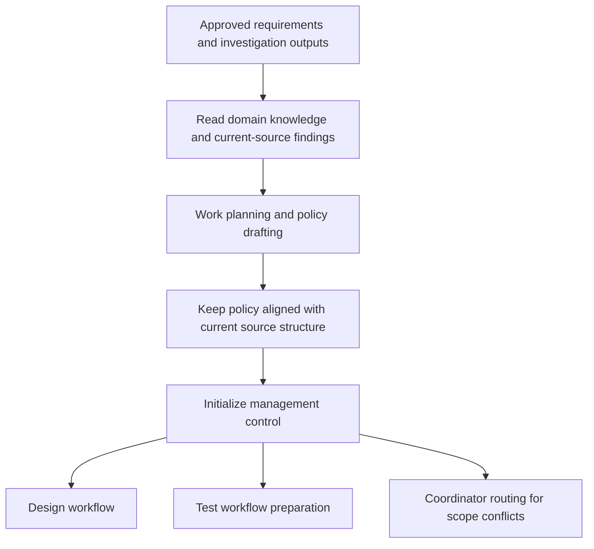

<!-- xid: 8B31F02A4006 -->

# Planning Workflow

This workflow defines how approved requirements are converted into executable plan drafts.

This page follows the shared [Workflow page schema](018_workflow_page_schema.md#xid-6D2E4A9C0B71). The sections below focus on workflow-specific content.

## Purpose

Prepare work planning and implementation policies before design starts, using domain knowledge and current-source analysis so the plan stays aligned with the existing codebase structure.

## Group Interaction

| Item | Value |
|------|------|
| Owner group | Design Group |
| Input from | approved requirements from Planning Group, change target list from Investigation workflow, domain knowledge references, current-source findings |
| Output to | Design Group design work, Test workflow preparation, and management control initialization |
| Main handoff artifacts | work plan, source modification policy, data change policy, data correction tool policy, test policy, test tool policy, release policy, planning basis source list |
| Escalation path | unresolved planning assumptions remain explicit; scope conflicts go to Coordinator routing |

## Flow Diagram

## Business Activities and Supporting Capabilities

- Work planning and policy drafting:
  - supported by [CAP-PLN-001 Work and Policy Planning Structuring](../capabilities/planning/100_cap_pln_001_task_decomposition_plan_draft.md#xid-F5193313AB79)

## Sequence

1. Confirm requirements are approved.
2. Read domain knowledge and current-source findings relevant to the target scope.
3. Perform work planning and policy drafting by applying [CAP-PLN-001 Work and Policy Planning Structuring](../capabilities/planning/100_cap_pln_001_task_decomposition_plan_draft.md#xid-F5193313AB79).
4. Keep source modification policy consistent with the current source structure unless a justified deviation is recorded.
5. Initialize management control for the resulting planning outputs and target lists.

## Outputs

- work plan
- source modification policy
- data change policy
- data correction tool policy
- test policy
- test tool policy
- release policy
- planning basis source list

## Control Rules

- Planning must read relevant domain knowledge before drafting policies.
- Planning must inspect current-source findings before defining source modification policy.
- Source modification policy should follow the current source structure by default.
- Data change policy must identify whether data correction requires a dedicated tool and, if so, define creation and verification expectations for that tool.
- Test policy must identify required test tools, whether an existing tool is selected or a new tool must be created, and how that tool will be verified before use.
- When a custom framework exists, planning must identify framework lifecycle, extension points, and convention rules before defining source modification policy.
- Planning must show which current source files, modules, registrations, or framework artifacts were used as the basis for each policy.
- Release policy should cover IPA-derived release activity areas, including cutover, rollback, operational readiness, pre-release verification, post-release monitoring, incident response, and business-cycle constraints.
- Release policy must distinguish test-environment release planning from production-environment release planning.
- Any planned structural deviation must include an explicit reason and downstream impact note.

## Related Skills

- [planning_flow](../skills/planning_flow/SKILL.md#xid-486C9EEE8A9D)
- [design_flow](../skills/design_flow/SKILL.md#xid-3D7A91B54210)
- [management_table_control](../skills/management_table_control/SKILL.md#xid-D6DDBAC513BF)

