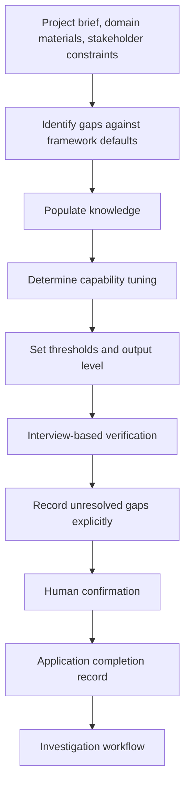

<!-- xid: 8B31F02A4014 -->

# Application Workflow

This workflow defines how the framework is configured for a specific project before normal workflows begin.

## Purpose

Establish a validated, project-specific configuration so that normal workflows operate on a known and verified foundation rather than on framework defaults.

This workflow runs once per project. It completes before Investigation workflow begins.

## Ownership

This workflow is owned by the human decision layer.

AI support is limited to:

- surfacing gaps in the configuration
- verifying internal consistency of the configuration
- conducting interview-based verification against the framework

The human decision layer retains full authority over all configuration decisions.

## Group Interaction

| Item | Value |
|------|------|
| Owner group | Human decision layer with AI support |
| Input from | framework baseline, project brief, domain materials, stakeholder constraints |
| Output to | all normal workflows as precondition; Investigation workflow as first consumer |
| Main handoff artifacts | domain knowledge injection record, capability tuning record, threshold configuration record, verification result |
| Escalation path | unresolved configuration gaps must be explicitly recorded before normal workflows begin; no silent defaults permitted |

## Flow Diagram

## What This Workflow Configures

### 1. Domain Knowledge Injection

Populate `knowledge/` with project-specific material:

- domain rules and local regulations
- organization-specific standards
- terminology and classification schemes
- known constraints and non-negotiable boundaries

### 2. Capability Tuning

Specify how base capabilities are specialized for this project:

- technology stack tuning (language, framework, platform)
- domain tuning (industry, regulatory context)
- quality-focus tuning (security, performance, compliance emphasis)

### 3. Threshold Configuration

Set project-specific values for:

- confidence threshold for human escalation (framework default: < 0.7)
- metrics interpretation rules specific to this domain
- acceptable `unknown` handling policy given project risk posture

### 4. Output Level Definition

Define what constitutes acceptable output for this project:

- artifact granularity expectations
- evidence requirements per workflow stage
- traceability depth required for handoff

## Sequence

1. Collect project brief, domain materials, and stakeholder constraints.
2. Identify gaps between framework defaults and project requirements.
3. Populate `knowledge/` with domain-specific material.
4. Determine capability tuning for each group that will operate in this project.
5. Set threshold and output level configuration.
6. Conduct interview-based verification to confirm that:
   - configuration intent matches framework structure
   - no silent assumptions remain
   - all configuration decisions are recorded explicitly
7. Record unresolved gaps explicitly; do not proceed with silent defaults.
8. Obtain human confirmation that the configuration is complete and verified.
9. Issue application completion record as precondition for Investigation workflow.

## Interview-Based Verification

Step 6 uses a structured interview between the human decision layer and AI support.

The interview confirms:

- each configuration decision can be traced to a project requirement or constraint
- the configured thresholds are consistent with the project risk posture
- domain knowledge in `knowledge/` covers the judgment areas that the normal workflows will require
- no workflow assumes knowledge that has not been injected

The interview is not a formal review by a separate group. It is the human decision layer using AI as a structured verification tool.

## Completion Conditions

This workflow is complete when all of the following are satisfied:

- domain knowledge injection is recorded
- capability tuning is recorded per group
- threshold and output level configuration is recorded
- interview-based verification has been conducted and its result recorded
- all unresolved gaps are explicitly listed
- human confirmation is obtained

`missing` configuration items are not permitted at completion. Unresolved items must appear in the gap record, not be silently carried forward.

## Outputs

- domain knowledge injection record
- capability tuning record
- threshold configuration record
- output level definition record
- interview verification result
- unresolved configuration gap record (empty if none)
- application completion record

## Control Rules

- This workflow must complete before any normal workflow begins.
- Human decision layer owns all configuration decisions. AI support does not decide.
- Silent defaults are not permitted. Every deviation from framework baseline must be an explicit decision.
- Unresolved configuration gaps must be recorded and acknowledged before proceeding.
- The application completion record is the handoff artifact to Investigation workflow.

## Relation to Normal Workflows

- This workflow sits before [Investigation workflow](032_investigation_workflow.md#xid-8B31F02A4001) in the project lifecycle.
- Configuration established here persists across all subsequent normal workflows unless explicitly revised.
- If a normal workflow discovers that the configuration is insufficient, it must surface the gap explicitly rather than resolve it silently. The gap returns to the human decision layer for configuration revision.

## Related

- [Capability layering](031_capability_layering.md#xid-8D50A972BA9F)
- [Group definitions](040_group_definitions.md#xid-8B31F02A4009)
- [Flow-to-group matrix](041_flow_to_group_matrix.md#xid-8B31F02A4010)
- [Investigation workflow](032_investigation_workflow.md#xid-8B31F02A4001)
