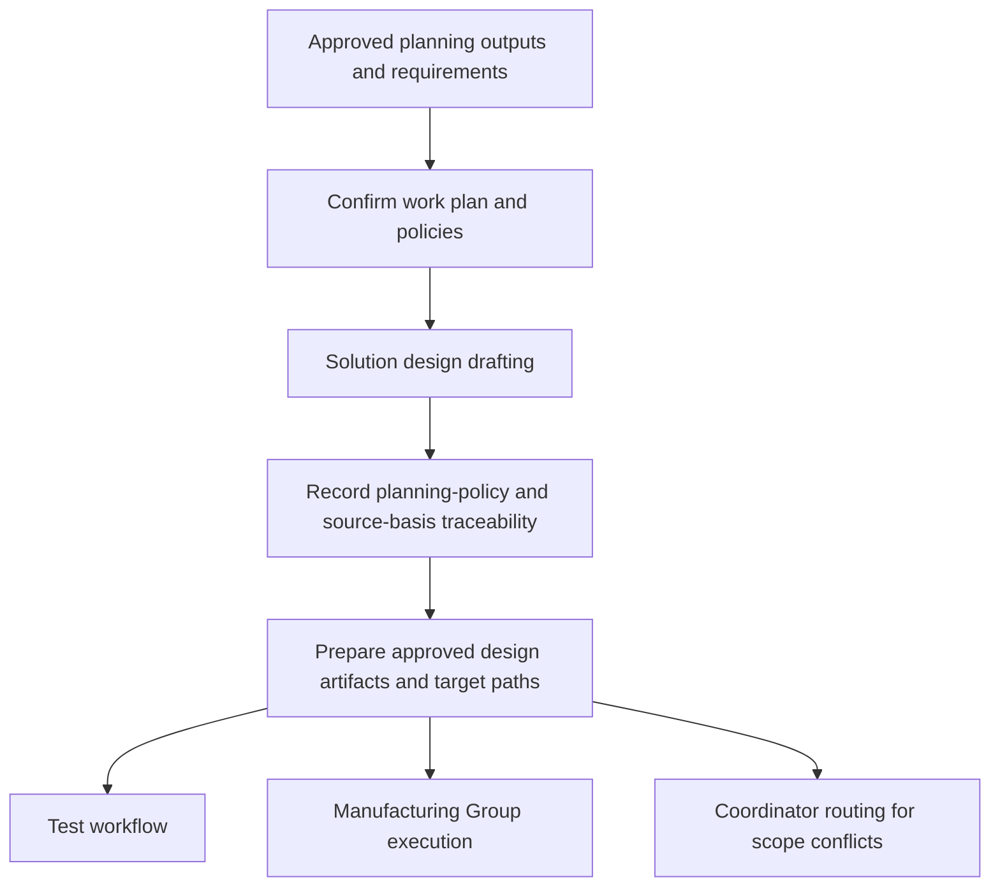

<!-- xid: 8B31F02A4015 -->

# Design Workflow

This workflow defines how planning outputs are converted into implementation-ready solution-design artifacts.

This page follows the shared [Workflow page schema](018_workflow_page_schema.md#xid-6D2E4A9C0B71). The sections below focus on workflow-specific content.

## Purpose

Prepare solution-design artifacts that realize approved planning policies before manufacturing and test work start.

## Group Interaction

| Item | Value |
|------|------|
| Owner group | Design Group |
| Input from | approved planning outputs from Design Group planning work, planning basis source list, approved requirements from Planning Group |
| Output to | Test workflow and Manufacturing Group execution work |
| Main handoff artifacts | approved design, target paths, source modification design, data change design, design basis policy reference |
| Escalation path | unresolved design evidence remains explicit; scope conflicts go to Coordinator routing |

## Flow Diagram

## Business Activities and Supporting Capabilities

- Solution design drafting:
  - supported by [CAP-DSN-001 Solution Design Structuring](../capabilities/design/100_cap_dsn_001_solution_design_structuring.md#xid-6C1A2D9F4501)

## Sequence

1. Confirm work plan and implementation policies are approved.
2. Perform solution design drafting by applying [CAP-DSN-001 Solution Design Structuring](../capabilities/design/100_cap_dsn_001_solution_design_structuring.md#xid-6C1A2D9F4501).
3. Record which planning policy and planning basis source entry each design artifact realizes.
4. Prepare approved design artifacts and target paths for test and manufacturing handoff.

## Related Skills

- [design_flow](../skills/design_flow/SKILL.md#xid-3D7A91B54210)
- [test_flow](../skills/test_flow/SKILL.md#xid-62F9F44D7711)
- [management_table_control](../skills/management_table_control/SKILL.md#xid-D6DDBAC513BF)
