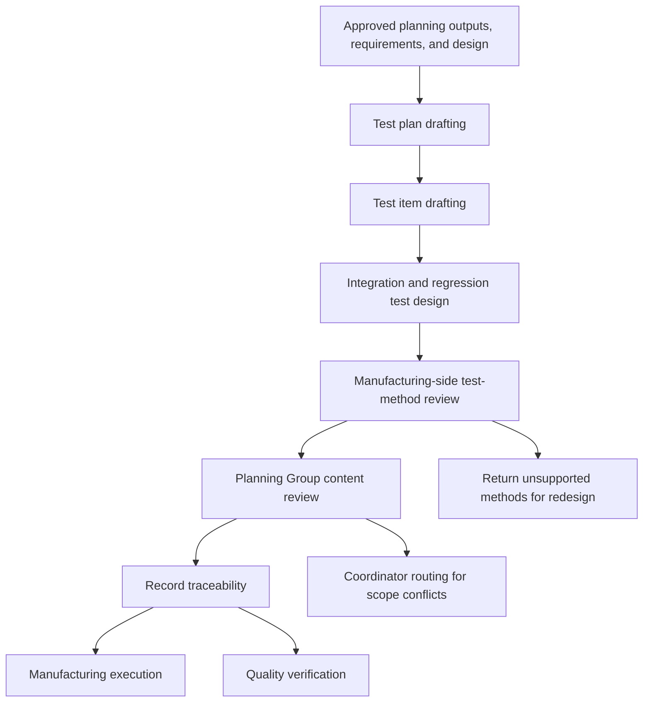

<!-- xid: 8B31F02A4016 -->

# Test Workflow

This workflow defines how test planning, requirement-traceable test-item structuring, and manufacturing-side test-method confirmation are orchestrated before execution and verification.

This page follows the shared [Workflow page schema](018_workflow_page_schema.md#xid-6D2E4A9C0B71). The sections below focus on workflow-specific content.

## Purpose

Prepare a reviewed test package from planning outputs, requirements, and approved design so that manufacturing and later verification work can execute against explicit test intent and traceability.

## Group Interaction

| Item | Value |
|------|------|
| Owner group | Design Group |
| Input from | approved planning outputs from Design Group planning work, approved requirements from Planning Group, approved design from Design Group design work |
| Output to | Planning Group content confirmation, Manufacturing Group execution work, and Quality Group verification work |
| Main handoff artifacts | test plan, test plan basis policy reference, test design, test design basis policy reference, test-item requirement traceability reference, integration regression test design, integration regression test basis policy reference, manufacturing test review result, planning test content review result |
| Escalation path | unresolved test evidence remains explicit; unsupported test methods return for redesign; scope conflicts go to Coordinator routing |

## Flow Diagram

## Business Activities and Supporting Capabilities

- Test plan drafting:
  - supported by [CAP-DSN-004 Test Plan Structuring](../capabilities/design/130_cap_dsn_004_test_plan_structuring.md#xid-6C1A2D9F4504)
- Test item drafting:
  - supported by [CAP-DSN-002 Test Design Structuring](../capabilities/design/110_cap_dsn_002_test_design_structuring.md#xid-6C1A2D9F4502)
- Integration and regression test design drafting:
  - supported by [CAP-DSN-003 Integration and Regression Test Design Structuring](../capabilities/design/120_cap_dsn_003_integration_regression_test_design_structuring.md#xid-6C1A2D9F4503)
- Manufacturing-side test-method review:
  - supported by [CAP-MFG-003 Test Method Review](../capabilities/manufacturing/130_cap_mfg_003_test_method_review.md#xid-55CC9027ACAE)
- Planning-side test-content review:
  - performed as Planning Group responsibility review against approved requirements and change specification

## Sequence

1. Confirm test policy, approved requirements, and approved design exist.
2. Perform test plan drafting by applying [CAP-DSN-004 Test Plan Structuring](../capabilities/design/130_cap_dsn_004_test_plan_structuring.md#xid-6C1A2D9F4504).
3. Perform test item drafting by applying [CAP-DSN-002 Test Design Structuring](../capabilities/design/110_cap_dsn_002_test_design_structuring.md#xid-6C1A2D9F4502).
4. Perform integration and regression test design drafting by applying [CAP-DSN-003 Integration and Regression Test Design Structuring](../capabilities/design/120_cap_dsn_003_integration_regression_test_design_structuring.md#xid-6C1A2D9F4503).
5. Perform manufacturing-side test-method review by applying [CAP-MFG-003 Test Method Review](../capabilities/manufacturing/130_cap_mfg_003_test_method_review.md#xid-55CC9027ACAE).
6. Perform Planning Group content review against approved requirements and change specification.
7. Record which requirement, test policy entry, and design artifact each test item realizes.
8. Hand off the reviewed test package for manufacturing execution and quality verification.

## Outputs

- test plan
- test plan basis policy reference
- test design
- test design basis policy reference
- test-item requirement traceability reference
- integration regression test design
- integration regression test basis policy reference
- manufacturing test review result
- planning test content review result
- unresolved list

## Control Rules

- Test planning must start from approved requirements and approved test policy.
- Each test item must identify which requirement or requirement fragment it verifies.
- Design Group owns the Test workflow and composes the reviewed test package.
- Planning Group must confirm that test content covers the intended change specification before manufacturing execution starts.
- Test-item traceability must remain explicit across manufacturing and quality verification handoff.
- Manufacturing review confirms test-method suitability against the internal realization approach; it does not redefine requirement intent or business scope.
- Quality Group reviews the resulting test package and test results as product evidence; it does not own change-specification confirmation.
- Unsupported test methods must be returned explicitly for redesign.
- Unresolved test assumptions must remain explicit.

## Related Skills

- [test_flow](../skills/test_flow/SKILL.md#xid-62F9F44D7711)
- [implementation_flow](../skills/implementation_flow/SKILL.md#xid-0ACF69A599D3)
- [qa_gate_review](../skills/qa_gate_review/SKILL.md#xid-09B250B1A8FB)
- [management_table_control](../skills/management_table_control/SKILL.md#xid-D6DDBAC513BF)
