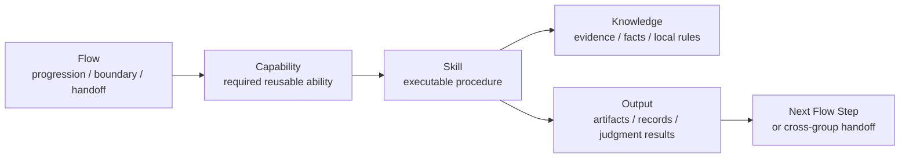

<!-- xid: 91C4B7E2D5A8 -->

# Flow Capability Skill Knowledge Model

This page consolidates the repository's layering model into one practical view for developers.

It restates the relation among workflow, capability, skill, and knowledge so implementation and documentation decisions stay consistent across the repository.

## Core Distinction

- `Flow` defines business progression, boundary, handoff, and control points.
- `Capability` defines reusable work-unit ability.
- `Skill` defines executable procedure.
- `Knowledge` defines evidence, facts, and local rules.

## Four-Layer Table

| Layer | What it represents | Main location | Typical contents | What it should not contain | Main relation |
|------|------|------|------|------|------|
| Flow | business progression, sequence, boundary, handoff, escalation | `docs/`, `flows/` | phases, inputs, outputs, gates, branch conditions, ownership, handoff rules | detailed execution procedure, raw evidence, large factual blocks | provides the control frame in which skills are executed |
| Capability | reusable professional ability or work-unit definition | `capabilities/` | required actions, judgment points, reusable task definitions, tuned ability definitions | project-specific evidence, full business-stage sequencing, large local rules | defines what a skill must accomplish |
| Skill | executable procedure for a concrete work unit | `skills/` | procedure, I/O contract, guardrails, execution steps, references to required XIDs | copied domain facts, broad governance, whole lifecycle control | executes one or more capabilities inside a flow |
| Knowledge | evidence, facts, domain rules, local rules | `knowledge/` | domain knowledge, quality criteria, operational rules, glossary, evidence basis | execution procedure, workflow orchestration, capability control definition | supplies the basis a skill reads when making or supporting judgments |

## Reading Order

The repository routing order is:

1. identify the business stage or user intent
2. identify the relevant flow
3. identify the required capabilities inside that flow
4. identify the skill that executes those capabilities
5. load only the required knowledge fragments
6. execute and hand off results back to the flow

## Practical Interpretation

- `Flow` answers: when does this happen, under whose boundary, and what is handed off next?
- `Capability` answers: what professional ability is required here?
- `Skill` answers: how is that work executed in practice?
- `Knowledge` answers: what evidence or local rule supports the work?

## Skill Runtime Envelope

A Skill is not only a procedure document. A loadable Skill must also carry the
repository operating envelope defined in [Skill Operating Contract](058_skill_operating_contract.md#xid-B7A2C94F0E61).

That envelope makes each Skill declare:

- worklist policy
- execution role
- check role
- logging policy
- judgment-log policy
- unknown and risk handling
- closure gate
- handoff policy

This keeps the repository closer to an operating foundation: Skills are loaded
with execution/check separation, records, closure, and handoff expectations
already attached.

## Design Rules

- Put lifecycle progression and business-stage control in `Flow`.
- Put reusable work-unit definitions in `Capability`.
- Put execution steps and guardrails in `Skill`.
- Put evidence, domain facts, and local rules in `Knowledge`.
- Do not copy large factual content into `Skill`; reference XID-backed knowledge instead.
- Do not use `Capability` pages as evidence; they are control definitions.
- Do not let `Flow` become a large procedure manual; keep it at orchestration level.

## Relationship Diagram

## PMBOK Interpretation

When this repository is organized with PMBOK thinking:

- `Flow` corresponds to lifecycle control such as initiating, planning, executing, monitoring and controlling, and closing.
- `Capability` corresponds to reusable professional abilities such as estimation, analysis, design, review, change assessment, and release preparation.
- `Skill` corresponds to executable work units such as `planning_flow`, `design_flow`, `cab_review_flow`, or `management_table_control`.
- `Knowledge` corresponds to the evidence basis used during execution such as project rules, quality criteria, operational constraints, and domain facts.

## Example

For implementation work:

- workflow: implementation and review flow in `docs/`
- capability: reusable implementation capability in `capabilities/manufacturing/`
- knowledge: coding rules, framework rules, and local constraints in `knowledge/`
- skill: `skills/implementation_flow/`

This means the implementation skill should not own the whole business workflow, and it should not embed large coding-rule text directly. It should execute implementation procedure while loading required evidence from canonical knowledge fragments.

## Audit View

The four-layer model becomes operationally traceable when paired with execution records:

- `sources/` holds original evidence
- `knowledge/` holds normalized operational evidence
- `skills/` perform the work
- `work/` records what was executed, why, and with which basis

This separation supports replay, review, and audit without requiring one long prompt to hold the entire operating model.

## Related

- [Capability layering](031_capability_layering.md#xid-8D50A972BA9F)
- [Capability Routing for Agents](../agent/010_capability_routing.md#xid-1F93A7C24010)
- [Flow-to-group matrix](041_flow_to_group_matrix.md#xid-8B31F02A4010)
- [Skill authoring with xref](013_skill_authoring_with_xref.md#xid-3DB05A0F5F5B)
