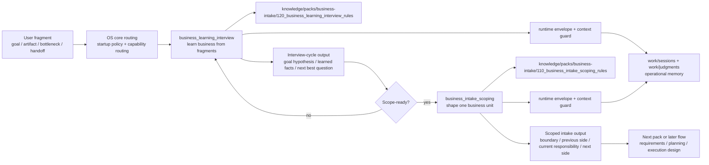

<!-- xid: D334C1964342 -->

# Business Intake Pack Dependency Design

This page is a design document for the first business-pack dependency map in
the AI Agent OS reorganization.
It defines the dependency boundary for the business-intake route.
It is not a usage guide.
For the boundary among operating models, usage guides, and design pages, see
[Operating models, usage guides, and design pages](022_operating_models_guides_and_designs.md#xid-9C4E2A71D583).

## Purpose

This page makes the business-intake route explicit as one business pack that
depends on the AI Agent OS core.

The goal is to turn the design statement in
[AI Agent OS Reorganization Design](063_ai_agent_os_reorganization_design.md#xid-22CAE81A6D3E)
into one concrete dependency map.

Related:

- [Business Pack model](071_business_pack_model.md#xid-40511A8A06CD)
- [AI Agent OS Reorganization Design](063_ai_agent_os_reorganization_design.md#xid-22CAE81A6D3E)
- [Capability Routing for Agents](../agent/010_capability_routing.md#xid-1F93A7C24010)
- [Business intake workflow](067_business_intake_workflow.md#xid-7F2C8DA14E66)
- [Business learning interview guide](061_business_learning_interview_guide.md#xid-D2A41E8C7B51)
- [Business intake scoping guide](060_business_intake_scoping_guide.md#xid-C91F7D2A6B40)

## Pack Boundary

The business-intake pack is the part of the repository that learns incomplete
business fragments and shapes them into a scope-ready business unit before
later execution design.

It includes:

- semantic intake routing for incomplete business requests
- business learning from fragments
- candidate business-unit discovery
- first-pass scope shaping
- explicit open questions and next confirmation points

It does not include:

- generic startup control
- generic runtime envelope logic
- generic closure-gate enforcement
- generic `xref` durability
- implementation-phase execution

## Core Components

### Pack Skills

- `skills/packs/business-intake/business_learning_interview/`
- `skills/packs/business-intake/business_intake_scoping/`

### Pack Guides

- [Business intake workflow](067_business_intake_workflow.md#xid-7F2C8DA14E66)
- [Business learning interview guide](061_business_learning_interview_guide.md#xid-D2A41E8C7B51)
- [Business intake scoping guide](060_business_intake_scoping_guide.md#xid-C91F7D2A6B40)

### Pack Flows

- `flows/packs/business-intake/business_intake_workflow.yaml`

### Pack Knowledge

- `knowledge/packs/business-intake/120_business_learning_interview_rules.md`
- `knowledge/packs/business-intake/110_business_intake_scoping_rules.md`
- `knowledge/organization/160_context_direction_guard_rules.md`

### Pack Capability References

- `capabilities/management/140_cap_mgt_005_skill_runtime_envelope.md`
- `capabilities/management/130_cap_mgt_004_context_direction_guard.md`

## Dependency Split

### What The Pack Owns

The business-intake pack owns:

- goal-first interview logic
- next-best-question logic
- partial-fragment intake behavior
- provisional business boundary shaping
- previous side / current responsibility / next side structuring
- scope-ready transition judgment

### What The OS Core Owns

The AI Agent OS core owns:

- startup entry and routing order
- load gating through `fm skill run`
- work item, artifact, concern, and phase recording
- execution / check / handoff separation
- unknown / risk visibility
- closure gate
- judgment-log linkage
- `xref search` / `xref show`
- operational-memory feedback after execution

The pack must depend on these controls but must not redefine them.

## Dependency Map

## Runtime Path

The intended runtime path is:

1. startup policy sees that the request is business intake with incomplete structure
2. routing selects `business_learning_interview`
3. the OS core opens the runtime envelope
4. the Skill learns from fragments and records operational memory
5. if the output is not scope-ready, the loop stays in business learning
6. once scope-ready, routing selects `business_intake_scoping`
7. the OS core opens the next runtime envelope
8. the Skill shapes one boundary-visible business unit
9. the resulting scoped output is handed off to a later pack or workflow

## Pack Inputs And Outputs

### Inputs

- user fragments
- stated goal or expected result
- partial artifacts
- partial ownership or handoff knowledge
- relevant business rules when available

### Outputs

- interview-cycle summary
- current business hypothesis
- explicit open questions
- next best question
- discovery-first scoped intake note
- previous side / current responsibility / next side
- smallest next confirmation point

## Pack-To-Core Contract

The business-intake pack requires the following OS-core contract surface:

- `fm skill run`
- `fm skill workitem`
- `fm skill artifact`
- `fm skill concern`
- `fm skill phase`
- `fm skill close`
- `fm xref search`
- `fm xref show`

If these operating controls change, the pack must be revalidated.

## Design Implication

This pack demonstrates the intended AI Agent OS split clearly:

- the OS core controls how the work is opened, recorded, checked, and closed
- the business-intake pack controls how incomplete business work is learned and scoped

That is why the business-intake route is the right first pack to map.
It is close enough to the operating layer to make dependencies visible, but it
still remains business work rather than OS-core control.
