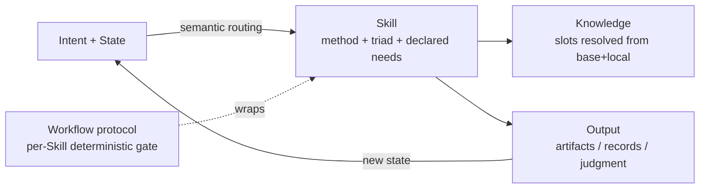

<!-- xid: 91C4B7E2D5A8 -->

# Skill and Knowledge Operating Model

This page is the repository's canonical Skill and Knowledge operating model.

## Model

Two content layers, wrapped by one generic protocol, orchestrated by semantic
routing:

- **Skill** — executable procedure (method), plus its meta identity
  (`capability` / `tuning` / `responsibility`) and declared needs
  (`knowledge_slots`, `preconditions`). Lives in `skills/`.
- **Knowledge** — evidence, facts, domain and local rules. Resolved dynamically
  from a Skill's slots against the base+local unified catalog. Lives in
  `knowledge/`.
- **Workflow protocol / kernel** — the generic, business-independent per-Skill
  control (phases, `verify`, `close`) that carries determinism. The same for all
  work; not a per-business definition. See
  [Skill operating contract](../contracts/058_skill_operating_contract.md#xid-B7A2C94F0E61)
  and
  [Workflow protocol sequence for humans](../../guides/087_workflow_protocol_sequence_for_humans.md#xid-E8B4D2F19A63).
- **Semantic routing** — selects the Skill for a goal by matching intent and
  current state against the Skill meta triad, filtered by declared
  preconditions.

## What Each Layer Holds

| Layer | Holds | Does not hold |
|------|------|------|
| Skill | procedure, judgment method, I/O contract, guardrails, the meta triad, declared knowledge slots and preconditions | copied domain facts, language-specific rule catalogs, static knowledge/capability XID lists, whole-business sequencing |
| Knowledge | domain knowledge, quality criteria, operational and local rules, glossary, evidence basis | execution procedure, orchestration, control definitions |

## Routing And Execution Order

1. identify the goal or user intent
2. route to the Skill by matching intent and current state against the meta
   triad (`capability` / `tuning` / `responsibility`) and `applies_when`
3. confirm the Skill's `preconditions` are satisfied by current state
4. run the Skill inside the workflow protocol envelope
5. resolve the Skill's `knowledge_slots` against the base+local catalog and load
   only the needed fragments
6. hand off; the next Skill is selected the same way from the new state

## Determinism Boundary

- **Deterministic**: the workflow protocol per-Skill gate (`verify`, `close`).
- **Non-deterministic**: routing (selection), Skill-internal judgment, and
  knowledge selection.

Non-deterministic steps run between deterministic protocol boundaries; they are
gated, not made deterministic themselves.

## Skill Runtime Envelope

A Skill is not only a procedure document. A loadable Skill also carries the
repository operating envelope defined in
[Skill operating contract](../contracts/058_skill_operating_contract.md#xid-B7A2C94F0E61).

New Skills do not need to start fully mature. Skills are managed as maturity
assets: `draft` → `trial` → `stable` → `governed`. At `stable` and `governed`
the envelope makes each Skill declare worklist policy, logging policy,
judgment-log policy, unknown and risk handling, closure gate, and handoff
policy. Execution/check separation is realized by the deterministic `verify`
gate, not by a per-Skill role field. Lifecycle and promotion rules are in
[Skill maturity governance](../contracts/059_skill_maturity_governance.md#xid-4E7B8D9C1A20).

## Reusable Skill Boundary

A reusable Skill owns the method, not the domain corpus.

The Skill may define:

- the judgment procedure
- required inputs and outputs
- the review or execution categories to produce
- how to record evidence, unknowns, risks, handoff, and closure
- which knowledge it needs, declared as `knowledge_slots`

The Skill must not own:

- language-specific rules, API facts, framework behavior, or coding criteria
- domain-specific examples that would block reuse for another tuning
- long checklists whose contents are evidence or local rules rather than
  procedure

The reuse that is real lives in shared `knowledge/` fragments selected by slots,
not in one Skill parameterized at runtime: because `tuning` and `responsibility`
are structural (they shape method and viewpoints), a differently-tuned Skill is
a different Skill that reuses common knowledge, not the same Skill with a runtime
flag. For a composite tuning, the resolved knowledge set is layered: common
capability knowledge, per-tuning knowledge (such as C# and SQL), and
cross-tuning boundary knowledge (such as transaction, mapping, migration, and
concurrency rules).

## Design Rules

- Put the execution or judgment method and guardrails in `Skill`.
- Put evidence, domain facts, and local rules in `Knowledge`.
- When source material mixes procedure, judgment criteria, and domain facts,
  decompose it through
  [Skill authoring with xref](../../guides/013_skill_authoring_with_xref.md#xid-3DB05A0F5F5B)
  before creating or revising Skill and Knowledge files.
- Declare knowledge needs as `knowledge_slots` resolved at runtime; do not copy
  facts into `SKILL.md` or pin static knowledge/capability XID lists.
- When the same judgment method can apply to many targets, list candidate
  targets as metadata first, select the target set from prompt and task cues,
  and load only selected XID bodies.
- Identify a Skill by its `capability` / `tuning` / `responsibility` triad; do
  not add a role field (executor is implicit; the checker is the deterministic
  protocol).
- Keep determinism in the protocol, not in Skill internals or in selection.

## Relationship Diagram

## Audit View

The model stays traceable when paired with execution records:

- `sources/` holds original evidence
- `knowledge/` holds normalized operational evidence
- `skills/` perform the work under the protocol
- `work/` records what was executed, why, and with which basis
