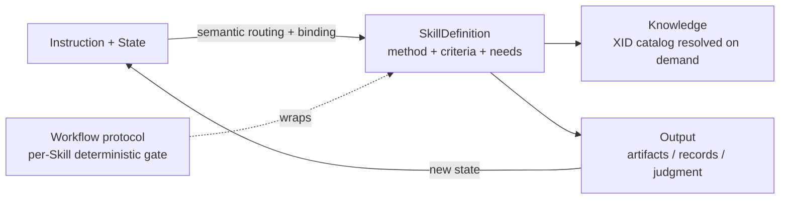

<!-- xid: 91C4B7E2D5A8 -->

# Skill and Knowledge Operating Model

This page is the repository's canonical Skill and Knowledge operating model.

## Model

Two content layers, wrapped by one generic protocol, orchestrated by semantic
routing:

- **Skill** — executable procedure (method) and reusable SkillDefinition
  contract. The canonical v1 form carries `applies_when`, `inputs`, `outputs`,
  `criteria`, `knowledge_needs`, and `control_refs`. `capability` / `tuning` /
  `responsibility` are runtime routing and binding fields derived from the
  instruction, not fixed Skill metadata. Lives in `skills/`.
- **Knowledge** — evidence, facts, domain and local rules. Resolved dynamically
  from a Skill's slots against the base+local unified catalog. Lives in
  `knowledge/`.
- **Workflow protocol / kernel** — the generic, business-independent control
  for Skill-backed and instruction-backed runs (phases, `verify`, `close`) that
  carries determinism. The same for all work; not a per-business definition. See
  [Skill operating contract](../contracts/058_skill_operating_contract.md#xid-B7A2C94F0E61)
  and
  [Workflow protocol sequence for humans](../../guides/087_workflow_protocol_sequence_for_humans.md#xid-E8B4D2F19A63).
- **Semantic routing** — selects a reusable SkillDefinition for a goal, then
  creates the runtime binding by deriving `capability` / `tuning` /
  `responsibility` from the instruction and current state.

## What Each Layer Holds

| Layer | Holds | Does not hold |
|------|------|------|
| Skill | procedure, judgment method, I/O contract, Skill-specific guards, criteria, and declared Knowledge needs | copied domain facts, runtime routing fields, common Workflow controls, static knowledge/capability XID lists, whole-business sequencing |
| Knowledge | domain knowledge, quality criteria, operational and local rules, glossary, evidence basis | execution procedure, orchestration, control definitions |

## Routing And Execution Order

1. identify the goal or user intent
2. route to a SkillDefinition by matching intent and current state against
   `applies_when` and its method contract
3. derive the runtime `capability` / `tuning` / `responsibility` binding from
   the instruction and confirm the definition's input conditions
4. run the Skill, or an instruction without an applicable Skill, inside the
   workflow protocol envelope
5. resolve the definition's `knowledge_needs` against the XID Knowledge catalog
   and load only the needed fragments at the point of use
6. hand off; the next Skill is selected the same way from the new state

## Determinism Boundary

- **Deterministic**: the workflow protocol gate (`verify`, `close`) for both
  Skill-backed and instruction-backed runs.
- **Non-deterministic**: routing (selection), Skill-internal judgment, and
  knowledge selection.

Non-deterministic steps run between deterministic protocol boundaries; they are
gated, not made deterministic themselves.

## Skill Runtime Envelope

A Skill is not only a procedure document. A loadable Skill also carries the
repository operating envelope defined in
[Skill operating contract](../contracts/058_skill_operating_contract.md#xid-B7A2C94F0E61).

New Skills do not need to start fully mature. Skills are managed as maturity
assets: `draft` → `trial` → `stable` → `governed`. For legacy split Skills,
`stable` and `governed` metadata still declares the envelope for compatibility.
SkillDefinition v1 receives worklist, logging, unknown/risk, common escalation,
closure, and handoff controls from the Workflow Protocol. Execution/check
separation is realized by the deterministic `verify` gate, not by a per-Skill
role field. Lifecycle and promotion rules are in
[Skill maturity governance](../contracts/059_skill_maturity_governance.md#xid-4E7B8D9C1A20).

## Reusable Skill Boundary

A reusable Skill owns the method, not the domain corpus.

The SkillDefinition may define:

- the judgment procedure
- required inputs and outputs
- the review or execution categories to produce
- how to record evidence, unknowns, risks, handoff, and closure
- which Knowledge it needs, declared as `knowledge_needs` and linked by XID

The canonical one-document contract is defined in
[SkillDefinition v1](../contracts/096_skill_definition_contract.md#xid-E6A19D4B72C3).
Legacy `meta.md` and `knowledge_slots` are migration inputs only.

The Skill must not own:

- language-specific rules, API facts, framework behavior, or coding criteria
- domain-specific examples that would block reuse for another tuning
- long checklists whose contents are evidence or local rules rather than
  procedure

The reuse that is real lives in shared `knowledge/` fragments selected from the
XID catalog. The same SkillDefinition can be executed with different runtime
bindings when the instruction calls for different capability, tuning, or
responsibility. Composite tuning still resolves layered common, specific, and
cross-tuning Knowledge.

## Design Rules

- Put the execution or judgment method and guardrails in `Skill`.
- Put evidence, domain facts, and local rules in `Knowledge`.
- When source material mixes procedure, judgment criteria, and domain facts,
  decompose it through
  [Skill authoring with xref](../../guides/013_skill_authoring_with_xref.md#xid-3DB05A0F5F5B)
  before creating or revising Skill and Knowledge files.
- Declare Knowledge needs as `knowledge_needs`, resolve them at runtime through
  the XID catalog, and do not copy facts into the method document. Legacy
  `knowledge_slots` are accepted only during migration.
- When the same judgment method can apply to many targets, list candidate
  targets as metadata first, select the target set from prompt and task cues,
  and load only selected XID bodies.
- Derive `capability` / `tuning` / `responsibility` in the runtime binding; do
  not add a role field (executor is implicit; the checker is the deterministic
  Workflow Protocol).
- Keep determinism in the protocol, not in Skill internals or in selection.

## Relationship Diagram

## Audit View

The model stays traceable when paired with execution records:

- `sources/` holds original evidence
- `knowledge/` holds normalized operational evidence
- `skills/` perform the work under the protocol
- `work/` records what was executed, why, and with which basis
