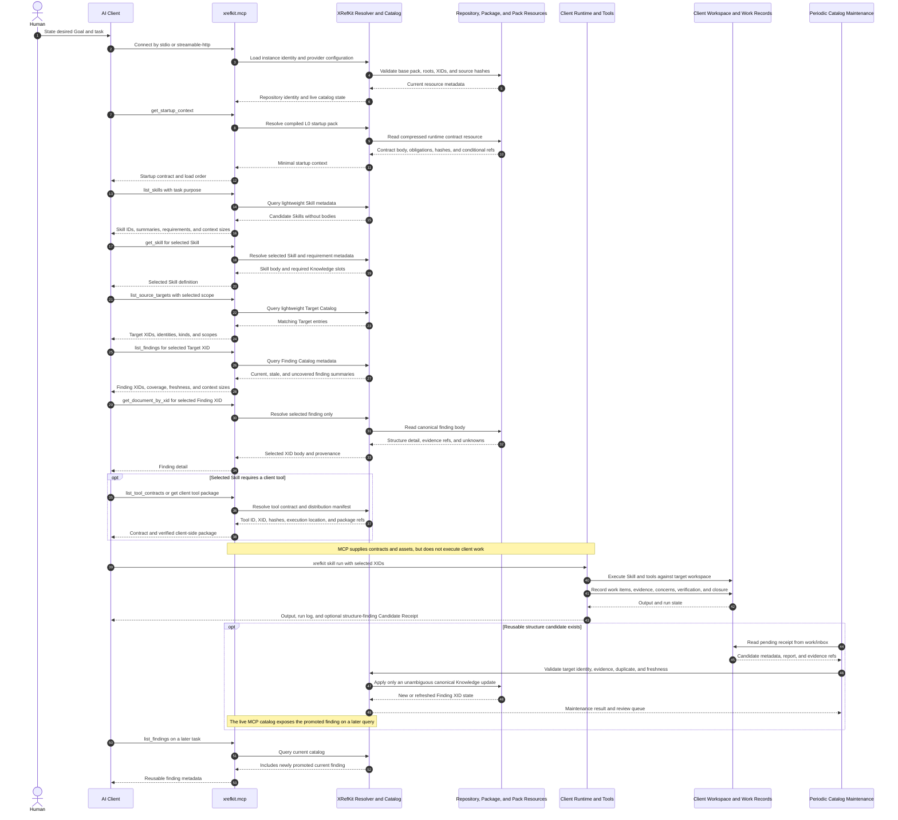

<!-- xid: F6A2C9D14E70 -->
<a id="xid-F6A2C9D14E70"></a>

# XRefKit Unified Package Migration Plan

Status: approved target architecture; implementation pending.

This page defines the repository change plan for consolidating XRefKit into a
portable Python package while preserving repository-native authoring, XID-based
progressive disclosure, Skill and Knowledge separation, and deterministic
workflow controls.

This plan is authoritative for the migration sequence. Earlier packaging
proposals remain design input only where they do not conflict with this page.

## Goal

The Goal is the operational state that must exist after migration, not the list
of migration activities.

In the achieved state:

- a user can install one Python package and invoke it as `xrefkit`
- `xrefkit init` can create or connect an XRefKit instance without requiring a
  source checkout of this repository
- repository, installed-package, and MCP-backed modes resolve the same XIDs and
  enforce the same runtime contracts
- `xrefkit mcp serve` starts the integrated read-only MCP supply plane through
  local `stdio` or network `streamable-http`
- an MCP client can obtain the compressed startup contract, list Skills and
  Knowledge, select source targets and findings, and load only selected XID
  bodies
- Skills and tools execute in the client work environment under the runtime
  protocol; the MCP server does not execute client work
- every CLI command has a defined input, state transition, output, and failure
  condition
- a Goal managed by `xrefkit goal` identifies the desired realized state and
  its acceptance conditions, rather than merely naming a task or storing a
  procedure
- periodic maintenance can promote reusable structure-analysis candidates
  without requiring catalog registration during the original change task
- root startup files, README, diagrams, and the public site describe this same
  operational state

The following changes are required to realize that state:

- Distribute XRefKit as one Python package with `xrefkit` as the command and
  runtime namespace.
- Remove the separate `xrefkit.runtime` concept; core runtime behavior belongs
  directly to `xrefkit`.
- Replace the `fm` command namespace with `xrefkit` without retaining a
  compatibility requirement.
- Integrate the adjacent XRefKit MCP implementation as the thin
  `xrefkit.mcp` adapter over the same resolver and catalogs used by the CLI.
- Supply Skill-facing commands through `xrefkit.tools`, addressed by stable
  tool IDs and XIDs without public sub-namespace requirements.
- Keep canonical Skills, Knowledge, agent instructions, and documentation as
  repository-authored assets.
- Package only the base runtime contracts required for startup and control.
- Compile base runtime contracts into semantically compressed, model-facing
  resources without losing obligations, stop conditions, escalation rules, or
  XID references.
- Let an AI select source targets and structure findings from lightweight
  catalogs before loading detailed bodies.
- Allow source-structure findings to be produced before their reuse value is
  known and promote them later through periodic catalog maintenance.
- Preserve `work/` as non-canonical operational state and `knowledge/` as the
  canonical current knowledge surface.
- Update the public `site/` content and build path so the published explanation
  matches the implemented package, catalog, runtime-resource, and MCP model.

## Non-Goals

- Do not pre-analyze every brownfield repository, service, project, or module.
- Do not load complete Skill, Knowledge, or documentation corpora at startup.
- Do not make MCP the owner of XID resolution, catalog rules, normalization, or
  periodic maintenance.
- Do not automatically turn deterministic tool candidates into accepted
  findings.
- Do not make arbitrary Markdown discoverable as a structure-finding candidate.
- Do not preserve `fm` compatibility after the repository and packaged assets
  have completed the cutover.
- Do not move human-only design history into runtime resources.

## Target Repository Layout

```text
XRefKit/
├─ pyproject.toml
├─ ownership.yaml
├─ AGENTS.md
├─ CLAUDE.md
├─ CHATGPT.md
├─ README.md
│
├─ xrefkit/
│  ├─ __init__.py
│  ├─ __main__.py
│  ├─ cli.py
│  ├─ xref.py
│  ├─ context.py
│  ├─ skillrun.py
│  ├─ catalog.py
│  ├─ catalog_maintenance.py
│  ├─ registry.py
│  ├─ resolver.py
│  ├─ loaders.py
│  ├─ runlog.py
│  ├─ workspace.py
│  ├─ hashing.py
│  ├─ models/
│  ├─ skills/
│  │  ├─ catalog.py
│  │  ├─ loader.py
│  │  ├─ runner.py
│  │  └─ validator.py
│  ├─ tools/
│  │  ├─ __main__.py
│  │  ├─ registry.py
│  │  └─ <tool implementations and packaged assets>
│  ├─ mcp/
│  │  ├─ server.py
│  │  ├─ catalog_adapter.py
│  │  ├─ resources.py
│  │  └─ transport.py
│  └─ resources/
│     └─ base/
│        ├─ manifest.json
│        ├─ current.json
│        ├─ generations/<generation>/contracts.json
│        ├─ generations/<generation>/model_body.md
│        ├─ contracts.json       compatibility snapshot
│        └─ model_body.md        compatibility snapshot
│
├─ skills/
├─ skills_private/
├─ knowledge/
├─ knowledge_private/
├─ agent/
│  └─ prompts/
├─ docs/
├─ work/
├─ observations/
├─ sources/
├─ tests/
├─ samples/
├─ packages/
└─ handoff/
```

The Python modules under `xrefkit.skills` implement Skill discovery, loading,
validation, and execution. Canonical Skill content remains under `skills/` and
`skills_private/` while authoring in this repository.

The Python modules and packaged assets under `xrefkit.tools` implement commands
used by Skills. Tool selection is by tool ID or XID; the internal directory
layout is not part of the public tool identity.

## Runtime Resource Model

`docs/` and `agent/` remain the canonical authoring locations. Runtime code
must not depend on those filesystem paths being present after package
installation.

The resolver supports three providers behind one XID-based interface:

1. Repository provider: reads live repository assets during development.
2. Package provider: reads compiled base resources and installed packs.
3. MCP provider: resolves resources through an MCP server when required by the
   active client mode.

Callers request an XID, not a physical path. A path in an XID-bearing Markdown
link remains a source location and diagnostic handle.

Provider activation and precedence are mode-specific:

| Mode | Active providers in resolution order |
| --- | --- |
| repository | repository roots, installed content packs, packaged base resources |
| installed instance | writable instance roots, installed content packs, packaged base resources, optional MCP fallback |
| `mcp_only` client | MCP provider only after the local connection bootstrap |
| MCP server | repository or installed-instance roots plus packaged base resources; MCP provider forbidden |

An MCP fallback resolves only an XID that is absent from all earlier local
providers. It never overrides a locally resolved XID.

If multiple active providers expose the same XID:

- equal normalized content hashes are deduplicated
- different hashes are a hard conflict unless the instance manifest declares
  an explicit allowed shadow relationship and provenance
- base runtime contract XIDs cannot be shadowed
- provider order must not silently hide a conflicting XID

When a compiled base resource is stale against an available canonical source,
package-mode and MCP-server startup fail and require regeneration. Repository-
native authoring may continue from canonical source documents, but it must not
claim packaged parity or start an MCP server from the stale pack. There is no
silent live-source fallback for a stale required L0 pack.

An MCP server must reject any resolver configuration containing an MCP
provider. This prevents MCP-to-MCP chains, cycles, and hidden remote authority.

## Base Runtime Contract Compilation

Base runtime XIDs are declared in a reviewed source manifest. The build does
not include all of `docs/`.

Normative obligations are not inferred from arbitrary prose during the build.
Each canonical base-runtime source must contain structured obligation entries
with stable IDs, level, condition, statement, and required references. Human
review accepts the mapping from normative prose to those entries as part of
canonical document authoring.

The reviewed base-runtime manifest records:

- included source XIDs and expected source hashes
- the complete expected obligation-ID set for each source XID
- conditional-load references
- compiler profile and version
- numeric token budgets for L0, each L1 class, and aggregate selected context
- token estimator identity and version
- budget approval owner and approval date

Exact budget values are decided and reviewed in Phase 0. Later phases consume
the manifest values and do not use an undocumented `approved token budget`.

The compiler produces a runtime contract pack containing:

- source XIDs and content hashes
- compiler version and build profile
- stable obligation IDs
- normalized `must`, `must_not`, stop, escalation, logging, and closure rules
- conditional XID load references
- a semantically compressed model-facing body
- integrity and token-budget measurements

The compiler may remove background, examples, repeated prose, related-link
lists, and source-path repetition. It must preserve normative obligations,
conditions, exceptions, authority boundaries, unknown handling, stop and
escalation rules, closure requirements, and XID references.

Runtime contract compilation is a build operation, not a runtime AI summary.
Generated resources are not edited manually.

The formal consumer contract is generation-based: consumers MUST read
`current.json` first, resolve the referenced generation, and read
`contracts.json` and `model_body.md` from that same generation directory.
Top-level `contracts.json` and `model_body.md` are compatibility snapshots only
and MUST NOT be used as the authoritative pair for generation consistency.

Parity verification is deterministic after authoring acceptance:

1. lint reports normative-looking prose that has no structured obligation as a
   review candidate, never as a confirmed omission
2. a human accepts or updates the canonical structured obligation entries and
   reviewed manifest
3. the compiler reads only accepted structured entries
4. `verify-base` checks exact set equality among manifest obligation IDs,
   canonical structured entries, and compiled obligation IDs
5. source hashes, reference closure, and numeric token budgets are checked
   mechanically

Lint candidates have an explicit disposition lifecycle:

- `pending`: not yet reviewed
- `accepted_obligation`: converted to or linked with a structured obligation
- `non_normative`: reviewed and confirmed not to state a runtime obligation
- `out_of_runtime_scope`: normative, but excluded from the declared runtime
  contract scope with a reviewed reason

`build-base --draft` may emit a non-releasable preview while `pending`
candidates remain. Release `verify-base` and the Phase 2 exit gate fail when any
candidate for an included source XID remains `pending`. This permits initial
corpus triage without allowing warning-only parity at release.

AI may propose obligation entries, but it cannot approve semantic parity. The
human authoring acceptance establishes meaning; the deterministic gate proves
that the accepted structure was transferred without omission or mutation.

Runtime loading has three levels:

- L0 startup pack: minimal base control and XID routing contract.
- L1 selected contract: loaded only when a condition such as Skill execution
  becomes active.
- L2 canonical source: loaded only for authoring, audit, diagnosis, or contract
  regeneration.

## Source Structure Knowledge Model

Structure information is split into three progressively disclosed layers:

1. Source Target Catalog: lightweight identities for repositories, services,
   projects, modules, directories, or other bounded targets.
2. Structure Finding Catalog: available finding XIDs, scope, analysis kind,
   coverage, source revision, verification date, status, and unresolved items.
3. Structure Finding: detailed structure, flows, boundaries, bindings,
   prohibited changes, evidence, and unknowns.

The target identity key is based on repository identity, bounded source scope,
and target kind. Filesystem path alone is not a stable cross-repository
identity.

Expected canonical locations:

```text
knowledge/source_analysis/
├─ 169_source_structure_target_catalog.md
├─ 170_current_source_structure_findings_catalog.md
└─ <number>_<target>_structure_findings.md
```

The exact page number for the target catalog must be allocated after checking
the current document registry at implementation time.

## Candidate and Promotion Model

Source analysis may finish before anyone knows whether the result should
become reusable canonical Knowledge. Analysis therefore produces a candidate
without requiring prior target or finding catalog registration.

Expected operational locations:

```text
work/
├─ inbox/
│  └─ source_structure_findings/
├─ reports/
├─ source_structure_overview/
└─ sessions/
```

A candidate receipt contains at least:

- candidate or finding XID
- analysis artifact path
- evidence path
- repository identity
- target hint
- source scope
- source revision
- producer Skill
- analysis date
- unresolved verification
- processing status

XID assignment occurs when the candidate is created. Catalog publication may
occur later without changing the identity referenced by earlier work records.

## Periodic Catalog Maintenance

`xrefkit catalog maintain --apply-safe` processes candidate receipts and only
applies changes that can be established without ambiguous judgment.

The maintenance sequence is:

1. Read pending receipts from `work/inbox/source_structure_findings/`.
2. Validate required metadata, source pointers, XID uniqueness, and source
   revision.
3. Load only the referenced report and evidence required for the candidate.
4. Match the candidate to a target by explicit target XID or exact repository
   identity and source scope.
5. Check duplicate, conflict, coverage, and freshness conditions.
6. Create or refresh canonical target and finding entries when all automatic
   conditions are satisfied.
7. Send ambiguous cases to a review queue without silently discarding them.
8. Write an idempotent maintenance report under `work/sessions/`.

`xrefkit catalog reconcile` is a lower-frequency backstop. It scans only
declared structure-analysis output roots and files carrying explicit candidate
metadata. It may recreate a missing receipt, but it must not infer canonical
Knowledge from arbitrary Markdown.

Automatic maintenance may register, refresh, or mark a finding stale. It must
not resolve conflicting target identity, conflicting current facts, missing
evidence, or unsupported semantic classification without review.

## Standard Command Surface

The target command groups are:

```text
xrefkit init       initialize or connect an XRefKit instance
xrefkit xref       XID init, check, fix, search, show, and lifecycle operations
xrefkit ctx        context pack construction
xrefkit skill      Skill list, check, run, progress, verify, and close
xrefkit tools      XID-backed individual tool execution
xrefkit catalog    Skill, Knowledge, target, finding, maintenance, and reconcile
xrefkit pack       package and content-pack validation
xrefkit gate       deterministic gate evaluation
xrefkit goal       goal, lease, packet, and wake state
xrefkit dashboard  local operational views
xrefkit mcp        MCP server startup
```

Command documentation, startup contracts, Skill instructions, tests, and
examples must use this surface after cutover.

## Command Operation Contracts

### `xrefkit init`

Input:

- target instance directory
- optional package or local-content roots
- optional startup-file set for supported AI clients

Behavior:

- create or validate the instance manifest
- register repository, package, local, and external content roots
- materialize or update `AGENTS.md`, `CLAUDE.md`, and `CHATGPT.md` startup
  pointers from the packaged startup template without overwriting unrelated
  user instructions
- verify that the packaged base runtime resources resolve

Output and failure:

- return the instance identity, configured roots, startup XID, and validation
  result
- fail on conflicting instance identity, duplicate XIDs, an invalid manifest,
  or an unavailable base runtime pack

### `xrefkit xref`

Behavior by operation:

- `init`: add missing XIDs to eligible authored Markdown
- `check`: detect missing, duplicate, and broken XID references without mutation
- `rewrite`: update diagnostic filesystem paths while preserving referenced
  XIDs
- `fix`: run init, rewrite, and check as one controlled mutation
- `index`: emit the current XID-to-resource mapping and provider identity
- `search`: return lightweight matching entries without loading full bodies
- `show`: resolve and return one selected XID body and provenance
- `deprecate`: mark a canonical resource as replaced and point to its successor

All operations use the same provider-independent resolver. Mutation operations
require an authored repository or writable instance root. Read-only package and
MCP providers reject mutation explicitly.

### `xrefkit ctx`

`xrefkit ctx pack` accepts seed XIDs, a purpose, and a context budget. It
resolves only the selected dependency closure allowed by the active contract,
deduplicates shared obligations, and emits:

- model-facing context body
- included XIDs and content hashes
- omitted candidates and the reason for omission
- missing or stale dependencies
- estimated context size

It does not recursively load every Markdown link and fails when a required seed
or required contract dependency cannot be resolved within the declared mode.

### `xrefkit skill`

Behavior by operation:

- `list`: return lightweight Skill routing metadata and publication boundary
- `check`: validate protocol enforcement requirements and report convention
  lint separately
- `index`: derive routing indexes from catalog-visible Skill metadata
- `merge-plan`: produce a deterministic intake report for an older Skill asset
- `run`: resolve the selected Skill and Knowledge inputs, validate maturity and
  preconditions, assign execution/check roles, and create the run envelope
- `phase`: record an allowed lifecycle transition
- `workitem`: add or update a concrete unit of work
- `artifact`: record output or evidence with ownership and status
- `concern`: record an unknown, risk, or non-trivial judgment
- `tokens`: record measured context and output usage
- `verify`: execute deterministic progression checks from the checker boundary
- `close`: accept completion only when required work, evidence, concerns,
  verification, and handoff conditions are satisfied

`run` returns the run-log path and the exact selected Skill document; clients do
not open the Skill body before a successful run. Invalid maturity, unresolved
required Knowledge, an illegal phase transition, or failed closure produces a
non-zero result with structured reasons.

### `xrefkit tools`

Behavior by operation:

- `list`: return tool IDs, XIDs, contracts, execution location, side effects,
  and required assets
- `show <tool-id>`: return one selected tool contract without executing it
- `run <tool-id>`: validate the contract, materialize required packaged assets,
  and execute the tool in the client work environment

The public identity is the tool ID or XID, not an internal Python namespace.
Tool output is evidence or a candidate unless the consuming Skill performs the
required semantic judgment. MCP may distribute tool contracts and packages but
does not execute client-side tools.

Executable client-package distribution is an explicit exception to the
inert-definition supply principle. A server-provided package hash proves
transfer integrity only; when the hash and package come from the same server it
does not independently prove publisher authenticity.

Remote executable distribution therefore requires an external trust anchor:

- an authenticated and TLS-protected deployment boundary, and
- a release-manifest digest or signing key pinned in client configuration by a
  channel independent of the serving MCP response

Local `stdio` and explicitly trusted localhost deployments may use the local
installation boundary as the trust anchor. Network `/dist` routes are disabled
unless the deployment declares the remote distribution trust configuration.
Expanding executable distribution beyond declared client tools requires a new
reviewed boundary decision.

### `xrefkit catalog`

Behavior by operation:

- list Skills, Knowledge, source targets, findings, packs, and tool contracts as
  lightweight entries
- get one selected entry or body by ID or XID
- rank or filter candidates from task purpose without loading every body
- `maintain --apply-safe`: validate pending receipts and promote only
  unambiguous candidates
- `reconcile`: detect missing receipts and stale registrations from declared
  roots without treating arbitrary Markdown as Knowledge

Every list result carries enough identity, scope, status, freshness, and
content-size metadata for a client to decide whether detail expansion is
needed.

### `xrefkit pack`

Behavior by operation:

- `list`: show installed and available content packs with versions and roots
- `lint`: validate pack manifests, declared roots, hashes, and core requirements
- `build-base`: compile the reviewed base-runtime-XID manifest into packaged
  runtime resources
- `verify-base`: check source hashes, obligation parity, reference closure, and
  token budgets
- `sync`: fetch or update declared content packs, verify integrity, and reject
  merged XID collisions

Pack operations never make a generated index more authoritative than the source
files and manifests.

### `xrefkit gate`

`xrefkit gate eval` runs deterministic, machine-only checks against the declared
artifact or diff and emits individual check results plus the aggregate gate
state. It may block a workflow on a deterministic contract violation, but it
does not convert tool candidates into semantic defects or replace human
acceptance.

### `xrefkit goal`

A Goal record contains:

- desired realized state
- acceptance conditions
- current observed state
- unresolved blockers and risks
- supporting packets and evidence
- lease and wake state for continuation

Behavior by operation:

- `define`: create or revise the desired-state and acceptance contract
- `show`: return desired state, observed state, gaps, and continuation status
- `packet append/latest`: persist or retrieve the minimum continuation packet
- `lease acquire/release/show`: coordinate one active continuation owner
- `wake observe/show`: record and inspect a continuation trigger
- `complete`: close only when acceptance conditions are evidenced; exhaustion
  of tasks or budget alone does not complete a Goal

The Goal is not a task list. Work items and migration phases are means used to
reach the Goal; they do not redefine it.

### `xrefkit dashboard`

- `serve`: start a local read-only operational view over run logs, Goal state,
  catalog maintenance, and closure results
- `data`: emit the same normalized dashboard data without starting a web server

The dashboard observes canonical or operational state and does not mutate Skill
runs or accept closure.

### `xrefkit mcp`

Local client startup:

```powershell
xrefkit mcp serve --repo . --transport stdio
```

Network startup:

```powershell
xrefkit mcp serve --repo . --transport streamable-http --host 127.0.0.1 --port 8000
```

At startup the command:

1. loads the instance manifest and configured resource providers
2. validates the compiled base runtime pack and repository identity
3. initializes the shared resolver and live catalog view
4. exposes the MCP tools and resources over the selected transport
5. exposes plain-HTTP distribution routes next to `streamable-http` only when
   artifact distribution is enabled

The MCP server provides startup context, repository identity, catalogs,
selected XID bodies, Skill definitions, Knowledge, and tool packages. It is
read-only with respect to client work and does not run Skills, catalog
promotion, or client tools. Network authentication remains an external gateway
or deployment-boundary responsibility.

The server rejects startup when its provider graph contains an MCP provider.
For network executable distribution, authentication alone is insufficient; the
client must also use the independently pinned release trust described under
`xrefkit tools`.

## MCP Boundary

`xrefkit.mcp` exposes the core resolver and catalogs. It does not duplicate
catalog construction, XID lookup, contract compilation, candidate promotion,
or Skill normalization.

The MCP surface provides operations equivalent to:

- repository identity and startup context
- list and get Skills
- list and get Knowledge entries
- list source targets
- list findings for a selected target
- get a selected finding by XID
- list tool contracts
- resolve a document by XID

MCP responses return lightweight lists before detailed bodies. The adjacent
XRefKit MCP repository is archived after equivalent behavior, tests, and client
configuration have moved into this repository.

## MCP Realization Sequence

The MCP integration realizes remote supply and progressive disclosure of
XRefKit control and domain context. Execution and repository mutation remain in
the client environment.



The sequence establishes these boundaries:

- MCP starts and serves the same core resolver used by the CLI.
- Startup transfers the compiled L0 contract, not the full documentation tree.
- Lists are returned before bodies; only explicitly selected XIDs are expanded.
- Tool contracts and packages may be distributed, but execution is client-side.
- Skill run logs and candidate receipts are written in the client workspace.
- Periodic catalog maintenance is an XRefKit core operation, not an MCP-side
  mutation tool.
- A promoted finding becomes visible through the live MCP catalog without
  creating a second MCP-owned source of truth.

## Current Public Site and Required Update

The current `site/` tree contains approximately 160 files and is a static
GitHub Pages artifact with:

- a root public slide catalog at `site/index.html`
- language indexes at `site/en/index.html` and `site/ja/index.html`
- shared viewer and CSS assets under `site/assets/`
- English Decks 063 and 064
- Japanese Decks 054, 055, 056, 063, and 065
- legacy top-level slide routes for Decks 054, 055, and 056
- rendered HTML, PNG, and narration manifests under language asset and slide
  directories

The current Pages workflow only uploads the checked-in `site/` directory. It
does not rebuild the site from `human-docs/` or validate that rendered output
matches its source before deployment.

Known content conflicts with the target architecture are:

- the root landing flow says `Skills / Flows / Checks`, while the current model
  uses Skill, Knowledge, and the wrapping workflow protocol
- the root catalog describes the old Skill, domain knowledge, Flow, and Group
  structure
- Deck 065 describes `docs / flows / capabilities / skills / knowledge / work /
  sources` as current independent layers
- Deck 065 instructs users to start execution with `fm skill run`
- Deck 065 describes the current product only as a repository OS and does not
  explain the portable `xrefkit` package, compiled runtime resources,
  list-first XID loading, periodic candidate promotion, or integrated MCP
- generated site content and editable `human-docs/` sources can drift because
  deployment does not regenerate or compare them

The site migration must use source-first generation:

```text
human-docs scripts, manifests, HTML, CSS, and diagram sources
  -> xrefkit tool: site-build
  -> site/ generated output
  -> link, manifest, text, image, and responsive visual checks
  -> GitHub Pages artifact
```

Required content changes are:

1. Update the root landing page to explain the Python package, Skill and
   Knowledge separation, workflow protocol, XID progressive disclosure,
   structure target and finding catalogs, and MCP as an adapter.
2. Update English and Japanese indexes so titles, summaries, language labels,
   and deck availability describe the current material.
3. Rebuild Deck 065 as the current XRefKit architecture overview. Replace the
   old layer and `fm` slides, update narration and manifests, and regenerate all
   HTML and PNG output. Include the unified package layout, compiled runtime
   contracts, catalog-first loading, candidate maintenance, and integrated MCP.
4. Add or regenerate an English current-architecture counterpart for Deck 065
   so the English public entry does not depend on a Japanese-only architecture
   explanation.
5. Review Deck 056 against the current Skill-centric model. Revise it or remove
   it from the current catalog if its Flow and Group model remains historical.
6. Review Decks 054, 055, 063, and 064 for terminology and boundary drift. Do
   not rewrite material that remains accurate, but do not publish obsolete
   architecture as current.
7. Keep editable sources, narration manifests, generated site files, README
   visuals, and video inputs aligned when they explain the same architecture.
8. Remove or redirect duplicate legacy slide routes only after all current
   inbound links have been inventoried.

The Pages workflow must build the site before upload, fail when generated
output differs from the expected artifact, validate local links and manifest
paths, and render representative desktop and mobile pages for visual checking.
Once reproducible generation is proven, `site/` may be removed from the normal
authoring surface and treated strictly as derived output as declared by
`ownership.yaml`.

## Pre-Phase Design Decisions

The following decisions must be accepted before implementation phases consume
them:

1. Goal storage schema: desired state, acceptance conditions, observed state,
   evidence, packets, leases, wakes, and completion semantics. The judgment
   boundary is recorded in
   `work/judgments/2026-07-10_judgment_goal_state_storage_boundary.md`.
2. Base obligation authoring schema: structured obligation fields, normative-
   prose lint behavior, pending-candidate blocking and disposition rules, human
   acceptance, and manifest parity rules.
3. Runtime budget manifest: numeric budgets, estimator, approval owner, and
   revision procedure.
4. Provider and shadow policy: active mode, allowed roots, duplicate behavior,
   base-contract non-shadowing, and stale-pack refusal.
5. Remote executable distribution trust: authenticated deployment boundary and
   independently pinned release manifest or signing key.

Phase 0 prepares and accepts these decisions. Phase 1 and later implement them;
they do not redefine them inside infrastructure work.

Phase 0 is therefore not a lightweight inventory sprint. It is an inventory
plus design-acceptance phase whose estimate must include review and acceptance
of the five pre-phase decisions.

## Migration Command Authority

The instance manifest carries one command-authority state:

```text
legacy_authoritative  ->  cutover_ready  ->  xrefkit_authoritative
```

- `legacy_authoritative`: `fm` remains the operationally authoritative command
  surface in startup contracts, canonical Skills, docs, and normal routing.
  New `xrefkit` commands are shadow implementations used only by migration
  tests and explicit pilot runs.
- `cutover_ready`: every replacement command and packaged resource has passed
  its phase gate, but authoritative repository content still names `fm`.
- `xrefkit_authoritative`: Phase 8B atomically switches startup files,
  canonical Skills, docs, tests, CI, README, and public explanatory content to
  `xrefkit`.

Phase 4 must not rewrite canonical Skill command references. It supplies
`xrefkit` implementations, fixtures, and explicit pilot execution while the
manifest remains `legacy_authoritative`. A mixed state in which normal routing
loads `xrefkit` Skills under an `fm` startup contract is invalid.

The Phase 8B entry controller owns the
`legacy_authoritative -> cutover_ready` transition. It may request the
transition only after `xrefkit gate eval --profile command-cutover-readiness`
has deterministically confirmed the exit evidence for Phases 1 through 7 and
Phase 8A. The gate emits readiness evidence and does not mutate authority state.
A human-approved manifest update applies `cutover_ready` using that evidence.
Phase 8B must not begin from `legacy_authoritative` or from stale readiness
evidence.

Phase 9 removes `fm` only after the repository is already
`xrefkit_authoritative`. Compatibility is not a final requirement, but the
authority transition is explicit and testable.

## Migration Phases

### Phase 0: Baseline and Migration Inventory

Deliverables:

- inventory every `fm` command, import, test, documentation reference, and
  Skill command reference
- inventory root startup instructions in `AGENTS.md`, `CLAUDE.md`, and
  `CHATGPT.md`, including their startup XIDs and package-mode behavior
- inventory `README.md` claims, quick-start commands, folder descriptions,
  media links, and referenced image assets
- identify the editable source and generated output for
  `human-docs/en/assets/why_xrefkit_needed/whatis_xrefkit.png` and
  `human-docs/en/assets/xrefkit_repository_snapshot/xrefkit_repository_snapshot.png`,
  including corresponding Japanese or site outputs where they exist
- inventory the complete `site/` catalog, language variants, slide routes,
  manifests, editable sources, generated assets, inbound links, and Pages
  deployment behavior
- classify each public deck as current, update-required, historical, or
  removable; record Deck 065 as update-required and require an explicit
  disposition for Deck 056
- inventory the adjacent MCP repository's server, catalog, startup-pack,
  distribution, and test surfaces
- classify documents into base runtime, selected runtime, and human-only sets
- inventory root `tools/` implementations and non-Python packaged assets
- record current token sizes for the repository-native and MCP startup payloads
- author and obtain human acceptance for the pre-phase Goal storage,
  obligation schema, numeric token-budget manifest, provider policy, and remote
  distribution trust decisions
- set and verify instance command authority as `legacy_authoritative`

Exit gate:

- every current command and MCP surface has a target owner and migration phase
- no current behavior is removed without an explicit replacement or approved
  deletion
- all pre-phase design decisions are accepted and referenced by their consuming
  phases
- numeric runtime token budgets and their approval metadata exist in the
  reviewed manifest

### Phase 1: Python Package and CLI Foundation

Deliverables:

- add or update `pyproject.toml` for the `xrefkit` package and console command
- make `python -m xrefkit` the target entry point
- implement `xrefkit init` and the command operation result/error schema
- implement the separately accepted Goal storage schema and migrate existing
  packet, lease, and wake behavior without revisiting its conceptual boundary
- establish shared models, resolver, registry, loaders, hashing, workspace, and
  run-log modules under `xrefkit`
- add command-parity tests before relocating behavior from `fm`

Exit gate:

- the package installs in a clean environment
- command help and deterministic fixture tests run from the installed package
- each command group has contract tests for successful output, refusal, and
  invalid input
- repository mode and installed-package mode resolve the same fixture XIDs

### Phase 2: Runtime Contract Compiler

Deliverables:

- reviewed base-runtime-XID manifest
- deterministic contract extractor and compiler
- canonical structured-obligation authoring and lint support
- obligation and conditional-load representation compiled only from accepted
  structured entries
- generated package resources with source hashes and compiler version
- exact obligation-ID set parity and numeric token-budget verification
- draft-build support plus release blocking for undispositioned normative-prose
  lint candidates

Exit gate:

- every manifest obligation ID exists exactly once in accepted canonical
  structure and exactly once in the compiled pack
- normative-looking prose without structured coverage is visible as a human
  review candidate and cannot be silently treated as parity success
- draft compilation may proceed with pending candidates, but release
  `verify-base` and Phase 2 completion fail until every included-source
  candidate has an accepted disposition
- every referenced runtime XID resolves
- a source change makes the generated pack stale deterministically
- L0 and L1 outputs stay within the numeric manifest budgets under the recorded
  estimator version

### Phase 3: XID and Context Cutover

Deliverables:

- repository, package, and MCP resource providers
- provider-independent XID resolution interface
- mode-specific provider activation, duplicate detection, explicit shadowing,
  base-contract non-shadowing, and stale-pack refusal
- MCP-provider chain and cycle rejection
- context builder that loads catalogs before selected bodies
- removal of runtime dependence on repository-relative `docs/` paths

Exit gate:

- the same startup XID resolves in repository and installed-package modes
- missing or conflicting XIDs fail explicitly
- equal duplicate hashes deduplicate, conflicting hashes fail unless an allowed
  non-base shadow relation is declared, and stale L0 packs refuse package or
  MCP startup
- MCP server configuration containing an MCP provider is rejected
- no startup path recursively loads transitive document links

### Phase 4: Skill and Tool Consolidation

Deliverables:

- `xrefkit.skills` discovery, validation, execution, and closure modules
- `xrefkit.tools` registry and stable tool-ID execution
- relocation or wrapping of current root tools and required assets
- migration fixtures and explicit pilot Skill runs using the `xrefkit` command
  surface without changing canonical routed Skill references

Exit gate:

- a representative Skill completes run, work-item, artifact, concern, verify,
  and close through the installed package
- required tools resolve by tool ID or XID without exposing internal namespace
  layout
- deterministic tool output remains candidate evidence, not an accepted
  semantic verdict
- command authority remains `legacy_authoritative`; normal startup and routing
  still use `fm`

### Phase 5: Target and Finding Catalogs

Deliverables:

- Source Target Catalog schema and canonical page
- Target XID linkage added to the current finding catalog schema
- list-first and selected-detail resolver operations
- freshness, coverage, source revision, and unresolved-verification fields
- Structure Selection Gate usable by design and implementation Skills

Exit gate:

- an AI can select a target without loading finding bodies
- it can select finding metadata without loading unrelated findings
- stale and uncovered structure cannot be presented as current fact
- missing coverage routes to source analysis rather than whole-repository
  context loading

### Phase 6: Candidate Maintenance Pipeline

Deliverables:

- candidate receipt schema
- `work/inbox/source_structure_findings/` discovery
- `catalog maintain --apply-safe`
- `catalog reconcile`
- duplicate, conflict, freshness, idempotency, and review-queue tests
- scheduled-maintenance prompt and operational guidance

Exit gate:

- an unregistered analysis result can be used immediately by its creating task
- periodic maintenance promotes an unambiguous candidate exactly once
- ambiguous candidates remain visible in the review queue
- rerunning maintenance produces no duplicate target or finding entries

### Phase 7: MCP Integration

Deliverables:

- MCP server and adapter under `xrefkit/mcp/`
- `xrefkit mcp serve` with `stdio` and `streamable-http` startup, repository and
  installed-instance modes, health information, and clean shutdown behavior
- catalog-first target and finding operations
- compiled startup contract delivery
- parity tests against the adjacent MCP repository's required behavior
- updated client startup examples and configuration
- MCP-provider chain rejection and remote executable-distribution trust checks

Exit gate:

- CLI and MCP return the same XID identity, catalog metadata, and selected body
- a clean installed package can start MCP through both required transports and
  serve the compressed startup contract without the adjacent MCP repository
- MCP startup does not become a prerequisite for repository-native startup
- MCP contains no independent catalog or resolution rules
- server startup rejects MCP-backed provider graphs
- remote `/dist` remains disabled unless authenticated transport and an
  independently pinned release trust anchor are configured

### Phase 8A: Publication Build and Verification Pipeline

Dependency: Phase 4 tool execution must be complete. Phase 8A may proceed in
parallel with Phases 5 through 7 once that dependency is satisfied.

Deliverables:

- implement the source-first site build as an XID-backed `xrefkit.tools`
  command
- define canonical source-to-output mappings for `human-docs/`, README images,
  slide manifests, generated HTML, PNG, video inputs, and `site/`
- add a check-only Pages job that builds into a temporary comparison output and
  compares it with the currently authoritative checked-in `site/`
- add generated-output drift, local-link, manifest-path, desktop-render, and
  mobile-render checks
- inventory legacy slide routes and external inbound links without changing
  current public content

Exit gate:

- a clean checkout reproduces the expected `site/` output deterministically
- CI rejects stale generated output and broken publication references
- representative renders have no clipped text, broken images, overlap, or
  unusable navigation
- command authority remains `legacy_authoritative`
- the production Pages upload still publishes the existing authoritative
  checked-in `site/`; Phase 8A validation output cannot become the deployment
  artifact

### Phase 8B: Authoritative Command and Content Cutover

Entry conditions:

- `xrefkit gate eval --profile command-cutover-readiness` has passed against
  current Phase 1 through 7 and Phase 8A evidence
- a human-approved manifest transition has set command authority to
  `cutover_ready`
- no readiness input changed after the evidence hash was produced

Deliverables:

- replace `python -m fm` references in agent contracts, docs, Skills, tests,
  samples, and operational instructions
- update root `AGENTS.md`, `CLAUDE.md`, and `CHATGPT.md` so every supported AI
  client starts from the same current XID-based contract and does not depend on
  repository-only paths in installed-package mode
- update `README.md` to describe the unified `xrefkit` package, current command
  surface, runtime-resource compilation, Skill and Knowledge placement,
  catalog-first loading, periodic candidate promotion, and integrated MCP
- update every image referenced by `README.md` whose content depicts the old
  repository layout, command namespace, runtime path, catalog model, or MCP
  boundary
- update the editable diagram source before regenerating PNG output; when an
  existing image has no maintainable source, create one rather than treating a
  manually edited bitmap as canonical
- keep English, Japanese, `site/`, and `human-docs/` variants synchronized when
  they represent the same diagram
- use the Phase 8A source-first build and verification pipeline
- switch `.github/workflows/pages.yml` from checked-in-site publication to the
  generated and verified site artifact
- update `site/index.html`, both language indexes, deck catalogs, narration
  manifests, slide HTML, and generated PNGs according to the Current Public
  Site section of this plan
- regenerate Deck 065 in Japanese and English against the implemented
  architecture and explicitly disposition the obsolete parts of Deck 056
- validate or redirect legacy top-level slide routes without breaking known
  inbound links
- update ownership zones for `xrefkit/` and remove obsolete `fm/` ownership
- regenerate routing and derived indexes
- update quality gates and CI commands
- change the instance command authority from `cutover_ready` to
  `xrefkit_authoritative` in the same reviewed cutover bundle

Exit gate:

- no authoritative file invokes `fm`
- normal startup, semantic routing, canonical Skills, and CI all resolve the
  `xrefkit_authoritative` command surface
- root AI startup files agree on the current startup contract and packaged
  resource behavior
- README commands, folder tree, architecture explanation, and links match the
  implemented package
- README-referenced images show the implemented package, XID loading, catalog,
  and MCP boundaries without obsolete `fm`, separate-MCP, or old-layout labels
- regenerated images render legibly at their README display size and all local
  media links resolve
- the Pages workflow generates `site/` from canonical human-facing sources
  before upload and rejects stale generated output
- the root site, language indexes, Deck 065, and any retained Deck 056 content
  contain no obsolete `fm`, separate-MCP, independent-capabilities-layer, or
  Flow/Group-as-current-model claims
- representative desktop and mobile renders have no clipped text, broken
  images, overlapping controls, or unusable navigation
- all XID and Skill validation passes through `xrefkit`
- generated indexes and links are current
- no intermediate mixed-authority state is published
- the Pages deployment artifact comes from the same verified generation run,
  not from a separately maintained checked-in tree

### Phase 9: Cutover and Removal

Deliverables:

- remove `fm/` after all callers and tests have migrated
- archive the adjacent XRefKit MCP repository after parity acceptance
- remove duplicate startup-pack and catalog implementations
- build and install the release candidate in a clean workspace
- execute a complete brownfield vertical slice
- verify Phase 8A and Phase 8B completion before deleting legacy code

The vertical slice must demonstrate:

1. package installation
2. compressed startup contract load
3. Skill selection
4. target list selection
5. finding list selection
6. selected finding expansion
7. missing-coverage analysis and candidate creation
8. Skill run, verification, and closure
9. periodic candidate promotion
10. MCP retrieval of the promoted finding

Exit gate:

- no production path imports or invokes `fm`
- no production path depends on the adjacent MCP repository
- repository-native, installed-package, and MCP-backed modes pass the shared
  fixture corpus
- the release candidate satisfies startup and selected-context token budgets

## Cross-Phase Validation

Each phase must preserve or add tests for:

- XID uniqueness and resolution
- source-hash freshness
- exact structured-obligation-ID parity after human authoring acceptance
- numeric manifest token budgets under the recorded estimator version
- provider-mode precedence, duplicate conflict, shadowing, stale-pack refusal,
  and MCP-chain rejection
- command-authority state and mixed-authority refusal
- remote executable-distribution trust-anchor enforcement
- list-before-detail behavior
- Skill protocol enforcement
- candidate-versus-finding separation
- catalog maintenance idempotency
- MCP and CLI parity
- Windows PowerShell command compatibility
- clean-environment package installation

Do not defer all verification to Phase 9. Each phase must leave the repository
in a testable state even though compatibility with `fm` is not a final
requirement.

## Documentation Changes During Migration

- Keep this page as the current migration plan.
- Update target architecture documents when implementation changes their
  authoritative state; do not accumulate old and new alternatives in one page.
- Treat root `AGENTS.md`, `CLAUDE.md`, `CHATGPT.md`, and `README.md` as required
  cutover surfaces rather than optional follow-up documentation.
- Update README-referenced diagrams in the same phase as the behavior they
  explain. A text-only README update does not complete documentation migration.
- Treat `human-docs/` sources as the editable basis for public explanatory
  material and `site/` as derived publication output. Do not correct generated
  site files without applying the same correction to their source.
- Update the public site in the same phase as README and startup-facing
  terminology. Publishing the new package while the site presents the old
  architecture does not satisfy cutover.
- Keep implementation events in `work/sessions/` and non-trivial migration
  judgments in `work/judgments/`.
- Update `agent/` and runtime contracts only when the corresponding command or
  resource path is operational.
- Do not switch startup instructions to `xrefkit` before the packaged command
  and required resources pass their phase exit gate.
- Keep `fm` authoritative until the Phase 8B cutover bundle changes all normal
  routing and documentation surfaces together.

## Completion Criteria

The migration is complete only when:

- XRefKit installs and runs as the `xrefkit` Python package and command.
- Base runtime contracts are compiled, compressed, hash-linked to canonical
  structured obligations, and verified by exact obligation-ID parity.
- approved numeric runtime budgets and estimator metadata are present in the
  reviewed manifest and enforced by build verification.
- Runtime references are resolved by XID rather than repository-only paths.
- provider conflicts, stale required packs, and MCP-provider chains fail
  explicitly rather than falling through silently.
- Skill and tool execution use `xrefkit.skills` and `xrefkit.tools`.
- source targets and findings support list-first, detail-on-demand loading.
- structure-analysis candidates can be promoted by safe periodic maintenance.
- MCP is a thin adapter in this repository.
- remote executable distribution requires an independently pinned trust anchor
  and does not broaden the MCP server into an execution plane.
- root AI startup files, README content, and README-referenced images describe
  the completed architecture consistently.
- the generated and deployed public site describes the same architecture in
  both supported languages and passes link and visual verification.
- `fm/` and the separate MCP implementation are no longer runtime
  dependencies.
- command authority is `xrefkit_authoritative` and no mixed-authority content is
  published.
- repository-native, package, and MCP modes pass the same acceptance fixture
  corpus.

## Post-Migration Follow-Up

Removing generic model-calibration countermeasure wording from individual
Skills is explicitly deferred until this migration plan is complete and command
authority is `xrefkit_authoritative`.

This follow-up is not a Phase 0 through 9 exit condition. It begins only after:

- the compiled base runtime contract mechanism is operational
- `016_uncertainty_protocol` and `058_skill_operating_contract` are delivered
  through the new runtime-resource path
- Skill authoring and lint run through `xrefkit`
- the shared acceptance fixture corpus passes in repository, package, and MCP
  modes

The follow-up will:

1. define generic claim-evidence disposition in the base runtime contract
2. remove generic calibration placeholders from Skill authoring templates
3. classify existing Skill wording as generic calibration, Skill-specific
   evidence rules, domain Knowledge, or evaluation policy
4. remove only generic calibration wording from Skills
5. preserve Skill-specific decision tables, evidence requirements, scope leaks,
   stop conditions, and handoff rules
6. keep model calibration regression detection in evaluation fixtures and
   scorers
7. add candidate-only lint for newly embedded generic calibration wording

This sequencing prevents calibration cleanup from changing existing Skill
behavior while the runtime and command surfaces are still being migrated.

## Related

- [XRefKit startup contract](../core/contracts/080_xrefkit_startup_contract.md#xid-C3A1F78D9B22)
- [Base control and xref routing layers](../core/models/017_base_and_xref_layering.md#xid-5A1C8E4D2F90)
- [Skill and knowledge operating model](../core/models/052_flow_capability_skill_knowledge_model.md#xid-91C4B7E2D5A8)
- [Working area policy](../policies/014_working_area_policy.md#xid-111D282CA0EA)
- [Current source structure findings catalog](../../knowledge/source_analysis/170_current_source_structure_findings_catalog.md#xid-A9E742B1C6D0)
- [Minimal core packaging and distribution design](086_minimal_core_packaging_and_distribution_design.md#xid-D0EEC9A16307)
