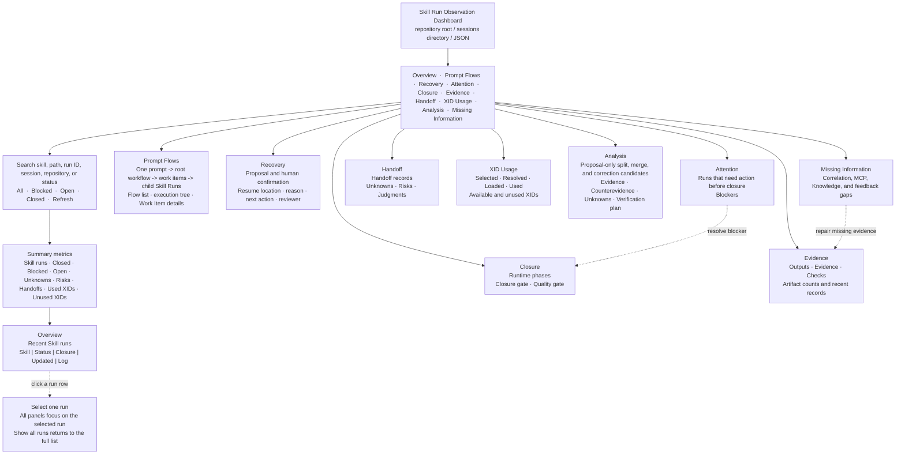

<!-- xid: 4A4763A2DE63 -->
<a id="xid-4A4763A2DE63"></a>

# Skill Run Observation Dashboard Usage

This guide explains how to run the Skill Run Observation Dashboard on a user's
local machine.

## Purpose

Use this dashboard to inspect Skill run logs emitted under `work/sessions/`.
It is an observation surface for humans, not a Skill executor and not an MCP
server.

The dashboard shows:

- Prompt Flow status and parent-child execution trees across generic workflow
  runs and delegated Skill Runs
- Prompt Flow lifecycle state derived from recorded routing, Work Item, child,
  reconcile, verification, and closure evidence
- Prompt Flow details with Work Item status, completion criterion or reason,
  reconcile status, and blockers
- Recovery Trace with proposed and human-confirmed resume locations, reasons,
  executable actions, owner, verification method, maximum attempts, stop
  conditions, and reviewer; the dashboard does not execute recovery
- Skill run status
- closure and quality gate state
- outputs, evidence, checks, handoffs, unknowns, risks, and judgments
- selected and used XIDs
- available but unused XIDs
- proposal-only boundary analysis candidates with evidence and unknowns

Base repository XIDs and local XIDs are both included when they appear in the
Skill run log. Local XIDs include entries supplied through a domain-knowledge
catalog and entries served from local knowledge such as `packs/local/...`.

## Screen Image

The dashboard is organized around one question: **what needs attention in this
run, and what evidence supports its closure?** The following wireframe shows
the first screen and the relationship between its controls and panels.



### What to look at first

| User question | Start here | Meaning | Next action |
| --- | --- | --- | --- |
| “Is anything blocked?” | **Attention** | Lists runs that still need action before closure. | Open the blocker and record the missing work, evidence, or handoff. |
| “How did one prompt flow through the system?” | **Prompt Flows** | Groups the root workflow and delegated Skill Runs by `flow_id`, including parent run, work item, status, lifecycle state, and blockers. | Follow the execution tree and inspect the linked individual Run records. |
| “Where should a paused flow resume?” | **Recovery** | Shows each Recovery Trace proposal and human confirmation with its resume location, reason, executable action, owner, verification method, attempt limit, stop conditions, and reviewer. | Confirm the proposal with a human, then execute the separately authorized recovery command. |
| “Can this run be considered complete?” | **Closure** | Shows runtime phase status, closure status, and quality-gate status separately. | Confirm the required phases and quality review; do not treat `verify` as quality approval. |
| “What was actually produced?” | **Evidence** | Shows output, evidence, check, and artifact records. | Check that the important result has an evidence or output artifact. |
| “Can another person continue this work?” | **Handoff** | Shows handoffs and the unknown/risk/judgment records that affect continuity. | Resolve or escalate open concerns before handoff/closure. |
| “Which Knowledge was used?” | **XID Usage** | Separates selected, MCP-resolved, client-loaded, used, available, and unused XIDs. | Investigate unused or unexpectedly missing XIDs; do not infer usage from availability alone. |
| “Should a boundary or rule be reviewed?” | **Analysis** | Shows deterministic, proposal-only candidates for Knowledge correction, Skill correction, split, merge, or usage gaps. | Review the evidence, counterevidence, unknowns, and verification plan; do not apply the candidate automatically. |
| “Why is the run hard to correlate?” | **Missing Information** | Ranks absent `run_id`, MCP, repository, Knowledge, or downstream feedback information. | Add the missing observation at the source and refresh the dashboard. |

### Status reading guide

- **Blocked**: the run has an action or gate preventing normal closure.
- **Open**: the run is still in progress or has not passed its closure gate.
- **Closed**: the process closure gate was accepted; inspect the separate
  quality state before treating the result as quality-approved.
- **Unknown / missing information**: evidence is absent or cannot be safely
  correlated. It is not the same as zero usage or no risk.

### A simple review sequence

1. Open **Overview** and select the relevant Skill Run.
2. Check **Attention** and **Missing Information** for blockers or evidence
   gaps.
3. Check **Evidence** and **Handoff** for reproducibility and continuity.
4. Check **Closure** for phase, closure, and quality-gate state.
5. Check **XID Usage** when the question concerns Knowledge selection or
   payload/context behavior.
6. Check **Analysis** for repeated signals that may warrant a Skill, Knowledge,
   or boundary review; verify the displayed evidence before making a decision.
7. Use **Show all runs** before starting a different run review.

## Human Review And Improvement Loop

The dashboard is a read-only observation surface. It helps a person decide
whether the AI result is acceptable and what should happen next; it does not
send corrections to the AI or rewrite canonical XRefKit files by itself.

The intended operating loop is:

```text
AI executes the Skill
    -> run log, output, evidence, and concerns are recorded
    -> deterministic verify checks workflow progression
    -> human or quality reviewer checks the output
       -> accepted: record acceptance, handoff, close, and observe the next run
       -> corrected/rejected: record feedback and run the AI again
    -> repeated problem: classify the cause
       -> Knowledge correction: update the existing XID content
       -> Skill correction: update procedure, judgment, routing, or quality rules
       -> boundary correction: split or merge the Skill/XID responsibility
    -> human approves the canonical change
    -> validate, redistribute, and observe the next executions
```

### What each result means

| Review result | Run action | Canonical change |
| --- | --- | --- |
| `accepted` | Record human feedback, complete quality checks, handoff, and close. | None unless the review also identifies a reusable improvement. |
| `corrected` | Record the correction and rerun the AI or the relevant Skill. | Do not change Knowledge or Skill files for a one-off correction. |
| `rejected` | Keep the run blocked or escalate it with the reason and evidence. | Decide whether the failure is in Knowledge, Skill procedure, routing, or quality criteria. |
| `unknown` | Keep the missing evidence visible and do not treat it as success or zero usage. | Repair the observation or correlation path before drawing a conclusion. |

Record a human correction against the affected output or judgment, for example:

```powershell
python -m xrefkit skill feedback --log work/sessions/<run-log>.md --kind human --status corrected --target OUT-001 --note "Judgment condition A was not satisfied; rerun with the corrected constraint."
```

`xrefkit skill verify` confirms work items, artifacts, concerns, role
separation, and workflow progression. It does not decide whether the AI output
is correct. The quality reviewer records content-acceptance checks separately.

### Choosing the correction destination

- **Existing Knowledge XID**: correct the content when the asset still has the
  same meaning and responsibility. Preserve the XID.
- **Skill procedure or judgment**: correct `SKILL.md`, `meta.md`, routing,
  constraints, or quality rules when the execution method or decision rule is
  wrong.
- **New boundary**: create a new XID or split/merge responsibilities when the
  Skill or Knowledge identity itself has changed. Do not silently change one
  XID to mean a different asset.
- **Observation path**: correct the workflow, run logging, MCP correlation, or
  host adapter when the problem is missing evidence rather than bad Knowledge.

Canonical changes require recorded evidence, unknowns, affected XIDs, an
expected verification plan, and human adoption judgment. After the change,
run the normal repository checks and compare the next bounded sample with the
previous observation. See the [Knowledge observation and improvement platform
design](../designs/088_knowledge_observation_and_improvement_platform_design.md#xid-32B512763C78)
for the canonical change boundary.

## AI Improvement Suggestions

An analysis AI or analysis Skill can use the dashboard data to suggest changes
that better fit the intended purpose of a Skill or Knowledge set. This is a
valid use of the dashboard when the suggestion is treated as a reviewable
proposal, not as an automatic decision.

The current MVP provides a deterministic proposal generator. It does not call
an external AI and does not make the final interpretation; its report is an
evidence-bounded input for an analysis AI, quality reviewer, or accountable
human.

The dashboard's **Analysis** tab displays the same proposal-only result that is
included in the dashboard JSON payload. Each card keeps the candidate's
support, affected Skills/XIDs, evidence references, counterevidence, unknowns,
verification plan, and pending decision visible together. An empty result means
that no candidate met the configured sample threshold; it is not proof that no
problem exists.

The AI may suggest:

- **XID split**: repeated task, Knowledge, tool, risk, or quality clusters
  indicate that one responsibility should become separate assets;
- **XID merge**: two assets repeatedly have the same responsibility, inputs,
  outputs, authority, and quality boundary;
- **Knowledge correction**: an existing XID is incomplete, ambiguous, stale,
  or inconsistent with accepted evidence;
- **Skill judgment correction**: the procedure, constraint, routing rule, or
  decision criterion causes a repeated incorrect result;
- **quality or observation correction**: the acceptance check, run logging, or
  MCP/XID correlation does not provide enough evidence;
- **keep or investigate**: the evidence is insufficient or counterevidence is
  stronger than the improvement signal.

### Required proposal contents

The AI suggestion must identify:

1. the purpose or responsibility being evaluated;
2. affected Skill and Knowledge XIDs and their content hashes;
3. the bounded sample and correlation quality;
4. supporting runs, outputs, feedback, and usage evidence;
5. counterevidence, unknowns, and excluded records;
6. the proposed split, merge, content correction, or Skill correction;
7. expected benefit, risk, and possible regression;
8. the human decision owner and a before/after verification plan.

Token count, cache use, or frequent co-occurrence may support a proposal, but
none of them is sufficient by itself to split, merge, or rewrite a canonical
asset. The AI must not infer hidden reasoning or fill missing evidence with
zero.

### Operating sequence

```text
1. Human selects a bounded set of Skill runs in the dashboard.
2. Human reviews the dashboard's **Analysis** tab, then gives dashboard data and
   approved trace evidence to the analysis AI when deeper interpretation is
   needed.
3. AI writes a proposal with evidence, counterevidence, unknowns, and a
   verification plan.
4. Human or quality reviewer checks whether the proposal fits the purpose.
5. Human records accepted, corrected, rejected, or unknown feedback.
6. If accepted, the repository workflow changes the existing XID, Skill, or
   boundary; the analysis AI does not edit canonical files directly.
7. Repository checks and quality review run before publication.
8. A bounded post-change sample is compared with the pre-change observation.
```

For a local export, the dashboard's existing JSON surface can be used as an
input:

```powershell
python -m xrefkit dashboard data --root . > work/reports/dashboard-observation.json
python -m xrefkit analysis boundary report --input work/reports/dashboard-observation.json --out work/reports/boundary-observation.md
```

The analysis report should be kept under `work/reports/` or another approved
evidence location, with source hashes and the analysis configuration recorded.
It must not become canonical Knowledge merely because an AI generated it.

The full split/merge and Skill-boundary proposal model is defined in the
[Copilot Trace Skill Boundary Analysis Design](../designs/089_copilot_trace_skill_boundary_analysis_design.md#xid-B6E4A91C7D2F).

## Runtime Assumption

The dashboard is designed for local trusted use.

- It runs with Python on the user's machine.
- It reads local files from the selected repository root.
- It binds to `127.0.0.1` by default.
- It does not require MCP to start.
- It does not expose local paths as a domain-knowledge retrieval contract.

Do not treat this dashboard as an externally hosted service unless the binding,
network, and data exposure rules are reviewed separately.

## Start

From the repository root:

```powershell
python -m xrefkit dashboard serve --root .
```

Default URL:

```text
http://127.0.0.1:8765/
```

To open the browser automatically:

```powershell
python -m xrefkit dashboard serve --root . --open-browser
```

## Port Or Session Directory Options

Use another port when `8765` is already in use:

```powershell
python -m xrefkit dashboard serve --root . --port 8766
```

Use another session log directory when the Skill run logs are not under the
default `work/sessions/`:

```powershell
python -m xrefkit dashboard serve --root . --sessions-dir path\to\sessions
```

## JSON Output

Use the JSON command when the dashboard data needs to be inspected by another
local tool or test:

```powershell
python -m xrefkit dashboard data --root .
```

The running dashboard also exposes JSON at:

```text
http://127.0.0.1:8765/api/runs
```

The health endpoint is:

```text
http://127.0.0.1:8765/healthz
```

## Stop

If the dashboard is running in the foreground terminal, stop it with
`Ctrl+C`.

If it was started in another process, stop the process that owns the selected
port. On Windows:

```powershell
Get-NetTCPConnection -LocalPort 8765 -State Listen | Select-Object LocalAddress,LocalPort,OwningProcess
Stop-Process -Id <OwningProcess>
```

## XID Display Rules

The `XID Usage` tab is derived from Skill run logs.

- Available XIDs come from the `Available Domain Knowledge` section.
- Selected XIDs come from the `Selected Knowledge Inputs` section.
- Used XIDs come from selected knowledge inputs plus runtime artifact or
  concern targets that look like XIDs.
- Unused XIDs are available XIDs that were not selected or used.

This includes local XIDs. A local XID is still an XID for dashboard purposes;
the dashboard does not need to know whether the source was base, shared pack, or
local pack as long as the run log records it by XID.

## Troubleshooting

If the page is empty, check that the selected root has Skill run logs under
`work/sessions/` or pass `--sessions-dir`.

If the browser cannot connect, confirm the server is listening:

```powershell
Invoke-WebRequest -UseBasicParsing http://127.0.0.1:8765/healthz
```

If local XIDs do not appear, confirm the Skill run log recorded them in the
domain-knowledge sections or as runtime evidence/artifact targets.
