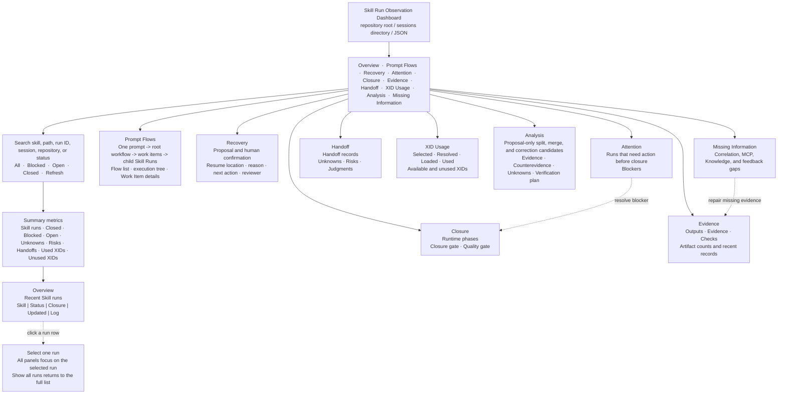

<!-- xid: 4A4763A2DE63 -->
<a id="xid-4A4763A2DE63"></a>

# Skill Run Observation Dashboard Usage

This guide explains how to run the Skill Run Observation Dashboard on a user's
local machine.

## Purpose

Use this dashboard to inspect Skill run logs emitted under `work/sessions/`.
It is an observation surface for humans, not a Skill executor and not an MCP
server.

The dashboard shows:

- Prompt Flow status and parent-child execution trees across generic workflow
  runs and delegated Skill Runs
- Prompt Flow lifecycle state derived from recorded routing, Work Item, child,
  reconcile, verification, and closure evidence
- Prompt Flow details with Work Item status, completion criterion or reason,
  reconcile status, and blockers
- Recovery Trace with proposed and human-confirmed resume locations, reasons,
  executable actions, owner, verification method, maximum attempts, stop
  conditions, and reviewer; the dashboard does not execute recovery
- Skill run status
- closure and quality gate state
- outputs, evidence, checks, handoffs, unknowns, risks, and judgments
- selected and used XIDs
- available but unused XIDs
- proposal-only boundary analysis candidates with evidence and unknowns

Base and local XIDs are displayed when they are recorded in the Skill run log.
The dashboard also reads validated events from the optional MCP audit JSONL when
their correlation identity matches the run. XID origin is not inferred: the
dashboard reports recorded selected, queried, loaded, applied, and
runtime-referenced values.

## Screen Image

The dashboard is organized around one question: **what needs attention in this
run, and what evidence supports its closure?** The following wireframe shows
the first screen and the relationship between its controls and panels.


```mermaid
flowchart TB
    H["Skill Run Observation Dashboard<br/>repository root / sessions directory / JSON"]
    N["Overview  ·  Prompt Flows  ·  Recovery  ·  Attention  ·  Closure  ·  Evidence  ·  Handoff  ·  XID Usage  ·  Analysis  ·  Missing Information"]
    F["Search skill, path, run ID, session, repository, or status<br/>All  ·  Blocked  ·  Open  ·  Closed  ·  Refresh"]
    M["Summary metrics<br/>Skill runs · Closed · Blocked · Open · Unknowns · Risks · Handoffs · Used XIDs · Unused XIDs"]
    O["Overview<br/>Recent Skill runs<br/>Skill | Status | Closure | Updated | Log"]
    P["Prompt Flows<br/>One prompt -> root workflow -> work items -> child Skill Runs<br/>Flow list · execution tree · Work Item details"]
    R["Recovery<br/>Proposal and human confirmation<br/>Resume location · reason · next action · reviewer"]
    A["Attention<br/>Runs that need action before closure<br/>Blockers"]
    C["Closure<br/>Runtime phases<br/>Closure gate · Quality gate"]
    E["Evidence<br/>Outputs · Evidence · Checks<br/>Artifact counts and recent records"]
    W["Handoff<br/>Handoff records<br/>Unknowns · Risks · Judgments"]
    X["XID Usage<br/>Selected · Resolved · Loaded · Used<br/>Available and unused XIDs"]
    B["Analysis<br/>Proposal-only split, merge, and correction candidates<br/>Evidence · Counterevidence · Unknowns · Verification plan"]
    I["Missing Information<br/>Correlation, MCP, Knowledge, and feedback gaps"]
    S["Select one run<br/>All panels focus on the selected run<br/>Show all runs returns to the full list"]

    H --> N --> F --> M --> O
    N --> P
    N --> R
    N --> A
    N --> C
    N --> E
    N --> W
    N --> X
    N --> B
    N --> I
    O -. "click a run row" .-> S
    A -. "resolve blocker" .-> C
    I -. "repair missing evidence" .-> E
```

### What to look at first

| User question | Start here | Meaning | Next action |
| --- | --- | --- | --- |
| “Is anything blocked?” | **Attention** | Lists runs that still need action before closure. | Open the blocker and record the missing work, evidence, or handoff. |
| “How did one prompt flow through the system?” | **Prompt Flows** | Groups the root workflow and delegated Skill Runs by `flow_id`, including parent run, work item, status, lifecycle state, and blockers. | Follow the execution tree and inspect the linked individual Run records. |
| “Where should a paused flow resume?” | **Recovery** | Shows each Recovery Trace proposal and human confirmation with its resume location, reason, executable action, owner, verification method, attempt limit, stop conditions, and reviewer. | Confirm the proposal with a human, then execute the separately authorized recovery command. |
| “Can this run be considered complete?” | **Closure** | Shows runtime phase status, closure status, and quality-gate status separately. | Confirm the required phases and quality review; do not treat `verify` as quality approval. |
| “What was actually produced?” | **Evidence** | Shows output, evidence, check, and artifact records. | Check that the important result has an evidence or output artifact. |
| “Can another person continue this work?” | **Handoff** | Shows handoffs and the unknown/risk/judgment records that affect continuity. | Resolve or escalate open concerns before handoff/closure. |
| “Which Knowledge was used?” | **XID Usage** | Separates selected, MCP-resolved, client-loaded, used, available, and unused XIDs. | Investigate unused or unexpectedly missing XIDs; do not infer usage from availability alone. |
| “Should a boundary or rule be reviewed?” | **Analysis** | Shows deterministic, proposal-only candidates for Knowledge correction, Skill correction, split, merge, or usage gaps. | Review the evidence, counterevidence, unknowns, and verification plan; do not apply the candidate automatically. |
| “Why is the run hard to correlate?” | **Missing Information** | Ranks absent `run_id`, MCP, repository, Knowledge, or downstream feedback information. | Add the missing observation at the source and refresh the dashboard. |

### Status reading guide

- **Blocked**: the run has an action or gate preventing normal closure.
- **Open**: the run is still in progress or has not passed its closure gate.
- **Closed**: the process closure gate was accepted; inspect the separate
  quality state before treating the result as quality-approved.
- **Unknown / missing information**: evidence is absent or cannot be safely
  correlated. It is not the same as zero usage or no risk.

### A simple review sequence

1. Open **Overview** and select the relevant Skill Run.
2. Check **Attention** and **Missing Information** for blockers or evidence
   gaps.
3. Check **Evidence** and **Handoff** for reproducibility and continuity.
4. Check **Closure** for phase, closure, and quality-gate state.
5. Check **XID Usage** when the question concerns Knowledge selection or
   payload/context behavior.
6. Check **Analysis** for repeated signals that may warrant a Skill, Knowledge,
   or boundary review; verify the displayed evidence before making a decision.
7. Use **Show all runs** before starting a different run review.

## Human Review And Improvement Loop

The dashboard is a read-only observation surface. It helps a person decide
whether the AI result is acceptable and what should happen next; it does not
send corrections to the AI or rewrite canonical XRefKit files by itself.

The intended operating loop is:

```text
AI executes the Skill
    -> run log, output, evidence, and concerns are recorded
    -> deterministic verify checks workflow progression
    -> human or quality reviewer checks the output
       -> accepted: record acceptance, handoff, close, and observe the next run
       -> corrected/rejected: record feedback and run the AI again
    -> repeated problem: classify the cause
       -> Knowledge correction: update the existing XID content
       -> Skill correction: update procedure, judgment, routing, or quality rules
       -> boundary correction: split or merge the Skill/XID responsibility
    -> human approves the canonical change
    -> validate, redistribute, and observe the next executions
```

### What each result means

| Review result | Run action | Canonical change |
| --- | --- | --- |
| `accepted` | Record human feedback, complete quality checks, handoff, and close. | None unless the review also identifies a reusable improvement. |
| `corrected` | Record the correction and rerun the AI or the relevant Skill. | Do not change Knowledge or Skill files for a one-off correction. |
| `rejected` | Keep the run blocked or escalate it with the reason and evidence. | Decide whether the failure is in Knowledge, Skill procedure, routing, or quality criteria. |
| `unknown` | Keep the missing evidence visible and do not treat it as success or zero usage. | Repair the observation or correlation path before drawing a conclusion. |

Record a human correction against the affected output or judgment, for example:

```powershell
python -m xrefkit skill feedback --log work/sessions/<run-log>.md --kind human --status corrected --target OUT-001 --note "Judgment condition A was not satisfied; rerun with the corrected constraint."
```

`xrefkit skill verify` confirms work items, artifacts, concerns, role
separation, and workflow progression. It does not decide whether the AI output
is correct. The quality reviewer records content-acceptance checks separately.

### Choosing the correction destination

- **Existing Knowledge XID**: correct the content when the asset still has the
  same meaning and responsibility. Preserve the XID.
- **Skill procedure or judgment**: correct `SKILL.md`, `meta.md`, routing,
  constraints, or quality rules when the execution method or decision rule is
  wrong.
- **New boundary**: create a new XID or split/merge responsibilities when the
  Skill or Knowledge identity itself has changed. Do not silently change one
  XID to mean a different asset.
- **Observation path**: correct the workflow, run logging, MCP correlation, or
  host adapter when the problem is missing evidence rather than bad Knowledge.

Canonical changes require recorded evidence, unknowns, affected XIDs, an
expected verification plan, and human adoption judgment. After the change,
run the normal repository checks and compare the next bounded sample with the
previous observation. See the [Knowledge observation and improvement platform
design](../designs/088_knowledge_observation_and_improvement_platform_design.md#xid-32B512763C78)
for the canonical change boundary.

## AI Improvement Suggestions

An analysis AI or analysis Skill can use the dashboard data to suggest changes
that better fit the intended purpose of a Skill or Knowledge set. This is a
valid use of the dashboard when the suggestion is treated as a reviewable
proposal, not as an automatic decision.

The current MVP provides a deterministic proposal generator. It does not call
an external AI and does not make the final interpretation; its report is an
evidence-bounded input for an analysis AI, quality reviewer, or accountable
human.

The dashboard's **Analysis** tab displays the same proposal-only result that is
included in the dashboard JSON payload. Each card keeps the candidate's
support, affected Skills/XIDs, evidence references, counterevidence, unknowns,
verification plan, and pending decision visible together. An empty result means
that no candidate met the configured sample threshold; it is not proof that no
problem exists.

The AI may suggest:

- **XID split**: repeated task, Knowledge, tool, risk, or quality clusters
  indicate that one responsibility should become separate assets;
- **XID merge**: two assets repeatedly have the same responsibility, inputs,
  outputs, authority, and quality boundary;
- **Knowledge correction**: an existing XID is incomplete, ambiguous, stale,
  or inconsistent with accepted evidence;
- **Skill judgment correction**: the procedure, constraint, routing rule, or
  decision criterion causes a repeated incorrect result;
- **quality or observation correction**: the acceptance check, run logging, or
  MCP/XID correlation does not provide enough evidence;
- **keep or investigate**: the evidence is insufficient or counterevidence is
  stronger than the improvement signal.

### Required proposal contents

The AI suggestion must identify:

1. the purpose or responsibility being evaluated;
2. affected Skill and Knowledge XIDs and their content hashes;
3. the bounded sample and correlation quality;
4. supporting runs, outputs, feedback, and usage evidence;
5. counterevidence, unknowns, and excluded records;
6. the proposed split, merge, content correction, or Skill correction;
7. expected benefit, risk, and possible regression;
8. the human decision owner and a before/after verification plan.

Token count, cache use, or frequent co-occurrence may support a proposal, but
none of them is sufficient by itself to split, merge, or rewrite a canonical
asset. The AI must not infer hidden reasoning or fill missing evidence with
zero.

### Operating sequence

```text
1. Human selects a bounded set of Skill runs in the dashboard.
2. Human reviews the dashboard's **Analysis** tab, then gives dashboard data and
   approved trace evidence to the analysis AI when deeper interpretation is
   needed.
3. AI writes a proposal with evidence, counterevidence, unknowns, and a
   verification plan.
4. Human or quality reviewer checks whether the proposal fits the purpose.
5. Human records accepted, corrected, rejected, or unknown feedback.
6. If accepted, the repository workflow changes the existing XID, Skill, or
   boundary; the analysis AI does not edit canonical files directly.
7. Repository checks and quality review run before publication.
8. A bounded post-change sample is compared with the pre-change observation.
```

For a local export, the dashboard's existing JSON surface can be used as an
input:

```powershell
python -m xrefkit dashboard data --root . > work/reports/dashboard-observation.json
python -m xrefkit analysis boundary report --input work/reports/dashboard-observation.json --out work/reports/boundary-observation.md
```

The analysis report should be kept under `work/reports/` or another approved
evidence location, with source hashes and the analysis configuration recorded.
It must not become canonical Knowledge merely because an AI generated it.

The full split/merge and Skill-boundary proposal model is defined in the
[Copilot Trace Skill Boundary Analysis Design](../designs/089_copilot_trace_skill_boundary_analysis_design.md#xid-B6E4A91C7D2F).

## Runtime Assumption

The dashboard is designed for local trusted use.

- It runs with Python on the user's machine.
- It reads local files from the selected repository root.
- It binds to `127.0.0.1` by default.
- It does not require MCP to start.
- It does not expose local paths as a domain-knowledge retrieval contract.

Do not treat this dashboard as an externally hosted service unless the binding,
network, and data exposure rules are reviewed separately.

## Start

From the repository root:

```powershell
python -m xrefkit dashboard serve --root .
```

Default URL:

```text
http://127.0.0.1:8765/
```

To open the browser automatically:

```powershell
python -m xrefkit dashboard serve --root . --open-browser
```

## Port Or Session Directory Options

Use another port when `8765` is already in use:

```powershell
python -m xrefkit dashboard serve --root . --port 8766
```

Use another session log directory when the Skill run logs are not under the
default `work/sessions/`:

```powershell
python -m xrefkit dashboard serve --root . --sessions-dir path\to\sessions
```

## Local Workspace And Versioned Work Management (Plan v2)

The **計画 / Plans** screen supports registered local workspaces as well as
the repository-root v1 plans described below. A workspace is an existing
repository-contained directory; registration does not move source files or
copy/change the baseline. The active dashboard root is the permitted file
boundary. A client can use a different project directory as `--root`.

Register explicit workspace metadata:

```json
{
  "schema_version": 1,
  "workspace_id": "local-change",
  "title": "Local change",
  "workspace_root": "."
}
```

```powershell
python -m xrefkit.work_management register --root . --input work/reports/workspace-input.json
```

Registry records live in `work/workspaces/*.json`. Each workspace reads its
own `work/plans` and `work/sessions`. Identity conflicts, duplicate roots,
overlapping session scopes, unsafe child directories, and escaping file
symlinks do not select a substitute workspace. Registering identical metadata
is an idempotent no-op; changing an existing identity is refused. No baseline
or source migration is performed.

A v2 submitted plan is one self-contained structured payload. This minimal
example illustrates the format; it is not a claim that a planning Skill ran:

```json
{
  "schema_version": 2,
  "workspace_id": "local-change",
  "repository_root": "C:/dev/itsm/XRefKit",
  "plan_id": "example-work",
  "plan_revision": "v1",
  "title": "Example work",
  "source": "work/reports/example-work.md",
  "report_id": "observation-1",
  "recorded_at": "2026-10-10T09:00:00+09:00",
  "project": {"project_id": "project", "title": "Project"},
  "change": {"change_id": "change", "title": "Change"},
  "baseline": {"baseline_id": "baseline", "code_revision": "fixed-source-revision"},
  "stages": [{"stage_id": "design", "title": "Design"}],
  "steps": [
    {
      "step_id": "task-a",
      "title": "Review the source",
      "stage_id": "design",
      "dependencies": [],
      "status": null,
      "completion_criterion": "Record the reviewed difference",
      "outputs": [],
      "runs": [],
      "pbi_ids": ["pbi-a"],
      "revalidation_needed": null
    }
  ],
  "pbis": [{"pbi_id": "pbi-a", "title": "Change objective"}],
  "confirmations": [],
  "external_refs": [],
  "initial_task_ids": ["task-a"]
}
```

`steps` are the stable task units counted by the screen; stages, retries,
confirmation entries, and repeated PBI references are not additional tasks.
The same selected snapshot powers totals, stage rows, dependency nodes and
details. The view switch and refresh preserve exact selection. The graph
groups tasks by recorded stages and renders recorded branch/merge edges;
it never generates sequence from stage order or permission to start work.

`initial_task_ids` explicitly identifies the original comparison set. Missing
or null means original/add/delete counts are unknown; an empty array is an
explicit original zero. Added/deleted counts compare stable IDs. Existing
source `done` contributes to **記録上の完了**, except when an explicit
`revalidation_needed: true` applies. Null revalidation means unrecorded, not
verified false. Remaining is current total minus this recorded completion
count. Missing/unrecognized source status and revalidation counts are shown
separately. These values are not effort, dates, quality acceptance or a new
workflow completion gate. Missing evidence stays visibly missing without
silently changing the recorded status.

Record the first observation with expected observation revision zero:

```powershell
python -m xrefkit.work_management record --root . --input work/reports/plan-input.json --expected-observation-revision 0
```

The successful acknowledgement supplies `output` and `observation_revision`.
For another status/evidence observation, submit a new `report_id` and that
expected revision. The writer owns `observation_revision`, `report_sha256`
and `observation_history`; omit these fields from submitted input. It
validates the complete input, obtains an exclusive lock, rechecks the current
revision, appends the prior submitted payload/receipt, flushes, and atomically
publishes one file. Reader sees a complete old or new snapshot. Runs are a
separate observation and are not part of an atomic cross-store transaction.

An exact accepted `report_id` retry is a no-op, even after later observations;
it never rolls the current state back. Reusing a report ID with different
content, stale expected revision, or changing the plan definition is a
conflict. Task identities, stage/dependency structure, completion criteria,
planning metadata and PBI definitions remain fixed within a `plan_revision`.
A scope amendment uses a new `plan_revision` and can name
`previous_plan_revision`/task `predecessor_step_ids`; old revision files remain.
No history is automatically purged. Limits are 1 MiB per snapshot, 200 history
records, 200 plan/registry files, 500 tasks and 200 entries in auxiliary
collections; overflow refuses publication. Stale locks cause explicit
refusal; the command does not steal a lock from another writer. Retention,
backup, multi-user collaboration and remote synchronization policy are not
provided by this local trial.

Optional array fields may be omitted but explicit null arrays are rejected.
Optional scalar fields may be null and remain unrecorded. Persisted snapshots
must contain valid writer revision/history/fingerprints. Unknown fields,
duplicate keys/IDs, malformed types and unresolved structural references are
controlled file errors. Important optional records are:

| Record | Fields |
| --- | --- |
| `change` | `scope_in`, `scope_out`, `assumptions`, `constraints`, `exit_criteria`, `decision_owner`, `review_owner`, `acceptance_owner`, `quality_conditions` |
| Quality condition | `condition_id`, `title`, `verification_method`, `reviewer`, `evidence_refs` |
| `baseline` | `source`, `docs_revision`, `code_revision`, `acquired_at`, `mismatches`, `artifacts` |
| Versioned artifact | `kind`, `path`, `revision`, `source`, `recorded_at` |
| Task | existing v1 task metadata and `stage_id`, `dependencies`, `pbi_ids`, `candidate_version`, `revalidation_needed`, `revalidation_evidence`, `impact_status`, `validation_records`, `artifact_refs`, `judgment_refs`, `concern_refs`, `predecessor_step_ids` |
| Validation | `validation_id`, `target_version`, `environment`, `input_data`, `expected_result`, `result`, `reviewer`, `recorded_at`, `evidence_refs` |
| PBI | `pbi_id`, `title`, `purpose`, `acceptance_criteria`, `priority`, `owner`, `acceptance_status`, `acceptance_evidence`, `external_ref_ids` |
| Confirmation | `confirmation_id`, `question`, `reason`, `owner`, `resolver`, `due_at`, `step_ids`, `version_refs`, `impact`, `answer`, `application`, `judgment_refs` |
| Answer | `text`, `responder`, `recorded_at`, `evidence_refs` |
| Application | `target_refs`, `verified_by`, `recorded_at`, `evidence_refs` |
| External reference | `external_ref_id`, `service`, `organization`, `project`, `item_id`, `url`, `revision`, `type_mapping`, `state_mapping`, `ownership_ref`, `last_read_at`, `last_success_at`, `sync_status`, `pending_summary` |

Typed dependencies use `{"step_id":"task-a","kind":"mandatory"}` or
`kind: optional` for a current-plan task. External dependencies use
`{"external_ref_id":"ref-a","kind":"external"}` and do not create fake
local nodes. Each can supply `evidence_ref`. Internal cycles are rejected.
Run mappings retain the v1 exact correlation contract; v2 monitor/back URLs
also carry `workspace_id`. The same Run ID in different workspace scopes
does not resolve across that boundary.

The screen separates confirmation answers from their application evidence,
PBI acceptance from task completion, and older validation results from the
current candidate version. Candidate impact does not automatically reopen a
task. Existing judgments/decision-trace are linked artifacts; this feature
does not duplicate decisions into another canonical store or create ADR
files. Other projects' existing ADR files can be ordinary confined artifact
references; XRefKit's internal document policy is not imposed on them.

External fields are plain recorded metadata. URL links allow only HTTP/HTTPS
without credentials and are labelled unverified references. No Azure access,
authentication, API update, remote existence check or shared evidence export
occurs. Recorded sync status/time does not imply that this tool synchronized
anything; local absolute paths are not shared evidence URLs.

Future Azure DevOps connections belong to each project workspace: organization,
project, process mappings, permitted write scope and credential reference must
be selected from that workspace. A plan reference must bind that connection
identifier and the external item; global or another workspace's defaults are
not fallback sources. This local schema currently stores item/reference
metadata only; connection profiles, credential storage and live authentication
are not implemented, and require their reviewed integration contract.

The serializer supports a structured plan producer; it does not execute the
planning Skill. The repository's `planning_flow` adoption currently retains
draft maturity, so automatic production by that Skill is unverified and must
respect its normal gate. No Skill maturity/definition is changed here.

## Plans v1: From A Planning Artifact To The Monitor

The **計画 / Plans** tab is the entry point for planned work, including steps
that have no Run yet. When valid plan artifacts exist, the dashboard opens
this tab by default. Select a step in the accessible card list below the
dependency diagram to inspect its recorded state, planned Skill, Agent,
completion criterion, outputs, and separate Run history. Select **モニタを開く**
to open that exact Run in **Closure**; **計画の工程へ戻る** restores the same
plan revision and step. **計画を更新** refreshes the records without starting
execution. Run search and audit warnings stay in the monitor panels.

The planning producer supplies a UTF-8 JSON sidecar under `work/plans/*.json`
alongside its prose artifact. This is an explicit output convention for the
producer; the dashboard does not infer a plan from prose and does not execute
or modify the planning Skill. The following is a schema example, not evidence
of a planning Skill Run:

```json
{
  "schema_version": 1,
  "plan_id": "example-plan",
  "plan_revision": "v1",
  "repository_root": "C:/dev/itsm/XRefKit",
  "title": "Example plan",
  "source": "work/reports/example-plan.md",
  "approval_status": null,
  "approval_evidence": null,
  "steps": [
    {
      "step_id": "implement",
      "title": "Implement the approved change",
      "depends_on": [],
      "status": null,
      "status_evidence": null,
      "planned_skill": null,
      "agent": null,
      "completion_criterion": null,
      "outputs": [],
      "runs": []
    }
  ]
}
```

The identity fields, title, and source are required nonempty strings.
`steps`, `depends_on`, `outputs`, and `runs` are required arrays; empty arrays
are valid. Step IDs must be unique within the revision, dependencies must
refer to that revision's steps, and dependency cycles are rejected. The
`(plan_id, plan_revision)` pair must be unique across input files: duplicate
plans stay visible with disabled monitor links. Unknown fields, unsupported
versions, malformed JSON, and duplicate JSON keys produce visible per-file
errors while independent valid plans remain available.

Optional scalar fields may be omitted or `null` and appear as **未記録**.
State and approval are displayed as source-recorded strings with their
evidence; displaying `approved` does not certify approval. No Skill name,
Closure result, filename, or step ordering fills missing state, Agent,
approval, or dependencies. Common step states are translated in the cards;
the detail retains the original recorded value. Process, Closure, quality,
and plan approval remain separate.

A Run mapping is an object in a step's `runs` array, for example:

```json
{
  "run_id": "an-explicit-existing-run-id",
  "flow_id": null,
  "work_item_id": null,
  "node_id": null,
  "recorded_at": "2026-10-10T09:00:00+09:00"
}
```

The normalized, resolved `repository_root` must match the active dashboard
root, and `run_id` must identify exactly one observed Run. Any supplied
`flow_id`, `work_item_id`, or `node_id` must agree with that Run's header;
membership in a Run's local Work Item list is not a substitute. An empty
`runs` list means **未実行**; an absent/null `run_id`, a missing/deleted Run,
a correlation conflict, or an ambiguous Run ID has its own unavailable
reason. A different repository disables artifact and monitor links.
Revisions keep separate mappings; no mapping transfers automatically.

Multiple Runs remain independently selectable. Recorded timestamps must be
ISO 8601 dates with a timezone and are sorted chronologically across offsets;
missing timestamps remain last in source order. No retry/supersession
relationship is inferred from that order. Limits for local parser reliability
are 1 MiB per plan file, 200 plan files, 500 steps per plan, and 200 mappings
per step. Oversized input is reported; these are implementation limits,
not a performance SLA.

The producer can validate and atomically serialize an already structured
payload with the module command (the dashboard UI remains read-only):

```powershell
python -m xrefkit.plan_observation --root . --input work/reports/structured-plan-input.json --name example-plan.json
```

Invalid input leaves an existing destination intact. The producer owns
accurate identities, dependencies, evidence, and explicit Run correlation.
This command does not parse prose or generate a plan Skill Run.

Monitor links use the current host and port, for example:

```text
/?panel=closure&run_id=an-explicit-existing-run-id&plan_id=example-plan&plan_revision=v1&step_id=implement
```

The origin tuple is checked against the current sidecar's enabled mapping.
An invalid/incomplete origin or missing Run never selects a substitute.
Refresh retains the exact identity and reports stale/deleted targets. A
Run-only URL can focus an observed Run without claiming plan correspondence.

Source, output, and evidence links are offered only for existing regular
files whose resolved paths remain inside the active repository. Textual
evidence references and unavailable/unsafe local paths stay visible without
a clickable local link. The `/artifact?path=<repository-relative-path>`
route downloads contents as plain text with an attachment disposition and
`nosniff`; it does not execute HTML or expose files outside the root. Opening
plans, refreshing, downloading artifacts, and following monitor links do not
create or update workflow records.

## Monitor JSON Output

Use the JSON command when the dashboard data needs to be inspected by another
local tool or test:

```powershell
python -m xrefkit dashboard data --root .
```

The running dashboard also exposes JSON at:

```text
http://127.0.0.1:8765/api/runs
```

The health endpoint is:

```text
http://127.0.0.1:8765/healthz
```

## Stop

If the dashboard is running in the foreground terminal, stop it with
`Ctrl+C`.

If it was started in another process, stop the process that owns the selected
port. On Windows:

```powershell
Get-NetTCPConnection -LocalPort 8765 -State Listen | Select-Object LocalAddress,LocalPort,OwningProcess
Stop-Process -Id <OwningProcess>
```

## XID Display Rules

The `XID Usage` tab is derived from Skill run logs.

- Available XIDs come from the `Available Domain Knowledge` section.
- Selected XIDs come from the `Selected Knowledge Inputs` section.
- Used XIDs are the union of selected Knowledge inputs and XID-looking artifact
  or concern targets, including explicit XID references in their notes or text.
- Queried and loaded XIDs from validated MCP or local observation events are
  displayed separately and are not silently treated as applied usage.
- Unused XIDs are available XIDs that were not selected or used.

This includes local XIDs. A local XID is still an XID for dashboard purposes;
the dashboard does not need to know whether the source was base, shared pack, or
local pack as long as the run log records it by XID.

## Troubleshooting

If the page is empty, check that the selected root has Skill run logs under
`work/sessions/` or pass `--sessions-dir`.

If the browser cannot connect, confirm the server is listening:

```powershell
Invoke-WebRequest -UseBasicParsing http://127.0.0.1:8765/healthz
```

If local XIDs do not appear, confirm the Skill run log recorded them in the
domain-knowledge sections or as runtime evidence/artifact targets.
