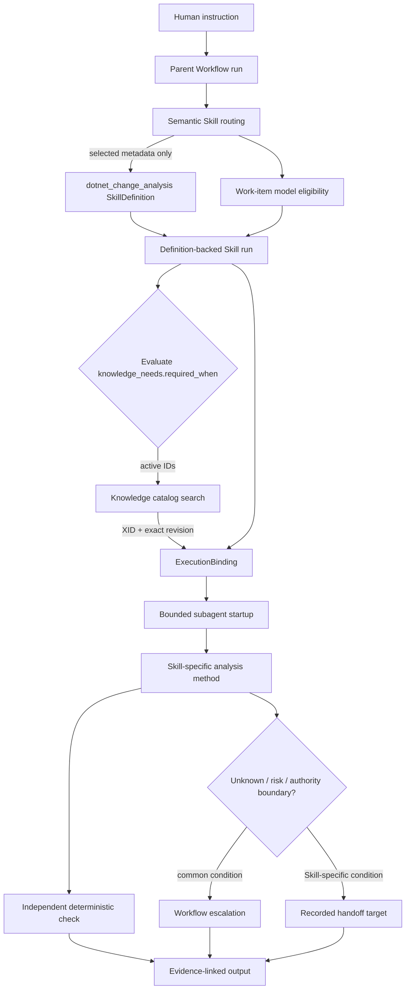

<!-- xid: 4F8C2A7D91E6 -->
<a id="xid-4F8C2A7D91E6"></a>

# 複雑なSkillDefinition / Flowの実行例

この例は、`dotnet_change_analysis`を一つの編集正本として選択し、指示ごとに必要な
能力・調整・責任とKnowledgeを組み立て、subagentへ渡す流れを示す。AI固有の
誤読防止、unknown、証拠、role分離、check、handoffは既存controlを継続利用する。



## 例に使う指示

> `OrderService`に新しい依存を追加する前に、DI lifetime、attribute route、暗黙の
> runtime binding、影響範囲を調べ、実装判断はせずchange-analysis noteを作る。

parentはまずInstruction-backed Workflowを開き、成果物、証拠、停止条件、権限を
work itemへ分ける。catalog一覧で方法本文はまだ取得せず、headerの`applies_when`、
`exclusions`、`inputs`、`outputs`、`criteria`だけで`dotnet_change_analysis`を選ぶ。
model routingは各work itemの必要能力を評価し、利用可能な低レベルmodelで満たせる
単位に分ける。Skill自身にmodel名やtierを保存しない。

## 実行時に注入する情報

この指示では、親が次を確定してSkill runを開く。

| runtime field | この例の値 |
|---|---|
| `capability` | `.NET repository structure and impact inspection` |
| `tuning` | `DI lifetime and attribute-binding evidence; preserve unknown` |
| `responsibility` | `produce the scoped note; do not decide implementation policy` |
| `execution_mode` | `subagent_required` |

```powershell
python -m xrefkit skill run `
  --definition work/skill-definition-candidate/dotnet_change_analysis/SKILL.md `
  --task "OrderServiceの変更前分析" `
  --capability ".NET repository structure and impact inspection" `
  --tuning "DI lifetime and attribute-binding evidence; preserve unknown" `
  --responsibility "produce the scoped note; do not decide implementation policy" `
  --execution-mode subagent_required `
  --json
```

runは定義のpath / XID / SHA-256とruntime fieldを固定する。`ExecutionBinding`はrunから
定義identityを転記し、同じ`capability` / `tuning` / `responsibility`であることを確認する。
subagent readerは定義本文を渡す直前にも同じrevisionを確認する。

## Knowledgeの選択

headerの`knowledge_needs`は本文ではなく検索要求である。親は`required_when`を今回の
指示へ適用し、必要なneed IDだけを`active_need_ids`として渡す。この例では少なくとも
次をactiveにする。

- `common_source_analysis_criteria`
- `dotnet_change_analysis_viewpoints`
- `structure_analysis_determinism_tiers`
- `structure_graph_tm_backstop`（DI lifetimeをgrepだけで確定できない場合）

`custom_framework_common_criteria`はcustom frameworkの存在が観測された時点でactiveに
する。条件をまだ評価していない場合、resolverは`unresolved_activation`を返し、必要性を
勝手にfalseへしない。active needはseed XIDを入口にcatalogを検索し、本文は必要な時点で
`get_document_by_xid`により取得する。

## subagentへの分割

親は仕事全体を移譲せず、相互に独立して読める調査作業を渡す。

| work item | subagent責任 | 完了証拠 |
|---|---|---|
| `WI-DI` | registration site、lifetime、依存方向を収集 | pathと検索/解析command |
| `WI-ROUTE` | attribute routeとconsumerを追跡 | producer/consumer/tokenの対応 |
| `WI-IMPACT` | review boundaryとmust-change boundaryを分離 | reference inventoryと分類根拠 |
| `WI-NOTE` |上記を統合しnoteを作る | output pathとcriterion対応 |

各subagentは同じ定義revisionと、自分のscope、stop condition、active Knowledgeだけを受け取る。
親は結果を統合し、別roleのcheckerがWorkflow recordとSkill固有criteriaを検査する。

## エスカレーションの置き場所

共通条件はWorkflow/guard/unknown contractで統一する。たとえば権限不足、必要証拠の欠落、
scope変更、retry上限、人の採用判断はSkill本文へ複製しない。Skill固有条件は方法に残す。
この例では、custom frameworkのactivation mechanismを確認できない、実装方針の決定が
必要、suspected defect/security issueが見つかった、既存構造自体を修復対象へ広げる必要が
ある場合が該当する。前二者は`unknown`または人への判断要求、後二者はそれぞれ
`csharp_review` / `security_review`またはscope拡張判断へのhandoffとして記録する。

## 完了境界

Skill固有criteriaは定義headerにあり、Workflowはwork item、artifact、evidence、role分離、
unknown/riskの解決またはescalationを検査する。AIのcheck成功は出力内容の採用を意味しない。
人がnoteを確認し、次のdesign/implementationで使うかを決める。

