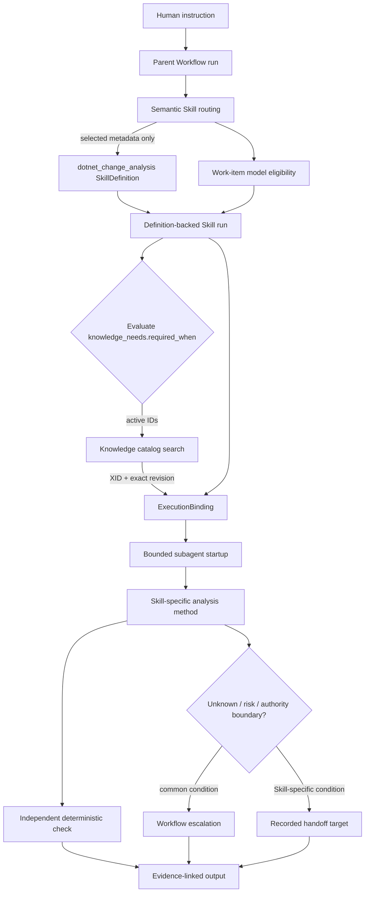

<!-- xid: 4F8C2A7D91E6 -->
<a id="xid-4F8C2A7D91E6"></a>

# Complex SkillDefinition / Flow Execution Example

This example treats the explicitly selected tracked v1
(`skills/dotnet_change_analysis/SKILL.v1.md`) as the authoring source of truth for
`dotnet_change_analysis`, keeps the old meta plus body readable, and shows how to
assemble the instruction-specific runtime binding and Knowledge before passing
bounded work to a subagent. Existing controls continue to handle AI-specific
misreading prevention, unknowns, evidence, role separation, checks, and handoff.



## Instruction Used in the Example

> Before adding a new dependency to `OrderService`, inspect the DI lifetime,
> attribute route, implicit runtime binding, and impact range, then produce a
> change-analysis note without deciding the implementation.

The parent first opens an instruction-backed Workflow and separates deliverables,
evidence, stop conditions, and authority into work items. It does not retrieve
the method body from the catalog yet; it selects `dotnet_change_analysis` using
only the header's `applies_when`, `exclusions`, `inputs`, `outputs`, and
`criteria`. Model routing evaluates the requirements of each work item and
splits work into units that an available low-level model can satisfy. The Skill
itself does not store a model name or tier.

## Information Injected at Runtime

The following values are an example of the instruction-derived Workflow
Runtime Binding. Their meanings and ownership come from [Workflow Runtime
Binding](../core/contracts/111_workflow_runtime_binding.md#xid-8D50A972BA9F);
this example does not add SkillDefinition semantics.

For this instruction, the parent fixes the following values before opening the
Skill run.

| runtime field | value in this example |
|---|---|
| `capability` | `.NET repository structure and impact inspection` |
| `tuning` | `DI lifetime and attribute-binding evidence; preserve unknown` |
| `responsibility` | `produce the scoped note; do not decide implementation policy` |
| `execution_mode` | `subagent_required` |

```powershell
python -m xrefkit skill run `
  --definition skills/dotnet_change_analysis/SKILL.v1.md `
  --task "Pre-change analysis of OrderService" `
  --capability ".NET repository structure and impact inspection" `
  --tuning "DI lifetime and attribute-binding evidence; preserve unknown" `
  --responsibility "produce the scoped note; do not decide implementation policy" `
  --execution-mode subagent_required `
  --json
```

The run fixes the definition path, XID, SHA-256, and Workflow Runtime Binding.
`ExecutionBinding` copies definition identity and runtime binding from the run as
separate fields and verifies that it has not reinterpreted the latter's
`capability` / `tuning` / `responsibility`. The subagent reader verifies the same
revision immediately before receiving the definition body.

## Knowledge Selection

The header's `knowledge_needs` is a search request rather than the body itself.
The parent applies `required_when` to the current instruction and passes only the
needed need IDs as `active_need_ids`. This example activates at least the
following:

- `common_source_analysis_criteria`
- `dotnet_change_analysis_viewpoints`
- `structure_analysis_determinism_tiers`
- `structure_graph_tm_backstop` (when DI lifetime cannot be established from grep alone)

Activate `custom_framework_common_criteria` when the presence of a custom
framework is observed. If the condition has not yet been evaluated, the
resolver returns `unresolved_activation` and does not silently set the need to
false. Active needs search the catalog from their seed XID, and the body is
retrieved with `get_document_by_xid` when needed.

## Subagent Decomposition

The parent does not delegate the entire job; it assigns independently readable
investigation tasks.

| work item | subagent responsibility | completion evidence |
|---|---|---|
| `WI-DI` | collect the registration site, lifetime, and dependency direction | path and search/analysis command |
| `WI-ROUTE` | trace the attribute route and consumers | producer/consumer/token mapping |
| `WI-IMPACT` | separate the review boundary from the must-change boundary | reference inventory and classification grounds |
| `WI-NOTE` | integrate the above into a note | output path and criterion mapping |

Each subagent receives the same definition revision, its own scope, stop
condition, and active Knowledge only. The parent integrates the results, and a
checker in a separate role inspects the Workflow record and Skill-specific
criteria.

## Where Escalation Belongs

Common conditions use the Workflow, guard, and unknown contracts consistently.
Insufficient authority, missing required evidence, scope changes, retry limits,
and human adoption decisions are not duplicated in the Skill body. Skill-specific
conditions remain in the method. In this example, the applicable conditions are
an unverified custom-framework activation mechanism, a need to decide
implementation policy, a suspected defect or security issue, or a need to
expand the existing structure into the repair scope. Record the first two as
an `unknown` or a request for human judgment; record the latter two as a
handoff to `csharp_review` / `security_review` or to a scope-expansion decision.

## Completion Boundary

Skill-specific criteria are in the definition header. The Workflow inspects work
items, artifacts, evidence, role separation, and resolution or escalation of
unknown/risk. A successful AI check does not mean that the output is adopted.
A person reviews the note and decides whether to use it for the next design or
implementation. The existence of tracked v1 does not automatically adopt it or
promote its maturity, and the legacy body remains readable.
