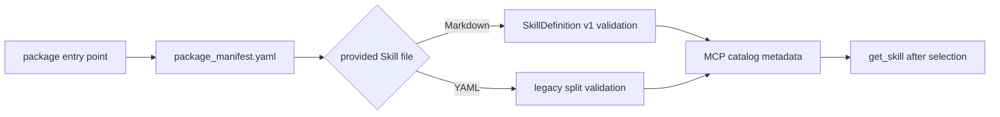

<!-- xid: B7D3A5E91C42 -->

# SkillDefinition distribution and adoption boundary

SkillDefinitionの配布は、文書の転送、構造検証、catalogへの採用を別の状態として扱う。
package discoveryは配布済み定義を読む経路であり、管理uploadは候補bytesを受け取る経路である。
どちらも、それだけでは人による品質受入れや代表Skillの切替を意味しない。

## Package discovery

`xrefkit.skill_packages` entry pointが返すpackage rootから`package_manifest.yaml`を読み、
`provides.skills[].path`をpackage root内で解決する。

- pathがone-document Markdownなら、SkillDefinition v1 parserで検証し、
  `definition_format: skill_definition_v1`、definition XID、raw bytes SHA-256をcatalogへ出す。
- pathが従来のSkill YAMLなら、entry Markdownとの分割形式を
  `definition_format: legacy_split_v1`として扱う。
- routing一覧にはmethod本文を含めない。選択後の`get_skill`だけがone-documentのraw内容を返す。
- packageのone-document形式はMCP catalogの配布境界である。旧v2 workspace registryは
  現時点で従来YAML modelのみを扱う。

## Management upload

このrepository checkoutにはadmin profile向けのmanagement upload transport、staging、
seal、review、adoption、maturity操作が実装されている。MCP-owned inbound WebDAVは
候補bytesをactive catalog外へstagingし、`seal_contribution_upload`、明示的な人の
review、`adopt_contribution_return`、maturity assessment/proposal/review/applyを
順に分離する。reader profileには管理操作を公開しない。

これらの操作で保証されるのは、各状態遷移とhash・承認・所有境界の記録である。
upload、validation、adoption、execution、production publication、live verificationは
別の観測状態であり、uploadやadoptionだけでactive catalogの既定sourceを切り替えたり、
品質受入れを完了したりしない。

この実装を利用する管理側は、既存のclient protocol選択とupload transportを維持し、
次の境界を確認する。

1. uploadしたraw UTF-8 bytesをactive catalog外へstagingする。
2. 同じbytesをSkillDefinition parserへ渡し、XIDとraw bytes SHA-256を記録する。
3. seal/review/adoptionが完了するまでrouting対象にしない。
4. adoption時に承認対象のpath、XID、hashを明示有効化境界へ渡す。
5. reader側からstaged候補や管理操作を見せない。

欠けた状態を推定で補わず、外部identity、secret manager、production publication、
長期運用のlive検証が必要な場合は`unknown`または未検証としてhandoffする。
