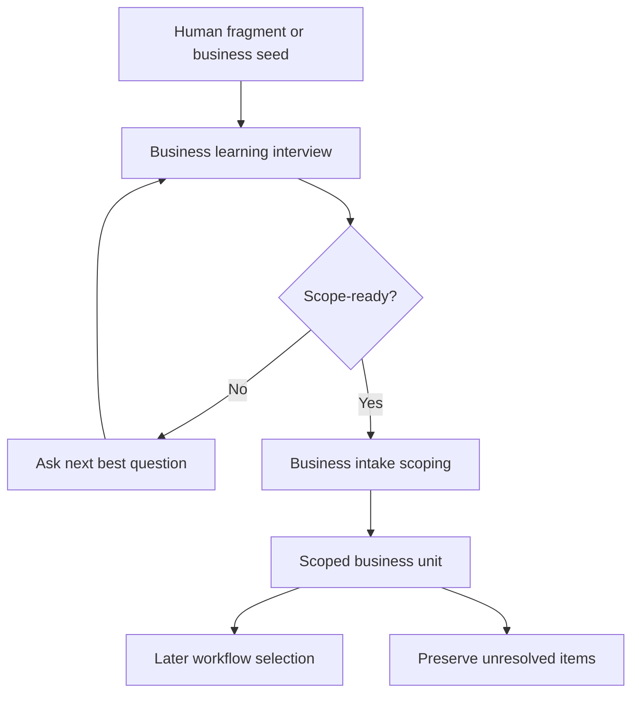

<!-- xid: 7F2C8DA14E66 -->

# Business Intake Workflow

This workflow defines how incomplete business fragments are learned and scoped
before later execution-design or delivery workflows.

## Purpose

Turn partial business fragments into one boundary-visible, scope-ready business
unit without requiring the human to provide the full business map in advance.

## Group Interaction

| Item | Value |
|------|------|
| Owner group | Planning Group |
| Input from | human fragment, artifact fragment, known owner, known downstream side, repeated trouble point |
| Output to | later investigation, requirements, or planning workflows after the business unit becomes scope-ready |
| Main handoff artifacts | interview-cycle summary, current business hypothesis, scoped business unit, unresolved intake items, next confirmation point |
| Escalation path | unresolved business interpretation stays explicit; boundary or ownership ambiguity is preserved for later human confirmation |

## Workflow Diagram

## Business Activities and Skills

- Business learning from fragments:
  - executed by [business_learning_interview](../../../skills/packs/business-intake/business_learning_interview/SKILL.md#xid-4D8E1A7C5B92)
- Scope-ready responsibility shaping:
  - executed by [business_intake_scoping](../../../skills/packs/business-intake/business_intake_scoping/SKILL.md#xid-6F2A9C41E8B3)
- Shared OS-core runtime control provides the runtime envelope, guard, and
  closure that both Skills depend on.

## Sequence

1. Start from one visible business seed such as a goal, artifact, owner, bottleneck, or downstream dependency.
2. Run business learning interview cycles until the goal, judgment, domain-knowledge area, input-information area, quality viewpoint, and handoff sides become visible enough.
3. If the result is not yet scope-ready, preserve unresolved points and continue with the next best question instead of demanding a full business map.
4. Once the unit becomes scope-ready, run business intake scoping on the current responsibility boundary.
5. Record previous side, current responsibility, next side, and first-pass scoping fields.
6. Hand off the scoped unit and unresolved items to the next applicable workflow.

## Inputs

- human fragment or business seed
- stated goal or expected result when available
- known upstream or downstream side when available
- artifact examples, rules, or approval points when available

## Outputs

- interview-cycle summary
- current business hypothesis
- scoped business unit
- unresolved intake items
- next confirmation point
- later-workflow handoff basis

## Control Rules

- Do not require the full business map before starting.
- When structure is incomplete, learning must run before scoping.
- Keep observed facts, AI hypotheses, and unresolved items separate.
- Do not treat local work steps as the primary scoping level.
- Previous side, current responsibility, and next side must remain explicit.
- If the unit is not scope-ready, preserve the gap instead of silently promoting it.

## Required Knowledge

- [Business learning interview rules](../../../knowledge/packs/business-intake/120_business_learning_interview_rules.md#xid-7B3E5D1A6103)
- [Business intake scoping rules](../../../knowledge/packs/business-intake/110_business_intake_scoping_rules.md#xid-7B3E5D1A6102)
- [Context direction guard rules](../../../knowledge/organization/160_context_direction_guard_rules.md#xid-7A2F4C8D1601)

## Related Skills

- [business_learning_interview](../../../skills/packs/business-intake/business_learning_interview/SKILL.md#xid-4D8E1A7C5B92)
- [business_intake_scoping](../../../skills/packs/business-intake/business_intake_scoping/SKILL.md#xid-6F2A9C41E8B3)

The context direction guard is base control applied inside every Skill run
via `CAP-MGT-004` and the guard knowledge rules above; it is not a separate
routable Skill.
