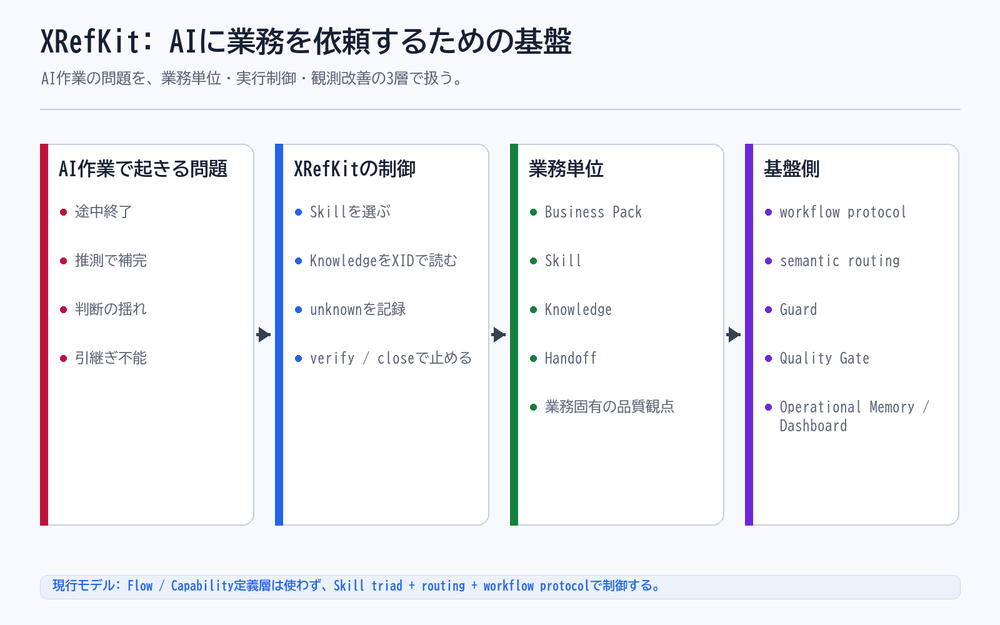

# XRefKitは、AIに業務を依頼するための基盤

## 一文要約

XRefKit is a foundation that counters common AI work problems through explicit controls, detection, and structured management.

## この図で伝えたい主張

AI を使うときの典型的な問題は、途中で作業を終えること、内容を推測で埋めること、判断が揺れることです。
XRefKit はそれに対して、リスト化、実行とレビュー、unknown の明示、ドメイン知識、判断基準と責務の明示を持ち、さらに実行ログと Dashboard で問題を検出します。
そのうえで、業務を一つの指示で扱うのではなく、一つの業務を一つの `Business Pack` として AI に依頼し、その中を主に Skill、Knowledge、Handoff と業務固有の品質観点で構造化し（進行は workflow protocol と semantic routing が担う）、Guard、共通の Quality Gate、Operational Memory で基盤側から支える考え方を示すのがこの図です。

## 用語の固定定義

- Skill: AI がある作業単位を実行するための具体手順（meta に capability / tuning / responsibility を宣言）
- Knowledge: 判断根拠としてロードされる業務知識、ルール、観点
- Workflow protocol: Skill 実行を包む汎用の決定論制御（開始ゲート、work item、verify、close）
- Semantic routing: 依頼の意図から適切な Skill を選ぶルーティング
- Handoff: 今の作業結果を次の Skill や人間へ渡す受け渡し点
- OS core: AI Agent の実行制御、guard、routing、closure、audit を担う共通層
- Business Pack: 特定業務を動かす Skill、Knowledge、handoff boundary、業務固有の品質観点の束
- Dashboard: AI の実行ログを人間が観測するための monitor-side layer
- Operational Memory: 監査証跡であると同時に、Skill、Knowledge、guard、quality gate の改善材料となる作業記録
- Guard: AI の実行前後で逸脱や不適切な進行を防ぐ制約
- Quality Gate: closure 前に満たすべき検証条件

## 読み方

- まず 1 の AI を使うときの問題点を見る
- 次に 2 の問題への対応と検出の仕組みを見る
- 最後に 3 の、一つの業務を一つの Business Pack として依頼する形を見る

## 非対象（誤解防止）

- low-level OS ではない
- LLM 本体ではない
- prompt collection ではない
- document repository だけではない
- OS 再編の説明だけを目的にした図ではない

## 関連図

- [03 Skill / Knowledge / Handoff と進行制御](03_flow_skill_knowledge_handoff.md)
- [02 Business Pack Explained](02_business_pack_explained.md)
- [08 Human Direction AI Modification Loop](08_human_direction_ai_modification_loop.md)
- [09 Business Pack Reuse](09_business_pack_reuse.md)
- [06 DashboardでAIの実行記録を確認する](06_os_and_flow_monitor_dashboard.md)
