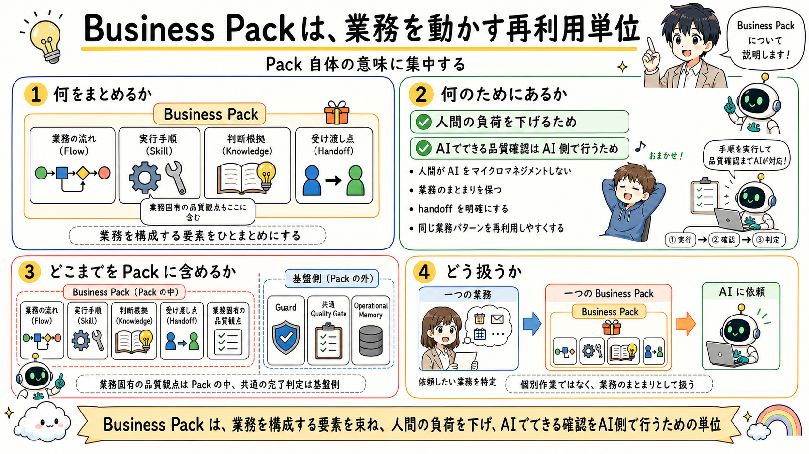

<!-- xid: D6B24A7C5E10 -->

# Business Pack Explained

## 一文要約

Business Pack bundles the elements that make up one business work unit and makes that unit reusable.

## この図で伝えたい主張

Business Pack は単なる Skill 集ではなく、業務の流れ、実行手順、判断根拠、受け渡し点という、業務を構成する要素をまとめた単位です。
主目的は、人間の負荷を下げ、人間が AI をマイクロマネジメントしなくてよいように、業務をひとまとまりで渡せるようにすることです。
あわせて、AI でできる品質確認は AI 側で行えるようにし、人間は必要な判断点だけを持てばよい形にします。
そのうえで、業務固有の品質観点は Pack の中に残し、共通の Quality Gate は基盤側で支える形に分け、一つの業務を一つの Business Pack として AI に依頼できるようにします。

## 用語の固定定義

- Skill: AI がある作業単位を実行するための具体手順（meta に capability / tuning / responsibility を宣言）
- Knowledge: 判断根拠としてロードされる業務知識、ルール、観点
- Workflow protocol: Skill 実行を包む汎用の決定論制御（開始ゲート、work item、verify、close）
- Semantic routing: 依頼の意図から適切な Skill を選ぶルーティング
- Handoff: 今の作業結果を次の Skill や人間へ渡す受け渡し点
- OS core: AI Agent の実行制御、guard、routing、closure、audit を担う共通層
- Business Pack: 特定業務を動かす Skill、Knowledge、handoff boundary、業務固有の品質観点の束
- Dashboard: AI の実行ログを人間が観測するための monitor-side layer
- Operational Memory: 監査証跡であると同時に、Skill、Knowledge、guard、quality gate の改善材料となる作業記録
- Guard: AI の実行前後で逸脱や不適切な進行を防ぐ制約
- Quality Gate: closure 前に満たすべき検証条件

## 読み方

- まず Pack が業務のどの要素をまとめるかを見る
- 次に、人間の負荷を下げ、AI 側でできる確認を AI 側へ寄せる主目的を見る
- 次に、Pack の中と基盤側の境界を見る
- 最後に、一つの業務を一つの Pack としてどう扱うかを見る

## 非対象（誤解防止）

- 技術スタック別テンプレートではない
- 単なるフォルダ分類ではない
- 何でも入る巨大パックを推奨するものではない
- 他の概念との差分説明をこの図だけで完結させるものではない

## 正典ページ

- 概念の正典定義は [Business Pack model](../../docs/core/models/071_business_pack_model.md#xid-40511A8A06CD)。この図はその概念図、各パック固有の設計は個別 doc を参照。

## 関連図

- [01 XRefKitは、AIに業務を依頼するための基盤](01_xrefkit_as_ai_agent_os.md)
- [03 Skill / Knowledge / Handoff と進行制御](03_flow_skill_knowledge_handoff.md)
- [04 Code Review as Split Checks](04_code_review_as_split_checks.md)
- [09 Business Pack Reuse](09_business_pack_reuse.md)
