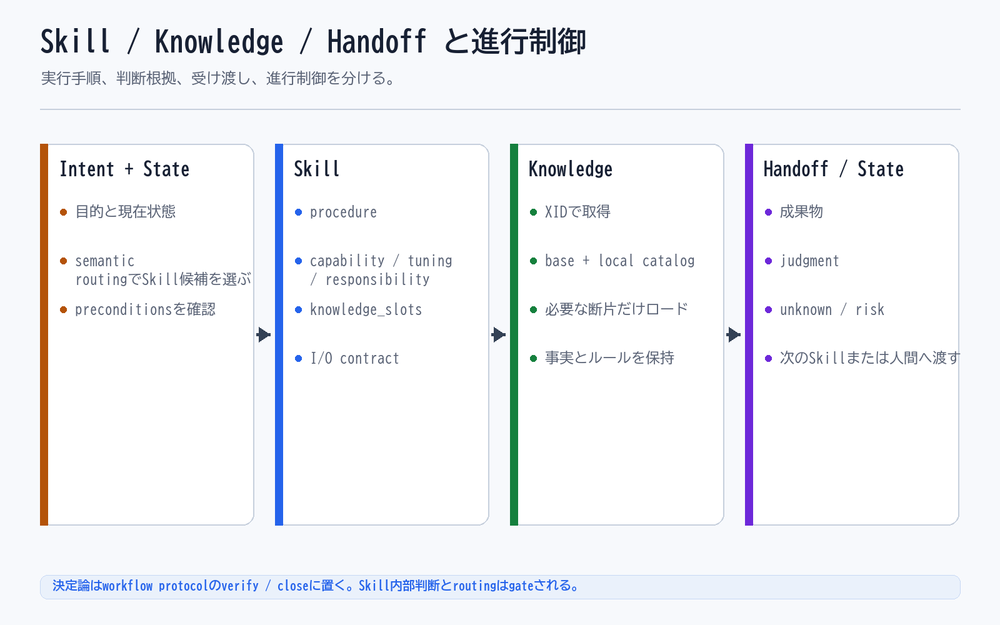

# Skill / Knowledge / Handoff と進行制御

## 一文要約

Skill, Knowledge, and Handoff separate execution, judgment basis, and transfer points, while a generic workflow protocol and semantic routing carry the progression that a Flow layer used to define.

## この図で伝えたい主張

AI が継続的に業務を扱うには、進み方、実行手順、判断根拠、受け渡し点を分ける必要があります。
この分離がないと、プロンプト一塊の中に流れ、根拠、実行、レビュー、引継ぎが混ざります。
図の目的は、XRefKit が何を分けて管理しているかを最初に理解させることです。

## 用語の固定定義

- Skill: AI がある作業単位を実行するための具体手順（meta に capability / tuning / responsibility を宣言）
- Knowledge: 判断根拠としてロードされる業務知識、ルール、観点
- Workflow protocol: Skill 実行を包む汎用の決定論制御（開始ゲート、work item、verify、close）
- Semantic routing: 依頼の意図から適切な Skill を選ぶルーティング
- Handoff: 今の作業結果を次の Skill や人間へ渡す受け渡し点
- OS core: AI Agent の実行制御、guard、routing、closure、audit を担う共通層
- Business Pack: 特定業務を動かす Skill、Knowledge、handoff boundary、業務固有の品質観点の束
- Dashboard: AI の実行ログを人間が観測するための monitor-side layer
- Operational Memory: 監査証跡であると同時に、Skill、Knowledge、guard、quality gate の改善材料となる作業記録
- Guard: AI の実行前後で逸脱や不適切な進行を防ぐ制約
- Quality Gate: closure 前に満たすべき検証条件

## 読み方

- まず各要素がそれぞれ何を担当するかを見る
- 次に、それらが混ざると何が壊れるかを見る
- 最後に、この分離が OS core と Business Pack にどうつながるかを考える

## 非対象（誤解防止）

- 単なる用語集ではない
- ドキュメント分類だけの話ではない
- 一回の回答生成だけを説明するものではない
- 人間だけの業務フロー図ではない

## 関連図

- [01 XRefKitは、AIに業務を依頼するための基盤](01_xrefkit_as_ai_agent_os.md)
- [02 Business Pack Explained](02_business_pack_explained.md)
- [04 Code Review as Split Checks](04_code_review_as_split_checks.md)

`04` は、この分離をコードレビューに落とした具体例であり、Skill の観点（responsibility）をどのように狭く分けて安定化させるかを見るための図です。
