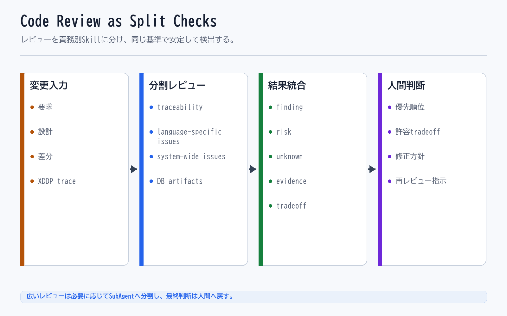

# Code Review as Split Checks

> 注記: 下の図画像は skill-centric 統合前の旧モデル（Flow / Capability）を描いています。本文は新モデルに更新済みで、画像は再描画待ちです。

## 一文要約

AI review is more stable when checks are split into narrower viewpoints such as traceability, security, and performance.

## この図で伝えたい主張

AI は作業範囲を絞ったほうが性能が安定するため、コードチェックは観点ごとに分割したほうがよいです。
その結果、traceability、security、performance などの観点が別々に最適化され、tradeoff が表面化します。
図の目的は、なぜ split checks が必要で、なぜ最後に人間判断点が残るのかを示すことです。
同時にこれは、Skill の観点（responsibility）を狭く分けて安定化させる具体例でもあります。

## 用語の固定定義

- Skill: AI がある作業単位を実行するための具体手順（meta に capability / tuning / responsibility を宣言）
- Knowledge: 判断根拠としてロードされる業務知識、ルール、観点
- Workflow protocol: Skill 実行を包む汎用の決定論制御（開始ゲート、work item、verify、close）
- Semantic routing: 依頼の意図から適切な Skill を選ぶルーティング
- Handoff: 今の作業結果を次の Skill や人間へ渡す受け渡し点
- OS core: AI Agent の実行制御、guard、routing、closure、audit を担う共通層
- Business Pack: 特定業務を動かす Skill、Knowledge、handoff boundary、業務固有の品質観点の束
- Dashboard: AI の実行ログを人間が観測するための monitor-side layer
- Operational Memory: 監査証跡であると同時に、Skill、Knowledge、guard、quality gate の改善材料となる作業記録
- Guard: AI の実行前後で逸脱や不適切な進行を防ぐ制約
- Quality Gate: closure 前に満たすべき検証条件

## 読み方

- まず review が複数チェックに分割されている部分を見る
- 次に、それぞれのチェックが別の懸念を見ていることを読む
- 最後に、観点間 tradeoff を人間へ戻す理由を見る

## 非対象（誤解防止）

- 1 回の総合レビューを完全否定する図ではない
- チェック観点を固定 3 種類に限定するものではない
- AI が tradeoff を勝手に決めてよいという話ではない
- パフォーマンスだけを優先する説明ではない

## 関連図

- [08 Human Direction AI Modification Loop](08_human_direction_ai_modification_loop.md)
- [07 Dashboard Observation and Improvement](07_dashboard_observation_and_improvement.md)

`08` は、この図で出てくる tradeoff や人間判断点を、人間と AI の役割分担として詳細化した図です。
