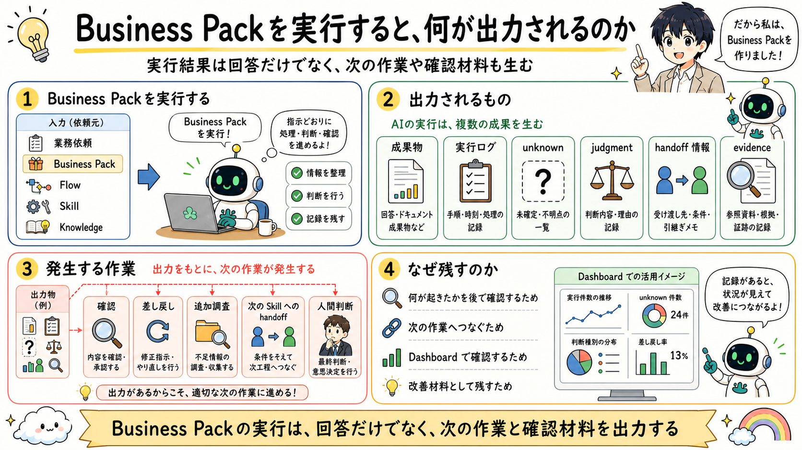

# Business Packを実行すると、何が出力されるのか

> 注記: 下の図画像は skill-centric 統合前の旧モデル（Flow / Capability）を描いています。本文は新モデルに更新済みで、画像は再描画待ちです。

## 一文要約

Business Pack execution produces not only an answer but also logs, unknowns, handoff information, and follow-up work.

## この図で伝えたい主張

Business Pack 実行時の結果は、最終回答だけではありません。
成果物、実行ログ、unknown、judgment、handoff 情報、evidence が出力され、その結果として確認、差し戻し、追加調査、次の Skill への handoff、人間判断といった次の作業が発生します。
図の目的は、実行結果がそのまま観測や次作業の入力になることを示すことです。

## 用語の固定定義

- Skill: AI がある作業単位を実行するための具体手順（meta に capability / tuning / responsibility を宣言）
- Knowledge: 判断根拠としてロードされる業務知識、ルール、観点
- Workflow protocol: Skill 実行を包む汎用の決定論制御（開始ゲート、work item、verify、close）
- Semantic routing: 依頼の意図から適切な Skill を選ぶルーティング
- Handoff: 今の作業結果を次の Skill や人間へ渡す受け渡し点
- OS core: AI Agent の実行制御、guard、routing、closure、audit を担う共通層
- Business Pack: 特定業務を動かす Skill、Knowledge、handoff boundary、業務固有の品質観点の束
- Dashboard: AI の実行ログを人間が観測するための monitor-side layer
- Operational Memory: 監査証跡であると同時に、Skill、Knowledge、guard、quality gate の改善材料となる作業記録
- Guard: AI の実行前後で逸脱や不適切な進行を防ぐ制約
- Quality Gate: closure 前に満たすべき検証条件

## 読み方

- まず AI 実行から何が出力されるかを見る
- 次に、それぞれの出力がどの次作業につながるかを見る
- 最後に、これが Dashboard や改善ループにつながることを考える

## 非対象（誤解防止）

- 実行結果が最終回答だけだという説明ではない
- Dashboard の詳細画面そのものを説明する図ではない
- 人間判断だけが後続作業だという説明ではない
- ログ保存だけを目的にした図ではない

## 関連図

- [06 実行結果はDashboardで観測される](06_os_and_flow_monitor_dashboard.md)
- [07 Dashboardから改善につなげる](07_dashboard_observation_and_improvement.md)
- [01 XRefKitは、AIに業務を依頼するための基盤](01_xrefkit_as_ai_agent_os.md)
