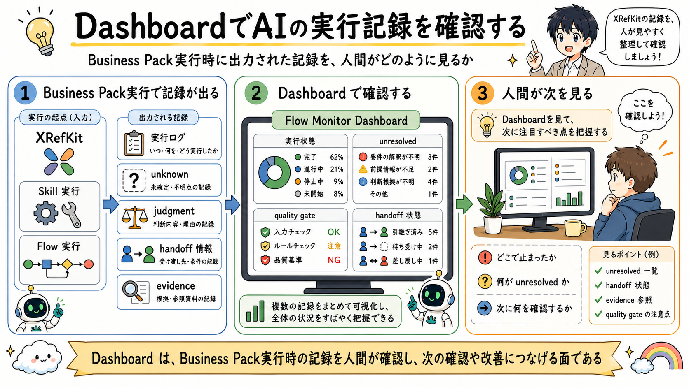

# DashboardでAIの実行記録を確認する

> 注記: 下の図画像は skill-centric 統合前の旧モデル（Flow / Capability）を描いています。本文は新モデルに更新済みで、画像は再描画待ちです。

## 一文要約

The execution records emitted during Business Pack execution are checked by humans through the Dashboard layer.

## この図で伝えたい主張

Business Pack 実行時に出力された成果物、実行ログ、unknown、judgment、handoff 情報、evidence のうち、確認対象になる実行記録は Dashboard 側に集まります。
Dashboard は実行そのものではなく、AI の動作を人間が確認し、問題箇所や改善点を見つける monitor-side layer です。
図の目的は、実行結果、Operational Memory、Dashboard、人間の関係を分離して示すことです。

## 用語の固定定義

- Skill: AI がある作業単位を実行するための具体手順（meta に capability / tuning / responsibility を宣言）
- Knowledge: 判断根拠としてロードされる業務知識、ルール、観点
- Workflow protocol: Skill 実行を包む汎用の決定論制御（開始ゲート、work item、verify、close）
- Semantic routing: 依頼の意図から適切な Skill を選ぶルーティング
- Handoff: 今の作業結果を次の Skill や人間へ渡す受け渡し点
- OS core: AI Agent の実行制御、guard、routing、closure、audit を担う共通層
- Business Pack: 特定業務を動かす Skill、Knowledge、handoff boundary、業務固有の品質観点の束
- Dashboard: AI の実行ログを人間が観測するための monitor-side layer
- Operational Memory: 監査証跡であると同時に、Skill、Knowledge、guard、quality gate の改善材料となる作業記録
- Guard: AI の実行前後で逸脱や不適切な進行を防ぐ制約
- Quality Gate: closure 前に満たすべき検証条件

## 読み方

- まず左側で実行結果として何が出るかを見る
- 次に中央で Dashboard がどの記録を受け取るかを見る
- 最後に右側で、人間がそれをどう確認するかを見る

## 非対象（誤解防止）

- Dashboard が AI を実行するものではない
- Dashboard が正本知識を持つ層ではない
- 監査だけのための表示ではない
- ログ保管庫そのものではない

## 関連図

- [05 AIを実行すると、何が出力されるのか](05_execution_outputs_and_followup_work.md)
- [07 Dashboardから改善につなげる](07_dashboard_observation_and_improvement.md)
- [01 XRefKitは、AIに業務を依頼するための基盤](01_xrefkit_as_ai_agent_os.md)

Business Pack 実行時に出力された記録が、どのように Dashboard 側へ渡るかを詳細化した図です。
