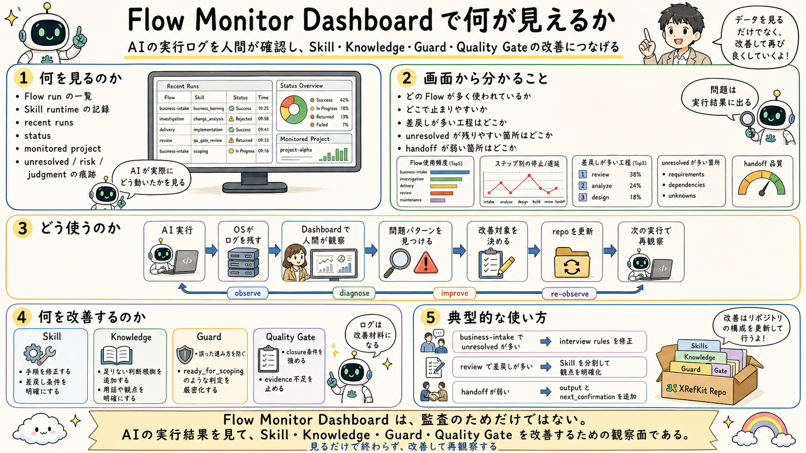

# Dashboardから改善につなげる

## 一文要約

The Dashboard observations are used to improve Skills, Knowledge, Guards, and Quality Gates.

## この図で伝えたい主張

`06` で観測された実行記録から、どの Skill が動いたか、どこで止まったか、何が unresolved か、どの quality gate で詰まったかを見られます。
その観測結果は監査で終わらず、Skill、Knowledge、guard、quality gate の改善材料として使います。
図の目的は、何を見られるのかと、それをどう改善につなげるのかを一枚で示すことです。

## 用語の固定定義

- Skill: AI がある作業単位を実行するための具体手順（meta に capability / tuning / responsibility を宣言）
- Knowledge: 判断根拠としてロードされる業務知識、ルール、観点
- Workflow protocol: Skill 実行を包む汎用の決定論制御（開始ゲート、work item、verify、close）
- Semantic routing: 依頼の意図から適切な Skill を選ぶルーティング
- Handoff: 今の作業結果を次の Skill や人間へ渡す受け渡し点
- OS core: AI Agent の実行制御、guard、routing、closure、audit を担う共通層
- Business Pack: 特定業務を動かす Skill、Knowledge、handoff boundary、業務固有の品質観点の束
- Dashboard: AI の実行ログを人間が観測するための monitor-side layer
- Operational Memory: 監査証跡であると同時に、Skill、Knowledge、guard、quality gate の改善材料となる作業記録
- Guard: AI の実行前後で逸脱や不適切な進行を防ぐ制約
- Quality Gate: closure 前に満たすべき検証条件

## 読み方

- まず Dashboard で見える情報の種類を見る
- 次に、どの観測がどの改善対象につながるかを見る
- 最後に、Operational Memory が改善ループの入力になっていることを確認する

## 非対象（誤解防止）

- ダッシュボードを見るだけで改善が自動完了するわけではない
- 人間が全ログを手作業で読むことを前提にしていない
- 単なる監査証跡ビューアではない
- 実行制御層そのものではない

## 関連図

- [06 Skill Run Observation Dashboard](06_skill_run_observation_dashboard.md)
- [04 Code Review as Split Checks](04_code_review_as_split_checks.md)
