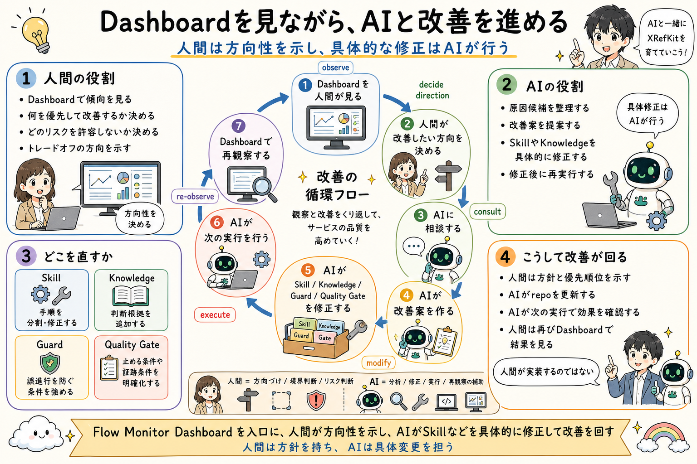

# 人間が方向を決め、AIが修正する

## 一文要約

Humans set direction and approval points, while AI performs the concrete modifications.

## この図で伝えたい主張

`04` で表面化した tradeoff や確認点に対して、改善ループでは人間の役割は方向性、優先順位、許容 tradeoff の提示です。
具体的な Skill、Knowledge、guard、quality gate の修正は AI が実施し、その結果を再び人間が確認します。
図の目的は、人間が方針を持ち、AI が具体変更を担う役割分担を明示することです。

## 用語の固定定義

- Flow: 業務の進み方、境界、handoff 順序を定義する単位
- Skill: AI がある作業単位を実行するための具体手順
- Knowledge: 判断根拠としてロードされる業務知識、ルール、観点
- Handoff: 今の作業結果を次の Skill や人間へ渡す受け渡し点
- OS core: AI Agent の実行制御、guard、routing、closure、audit を担う共通層
- Business Pack: 特定業務を動かす Flow、Skill、Knowledge、handoff boundary の束
- Dashboard: AI の実行ログを人間が観測するための monitor-side layer
- Operational Memory: 監査証跡であると同時に、Skill、Knowledge、guard、quality gate の改善材料となる作業記録
- Guard: AI の実行前後で逸脱や不適切な進行を防ぐ制約
- Quality Gate: closure 前に満たすべき検証条件

## 読み方

- まず人間が決めるものと AI が直すものの境界を見る
- 次に、修正対象が複数の管理対象に分かれていることを見る
- 最後に、修正後の再観測と次の改善ループを見る

## 非対象（誤解防止）

- 人間が細部修正をすべて手作業で行う運用ではない
- AI が方針を独断で決める運用ではない
- 一回直せば終わる改善モデルではない
- コード修正だけに限定したループではない

## 関連図

- [04 Code Review as Split Checks](04_code_review_as_split_checks.md)
- [07 Dashboardから改善につなげる](07_dashboard_observation_and_improvement.md)

`04` で分割された確認観点のあいだに tradeoff が出たとき、誰が方向を決め、誰が具体修正を行うかを詳細化した図です。
