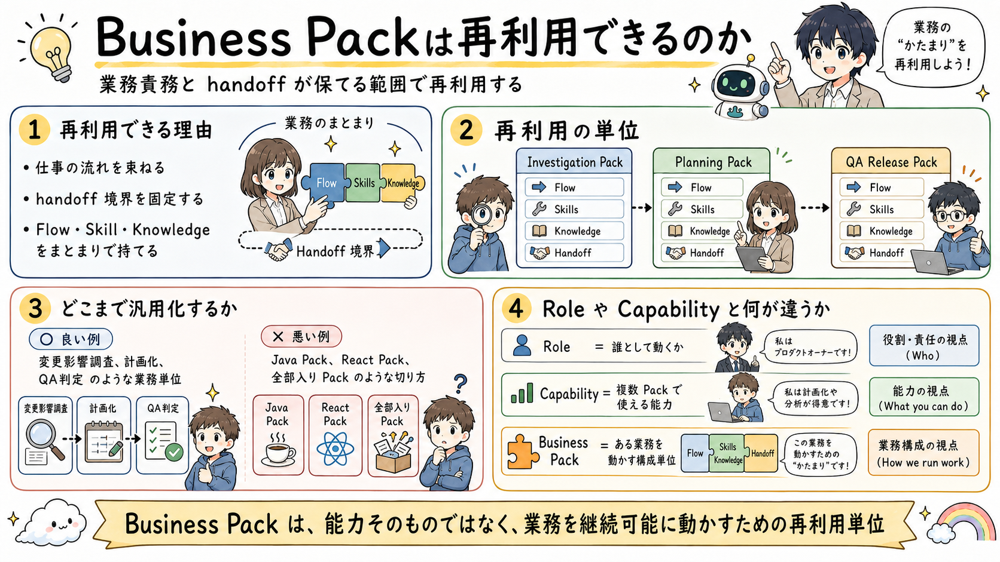

# Business Packはどう再利用するか

## 一文要約

Business Pack can be reused when work responsibility and handoff boundaries stay intact, and this is different from role or capability reuse.

## この図で伝えたい主張

Business Pack は再利用できますが、何でも共通化するものではありません。
再利用単位は技術スタックではなく、変更影響調査、計画化、QA 判定のような業務責務のまとまりです。
この図ではじめて、Role、Capability、Business Pack の違いを並べて説明します。

## 用語の固定定義

- Flow: 業務の進み方、境界、handoff 順序を定義する単位
- Skill: AI がある作業単位を実行するための具体手順
- Knowledge: 判断根拠としてロードされる業務知識、ルール、観点
- Handoff: 今の作業結果を次の Skill や人間へ渡す受け渡し点
- OS core: AI Agent の実行制御、guard、routing、closure、audit を担う共通層
- Business Pack: 特定業務を動かす Flow、Skill、Knowledge、handoff boundary の束
- Dashboard: AI の実行ログを人間が観測するための monitor-side layer
- Operational Memory: 監査証跡であると同時に、Skill、Knowledge、guard、quality gate の改善材料となる作業記録
- Guard: AI の実行前後で逸脱や不適切な進行を防ぐ制約
- Quality Gate: closure 前に満たすべき検証条件

## 読み方

- まず再利用できる理由と、Pack が束ねるものを見る
- 次に、どのような業務単位なら再利用しやすいかを見る
- 最後に、Role、Capability、Business Pack の違いを見る

## 非対象（誤解防止）

- Java Pack や React Pack のような技術名パックを推奨するものではない
- 全部入りの巨大パックを推奨するものではない
- Role や Capability を不要だと言う図ではない
- Pack が OS core を置き換えると言う図ではない

## 関連図

- [02 Business Pack Explained](02_business_pack_explained.md)
- [03 Flow Skill Knowledge Handoff](03_flow_skill_knowledge_handoff.md)
- [01 XRefKitは、AIに業務を依頼するための基盤](01_xrefkit_as_ai_agent_os.md)
