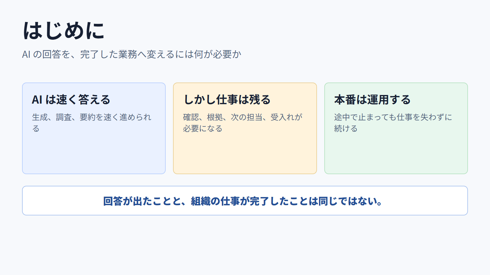
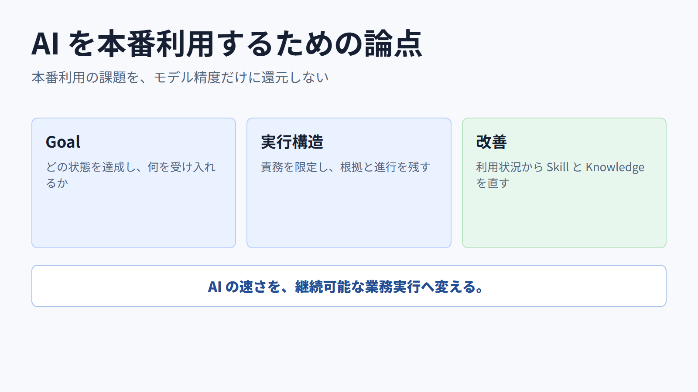
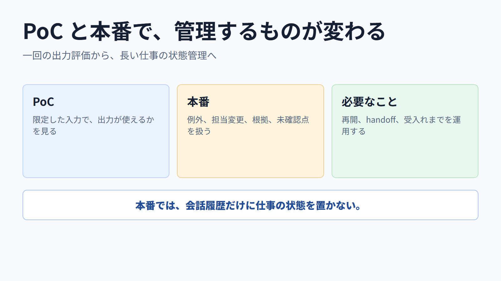
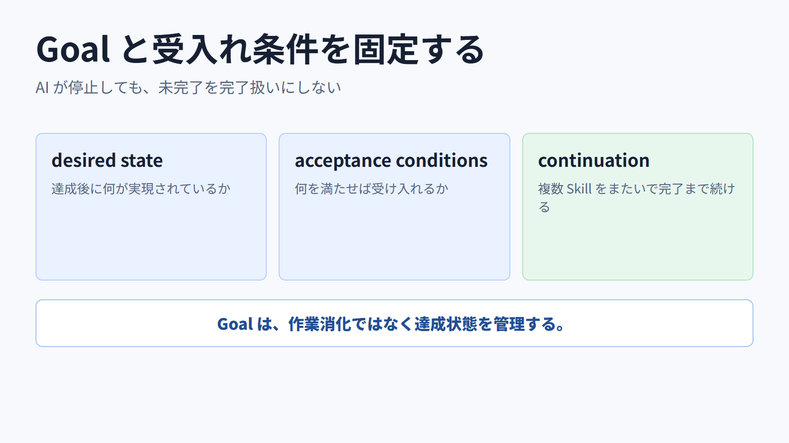
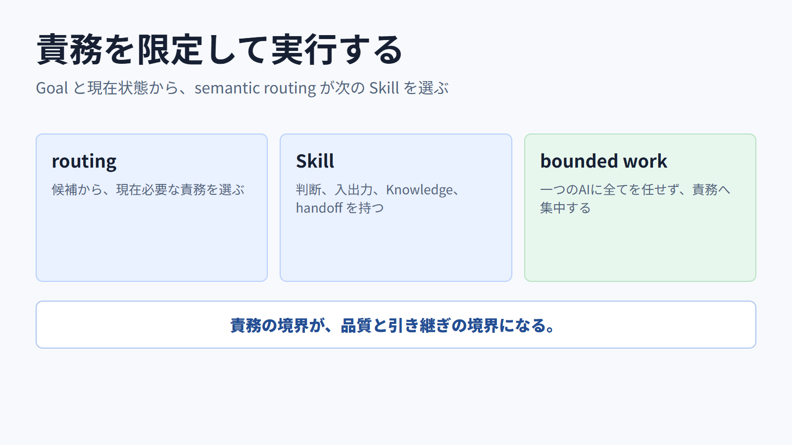
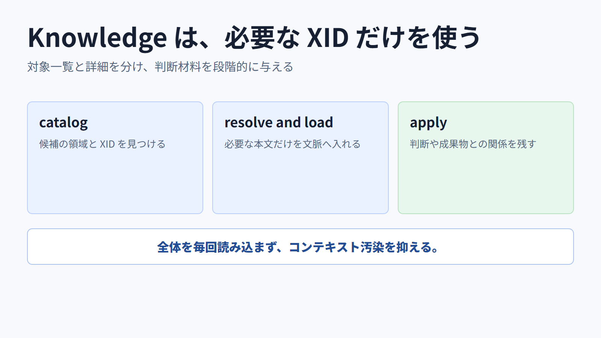
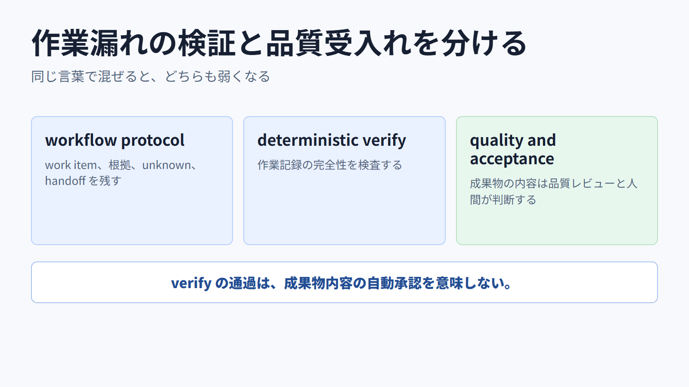
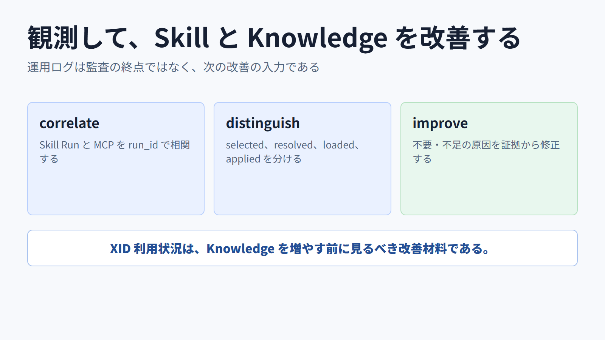
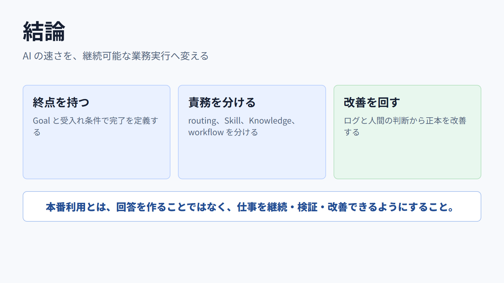

<!-- xid: A4D7E9C21B63 -->

# AI を本番利用するための論点

- 想定読者: AI 活用を個人利用や PoC から業務実行へ進めたい組織
- 目的: 本番利用の課題をモデル精度だけに還元せず、Goal、責務、Knowledge、検証、受入れ、観測の運用として整理する
- 構成: PoCとの差 -> 本番に必要な境界 -> 実行と検証 -> 観測と改善

---

AI の回答が有用でも、業務として安全に続けられるとは限りません。本番利用では、何を終点とし、誰が受け入れ、途中で止まった仕事をどう扱うかが必要になります。

---

本番利用の論点は、モデルを賢くすることだけではありません。AI の仕事を、再開、検証、改善できる実行単位にすることです。

---

PoC は一回の出力を評価できます。本番では、長い仕事、例外、担当変更、判断根拠、受入れまで管理します。

---

Goal は達成後の状態と受入れ条件を置きます。タスクを消化したことや AI が止まったことを、完了にはしません。

---

semantic routing が次の Skill を選びます。Skill は責務、判断、入出力、必要な Knowledge、handoff 境界を限定します。

---

Knowledge はカタログから必要な XID を選びます。全体を毎回読み込まず、判断に必要な情報だけを段階的に使います。

---

workflow protocol は work item、根拠、unknown、handoff を記録します。`verify` は記録の完全性を検査し、成果物の受入れは別の quality review と人間が判断します。

---

Skill Run と MCP のログを相関させ、選ばれた、解決された、ロードされた、適用された XID を区別します。不要・不足の Knowledge と Skill の改善を証拠から行います。

---

本番利用とは、AI の速さを単発の回答で終わらせず、Goal、責務、Knowledge、検証、受入れ、観測を持つ業務実行へ変えることです。
