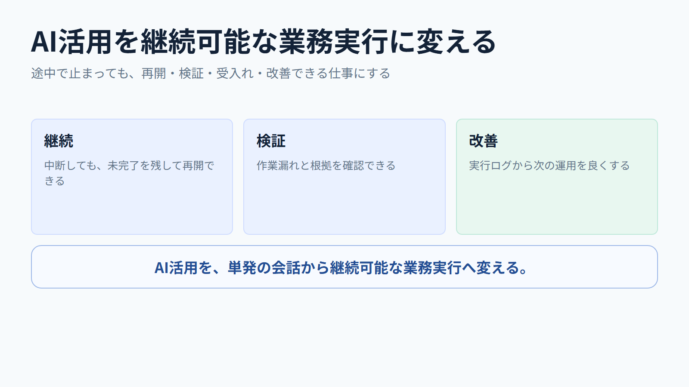
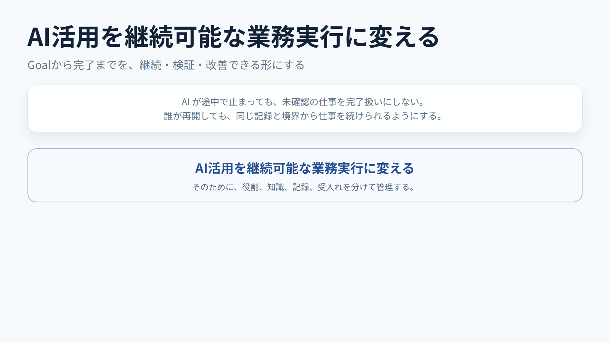
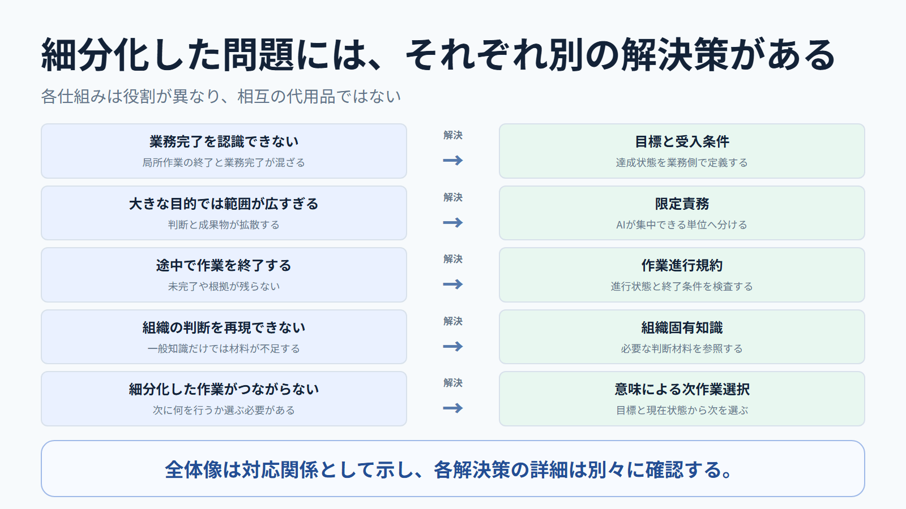
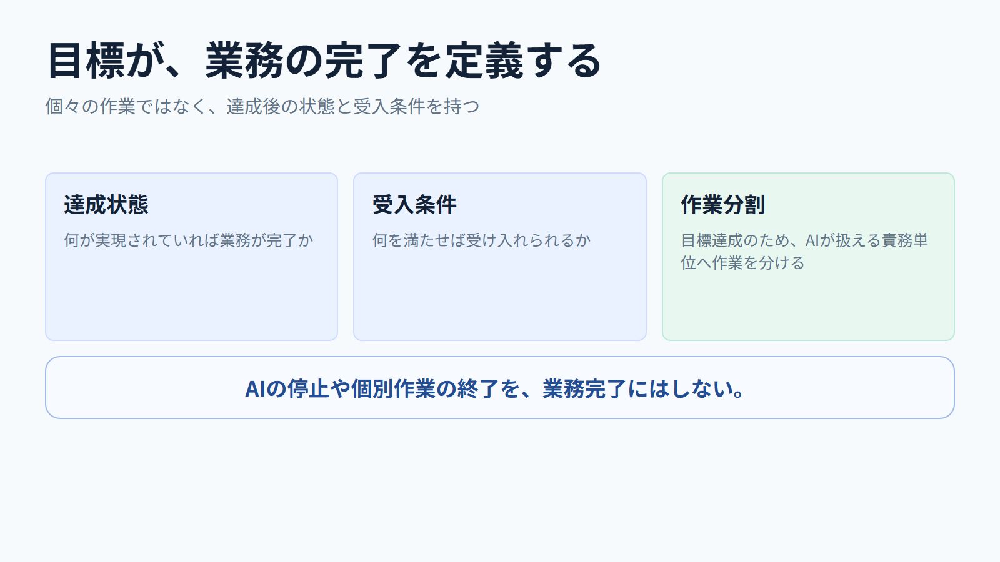
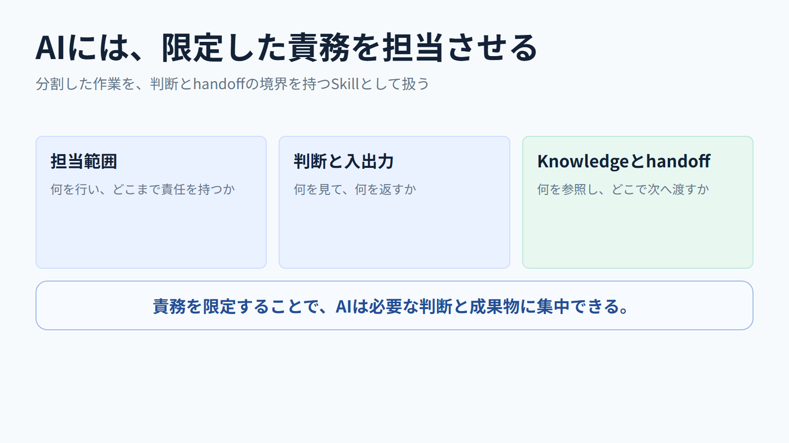
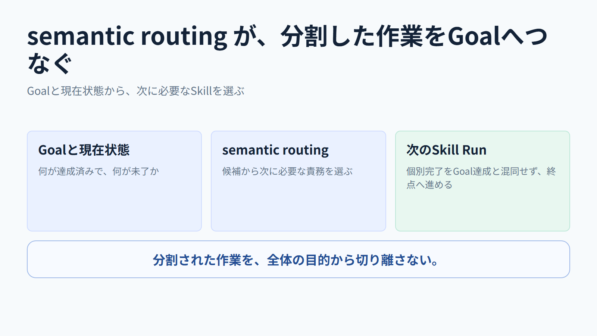
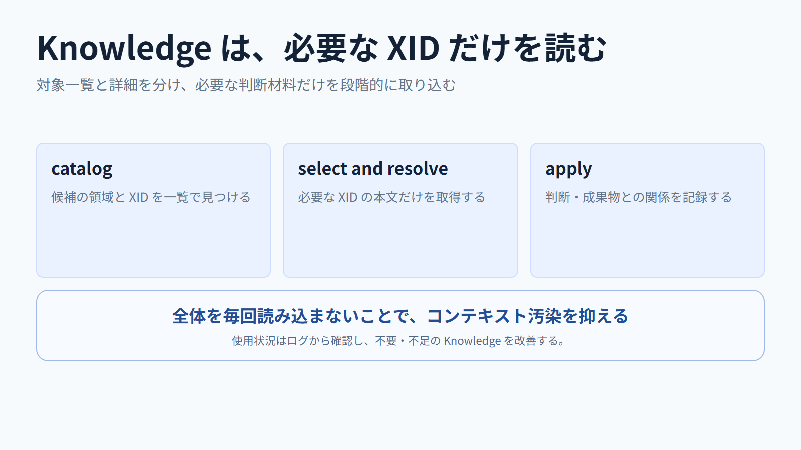
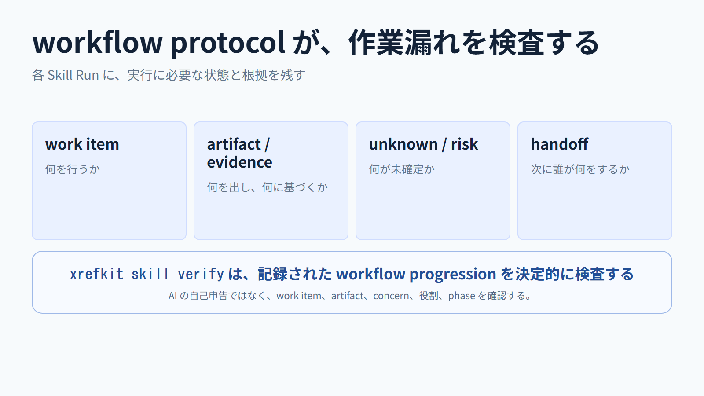
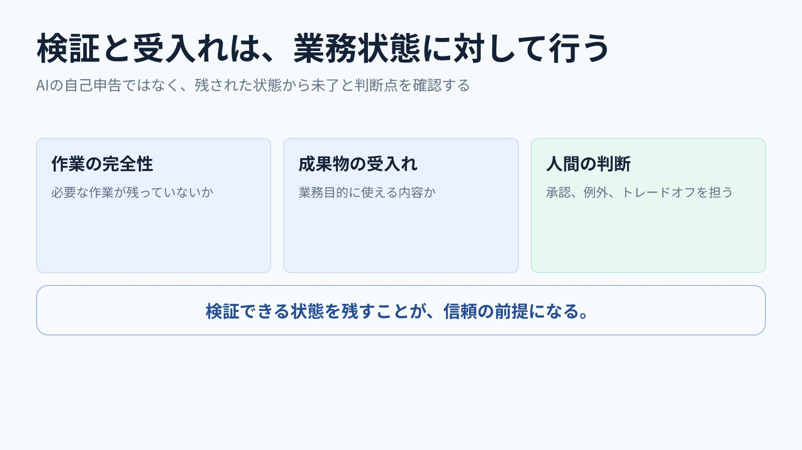
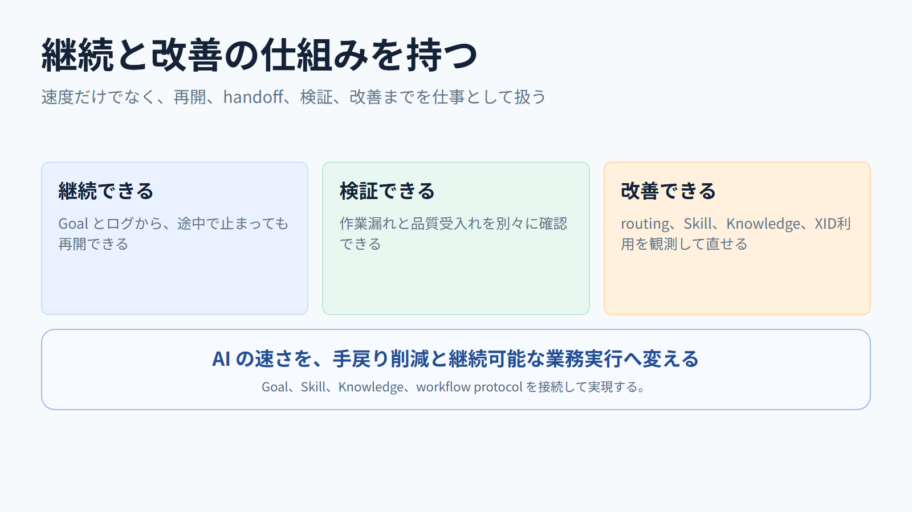

<!-- xid: D7C3A9E15B42 -->

# AI活用を継続可能な業務実行に変える

- 想定時間: 8-12 分
- 想定読者: AI 活用を個人の会話から、継続可能な業務実行へ進めたい組織
- 目的: AI の回答を、Goalから完了まで継続・検証・改善できる業務実行へ変える仕組みを説明する
- 構成: 個人利用の限界 -> 運用の構成要素 -> 実行時の役割分担 -> 継続と改善
- 形式: 画像ベース

---

発表メモ:
AI は速く答えます。しかし、回答が出たことと、組織の仕事が完了したことは同じではありません。この資料では、AI 活用を継続可能な業務実行に変える仕組みを説明します。

---

発表メモ:
問いは、AI をどう増やすかではありません。途中で止まっても仕事を失わず、誰が再開しても同じ運用をたどれるようにするには、何を持つ必要があるかです。

---

発表メモ:
個人のプロンプト運用では、判断材料、未確認点、次の作業、受入れ条件が会話に埋もれます。担当者が変われば、同じ説明と調査を繰り返すことになります。

---

発表メモ:
最初に、何を完了とするかを Goal と受入れ条件で置きます。作業を消化したことや、AI が停止したことを完了にしないためです。

---

発表メモ:
Goal と現在状態から、semantic routing が次に必要な Skill を選びます。人が毎回、Skill 一覧から手作業で選ぶ運用にしません。

---

発表メモ:
Skill は担当範囲、判断方法、入出力、必要な Knowledge、handoff を定義します。AI の責務を限定することで、必要な判断に集中でき、品質の責任範囲も明確になります。

---

発表メモ:
Knowledge は判断材料です。カタログから必要な XID を選び、本文を段階的に読むことで、全体を毎回読み込むことによるコンテキスト汚染を防ぎます。

---

発表メモ:
各 Skill Run では work item、成果物、根拠、unknown、risk、judgment、handoff をログに残します。`xrefkit skill verify` は、その作業記録に漏れがないかを決定的に検査します。

---

発表メモ:
workflow の検証は、成果物の内容を承認することとは別です。必要な場合は独立した quality review と人間の受入れで品質を判断します。人間は Goal、受入れ、例外を担います。

---

最後の一言:
Goal、routing、責務を限定した Skill、必要な Knowledge、workflow protocol を分け、記録から再開・handoff・改善できるようにする。これにより、AI の速さを継続性と手戻り削減へ変えます。

## 関連

- [AI組織説明動画 改訂シナリオ](063_ai_organization_explainer_clear_script.md)
- [AIの作業を途中で終わらせないための仕組み](071_ai_workflow_completion_and_skill_scope_material.md#xid-F6C3A9E12B47)
- [XID利用状況を確認し、SkillとKnowledgeを改善する](072_xid_usage_observability_and_improvement_presentation.md#xid-E5B0D94A71C3)
