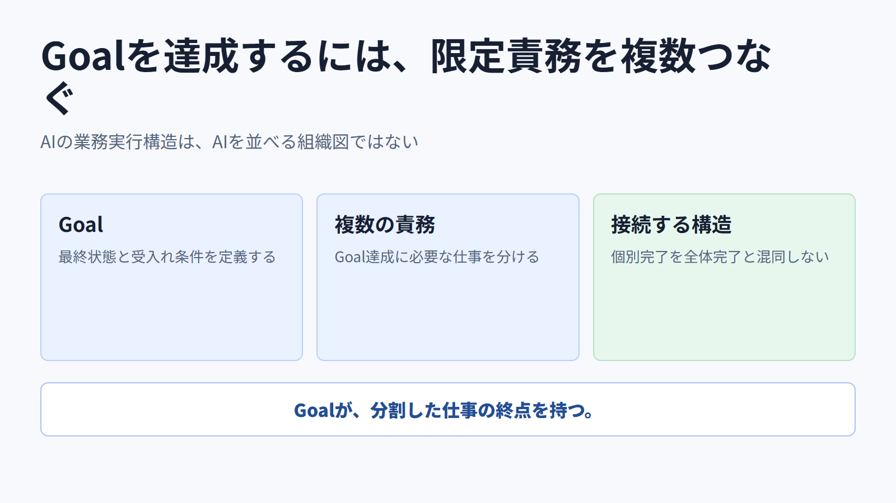
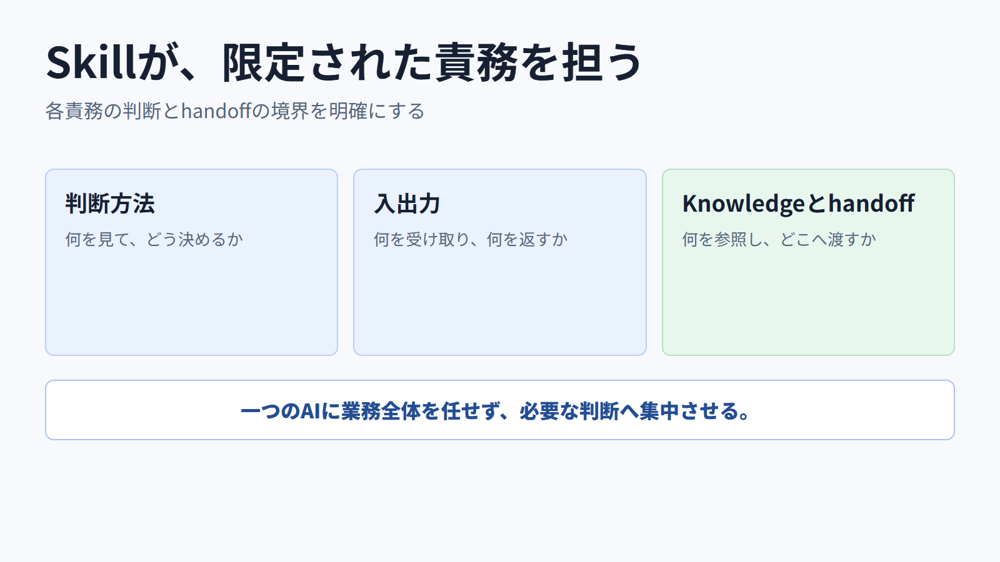
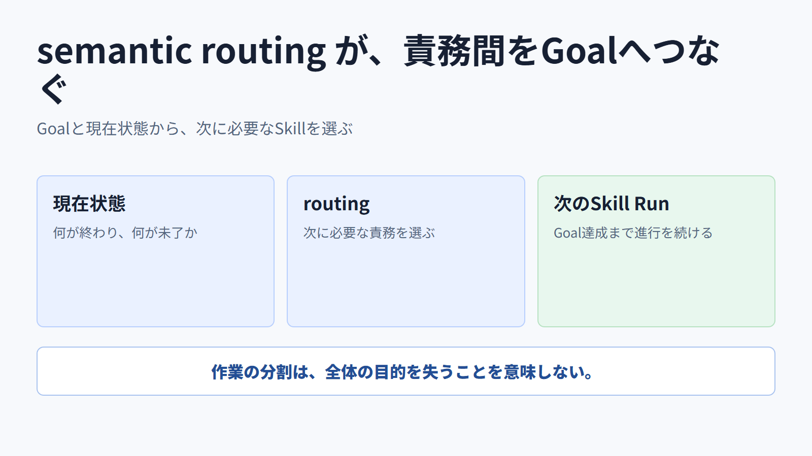
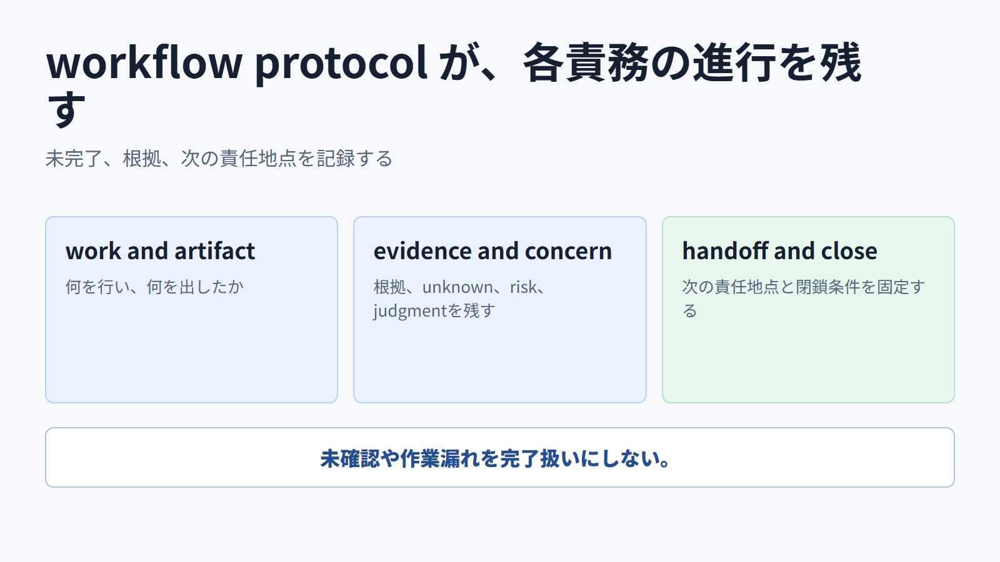
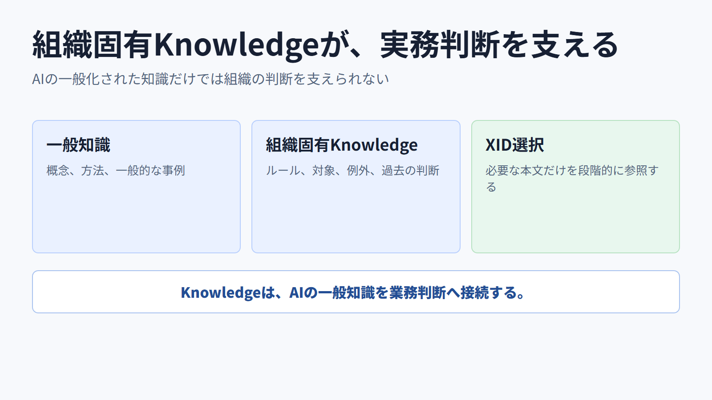
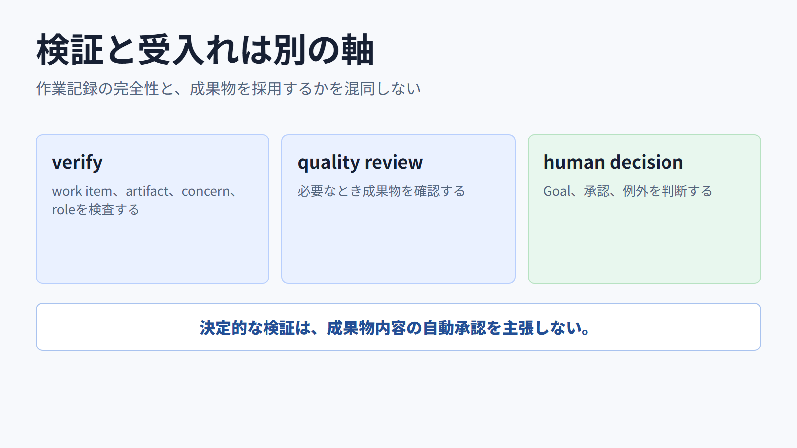
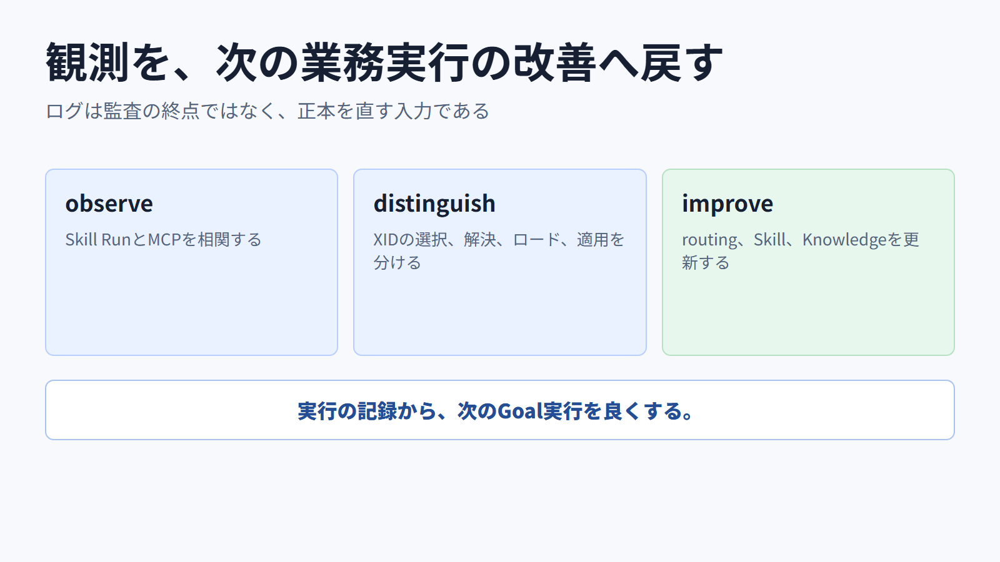
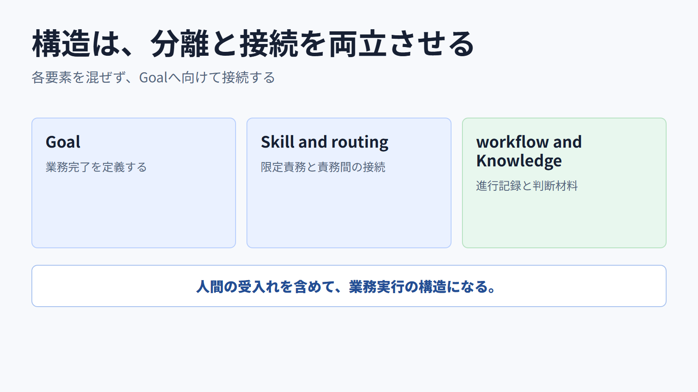
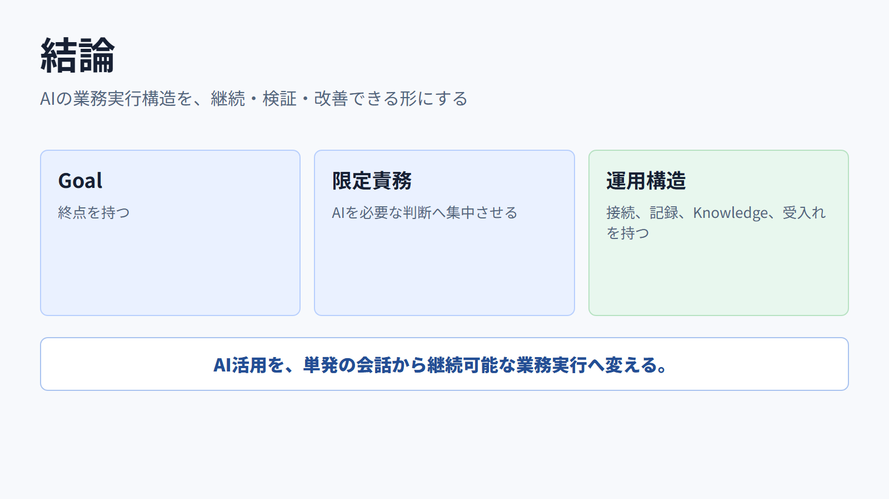

<!-- xid: C8E2B4D19A65 -->

# AI の業務実行構造をどう持たせるか

Goalを達成するための限定責務をSkillとして定義し、semantic routing、workflow protocol、組織固有Knowledge、人間の受入れで接続する構造を説明する。

---

---

---

---

---

---

---

---

---

