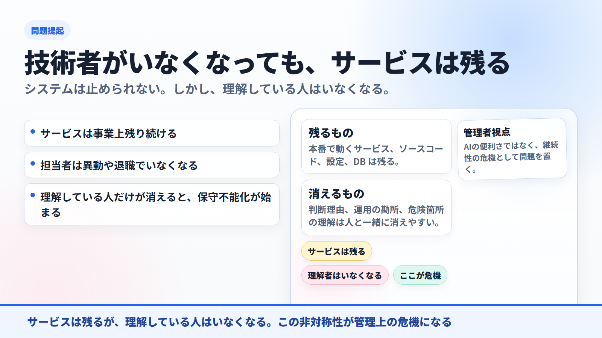
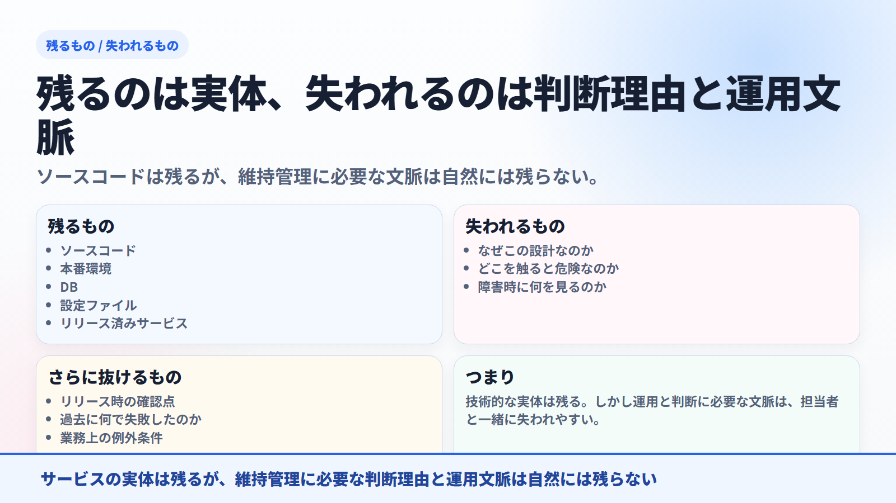
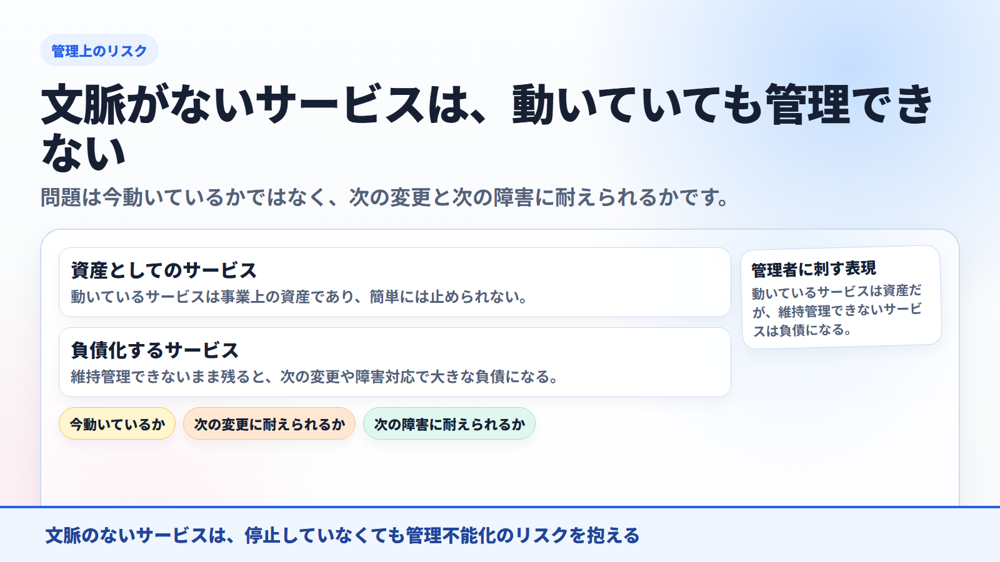
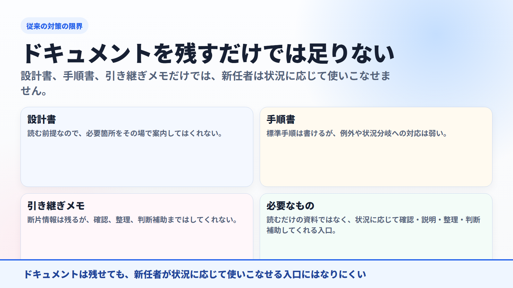
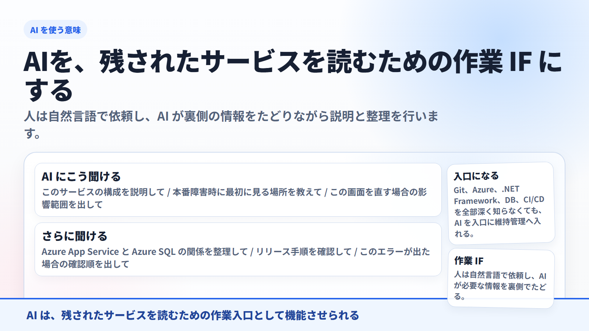
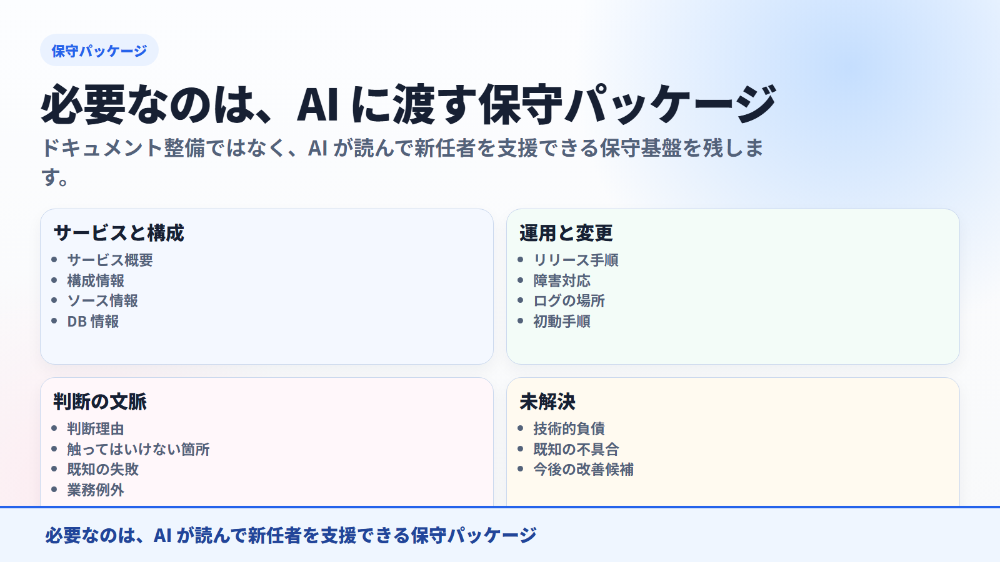
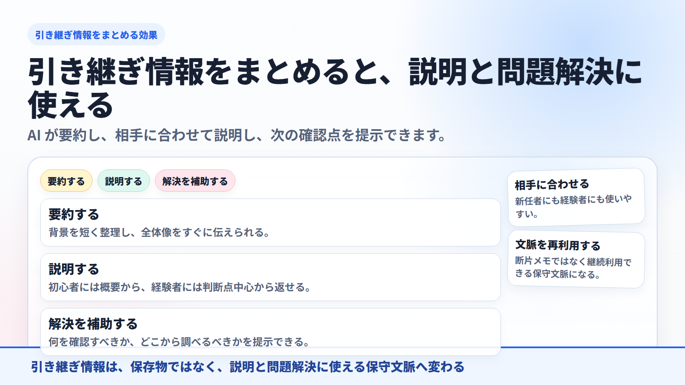
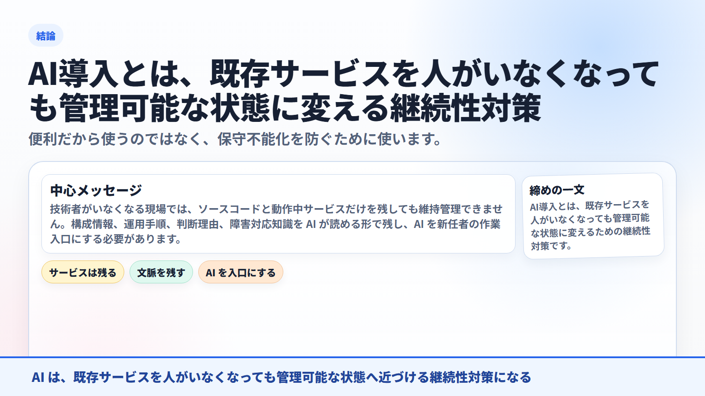

<!-- xid: B8F4D19A6C32 -->

# AIに作業を引き継ぐとは何か キャラクタ版スライド

- 想定時間: 6-10 分
- 想定読者: 異動や担当変更がある組織で、知識継承の難しさを感じている人
- 目的: `AIに引き継ぐ` を、既存サービスの保守不能化を防ぐ継続性対策として説明する
- 強調点: AI を、残されたサービスを読むための作業 IF として使う
- 形式: 画像ベース

---

発表メモ:
システムは止められません。しかし、理解している人はいなくなります。ここで管理者の危機感を先に作ります。

---

発表メモ:
残るのは、ソースコード、本番環境、DB、設定ファイル、リリース済みサービスです。失われるのは、設計理由や運用時の判断文脈です。

---

発表メモ:
問題は今動いているかではありません。次の変更、次の障害、次の担当者交代に耐えられるかです。

---

発表メモ:
設計書、手順書、引き継ぎメモだけでは、新任者は状況に応じて使いこなせません。必要なのは、状況に応じて案内してくれる入口です。

---

発表メモ:
新任者は AI に、構成説明、影響範囲、障害時の確認順、リリース手順を聞けます。AI が裏側の情報をたどる入口になります。

---

発表メモ:
残すべきなのは、サービス概要、構成情報、ソース情報、DB 情報、リリース手順、障害対応、判断理由、未解決事項です。

---

発表メモ:
引き継ぎ情報を AI 可読な形でまとめると、AI が要約し、相手に合わせて説明し、次の確認点や修正方向を提示できます。

---

最後の一言:
便利だから使うのではありません。保守不能化を防ぐために、AI を新任者の作業入口として使える状態を作ることが重要です。
