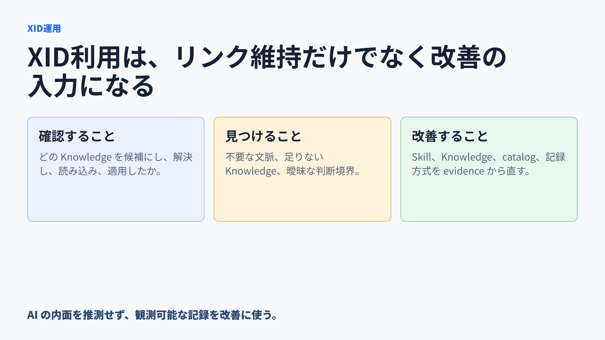
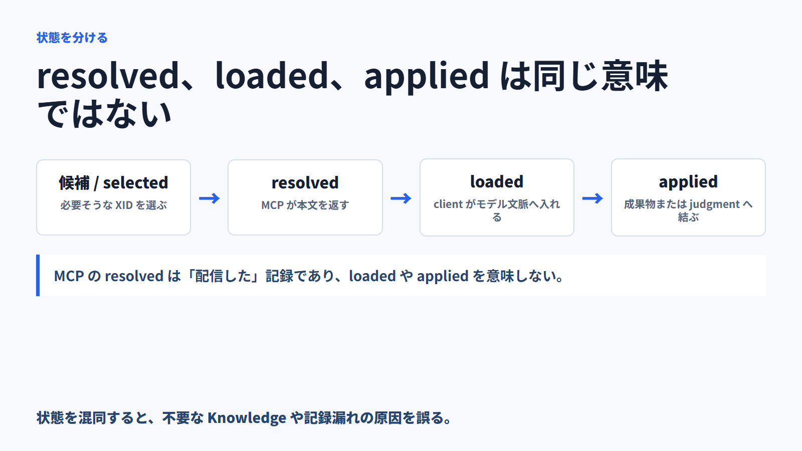
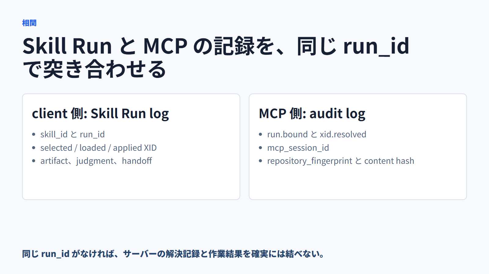
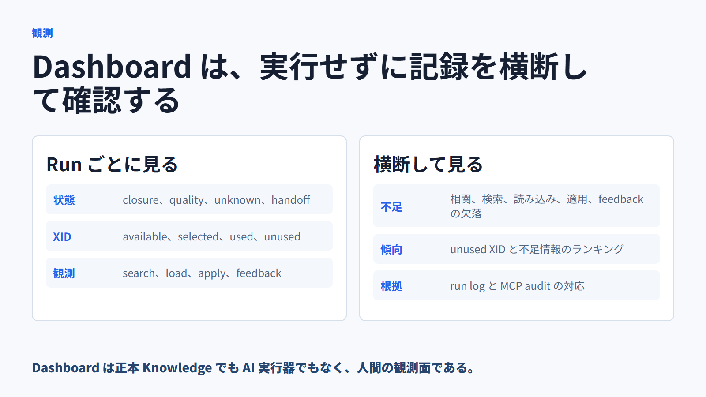
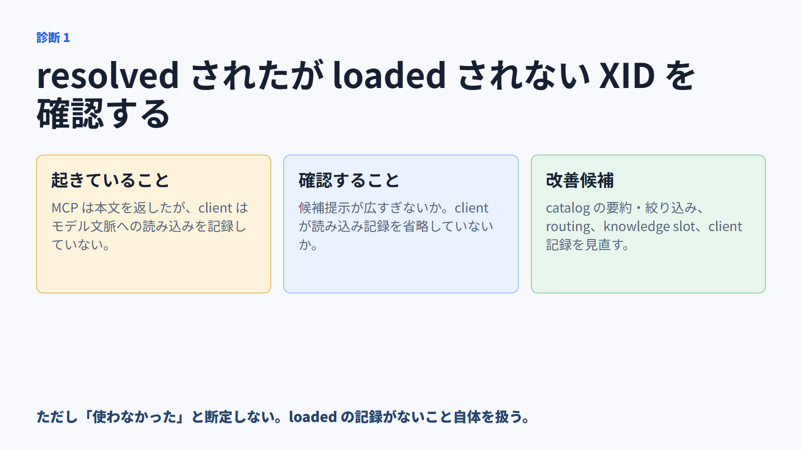
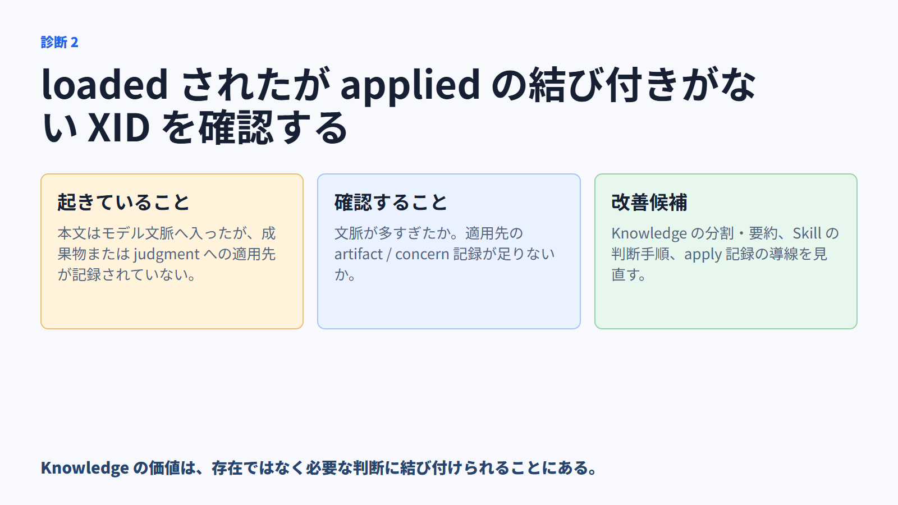
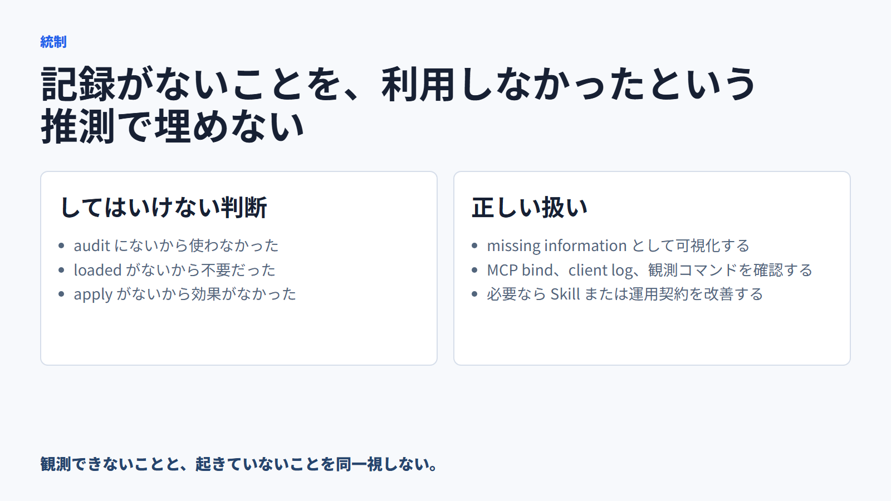
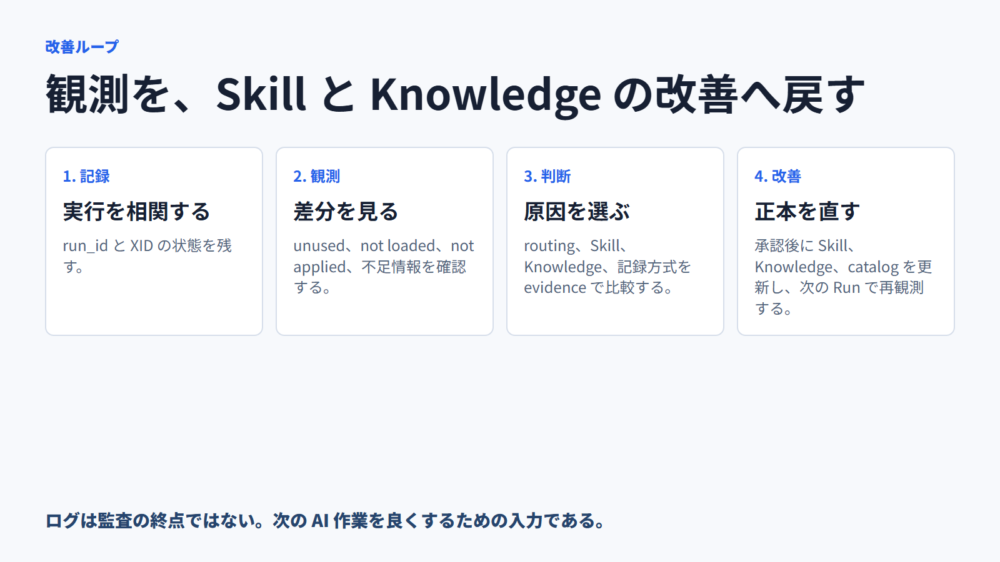

<!-- xid: E5B0D94A71C3 -->

# XID利用状況を確認し、SkillとKnowledgeを改善する

この資料は、Skill Run と MCP の記録から、AI がどの XID を候補にし、
解決し、モデル文脈へ読み込み、成果物または判断へ適用したかを確認するための
運用者向けスライドである。

## 中心メッセージ

XID の管理はリンク切れの検査だけではない。実際に使われた Knowledge の記録を
確認し、不要な文脈、足りない Knowledge、曖昧な Skill の判断境界を改善する。

ただし、MCP が XID を解決したことだけでは、AI がその本文をモデル文脈へ
読み込んだことにも、判断へ適用したことにもならない。これらを分けて記録する。

## スライド

---

---

---

---

---

---

---

---

## 運用上の判断

- `xid.resolved` だけ: MCP が候補本文を返した記録。モデル文脈へ入ったとは判断しない。
- `knowledge.loaded`: クライアントが本文をモデル文脈へ読み込んだ記録。
- `knowledge.applied`: 読み込んだ XID と成果物または judgment の結び付け。
- resolved されても loaded されない: 検索・候補提示が広すぎる、またはクライアントが選択を記録していない可能性を確認する。
- loaded されても applied がない: 文脈が多すぎる、適用先の記録が不足している、または判断に使わなかった可能性を確認する。
- missing information: 利用しなかったと決めつけず、ログ、MCP bind、または client observation の不足として扱う。

改善は、観測だけで自動決定しない。人間が evidence を確認し、次のどこを直すかを選ぶ。

- semantic routing または Skill の applicability / precondition
- Skill の knowledge slot、手順、出力・handoff 境界
- Knowledge の要約、分割、統合、catalog metadata、適用範囲
- MCP / client の相関・読み込み・適用記録

## 関連

- [Skill Run Observation Dashboard Usage](../../docs/guides/086_skill_run_observation_dashboard_usage.md#xid-4A4763A2DE63)
- [Workflow Protocol Sequence For Humans](../../docs/guides/087_workflow_protocol_sequence_for_humans.md#xid-E8B4D2F19A63)
- [XRefKit Startup Contract](../../docs/core/contracts/080_xrefkit_startup_contract.md#xid-C3A1F78D9B22)
