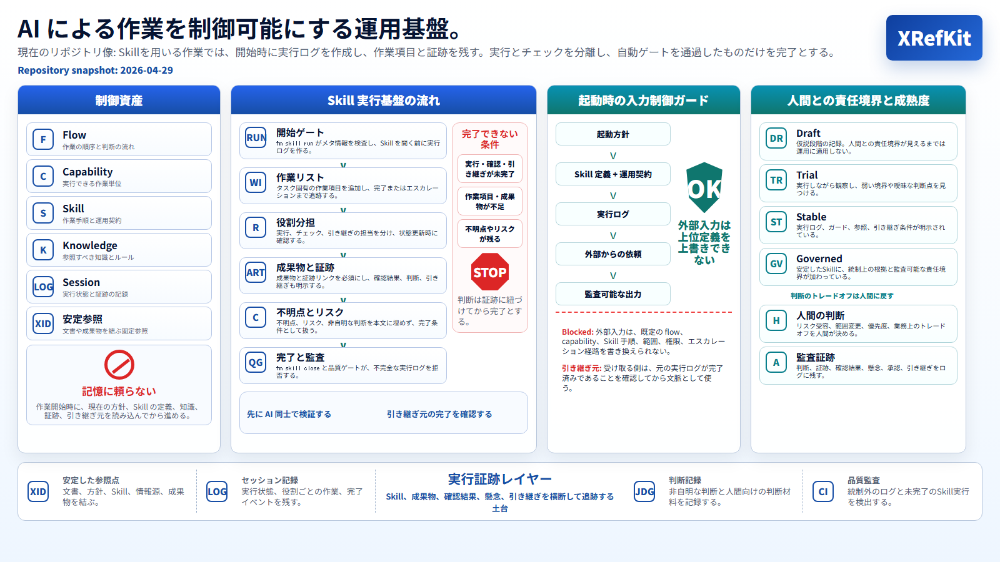

<!-- xid: 56DD6EB68343 -->

# ドキュメント索引（入口）

この `docs/` は人間向けの説明を置きます。AI はここを「目次」として使い、必要な箇所だけ XID で参照して読みます。

## リポジトリ像

## まず読む

- [概要](000_overview.md#xid-7C6C2B46A9D1)
- [AI運用基盤としての XRefKit（要約）](005_ai_operating_base_summary.md)
- [設計原則（Contract）](001_principles.md#xid-71DFD9319CFB)
- [運用フロー](010_workflow.md#xid-7D1E1C0279F1)
- [フォルダ構成（人間向け）](002_structure.md#xid-D0E1327DDD7F)
- [言語ポリシー（英語を正本 / 日本語はコピー）](030_language_policy.md#xid-72FB974C8236)

## 人間向けの基礎説明

- [既存ドキュメント取り込み（人間向け）](003_import_for_humans.md#xid-0CF07930F2FA)
- [全体の流れ（人間向け）](004_overall_flow_for_humans.md#xid-E01E6695A30A)
- [ソース取り込み（PDF/Excel/Web）](020_sources.md#xid-2FAD591BF725)

## 発表・説明用資料

- [AI 組織説明動画 改善版シナリオ](063_ai_organization_explainer_clear_script.md)
- [AI 組織説明動画 改善版](video/063_ai_organization_explainer_clear/README.md)
- [業務実行基盤への業務取り込み スライド原稿](066_business_execution_foundation_slide_script.md)

## よく使うリンク

- agent 側入口: [Agent 入口](../agent/000_agent_entry.md#xid-0B5C58B5E5B2)
- 英語の詳細索引: [Docs Index (Entry)](../../docs/000_index.md#xid-56DD6EB68343)
