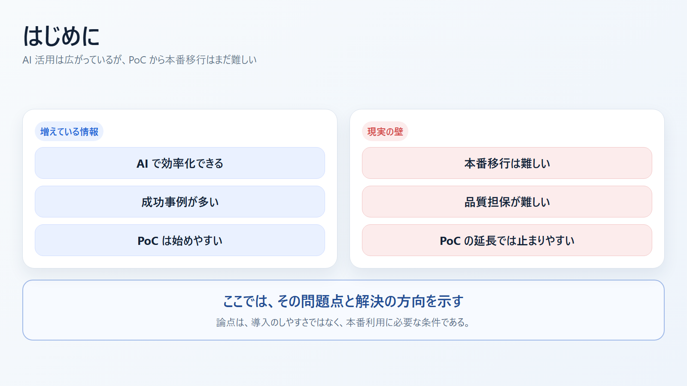
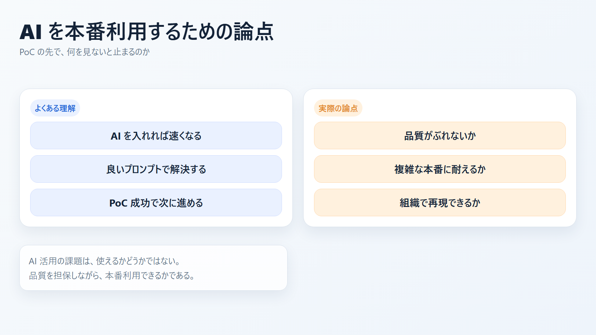
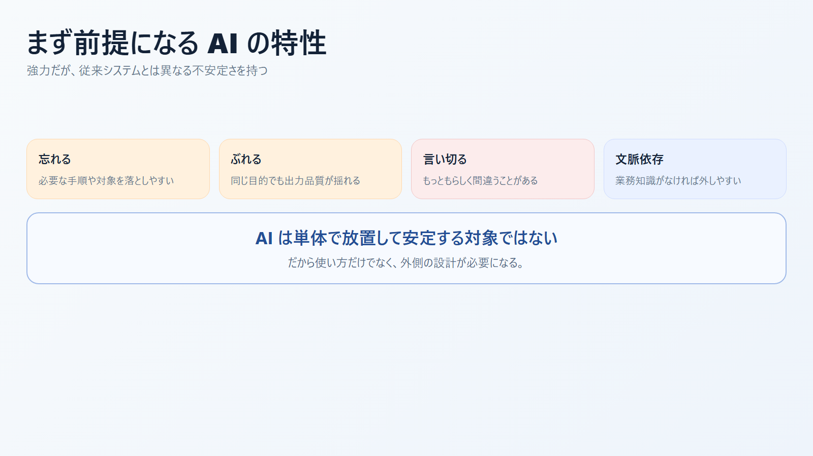
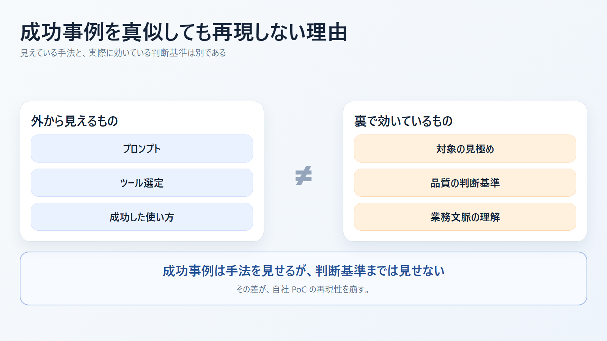
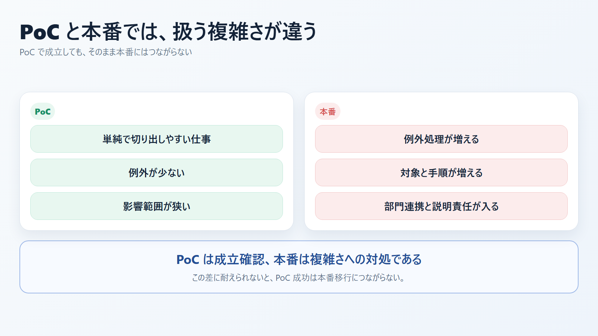
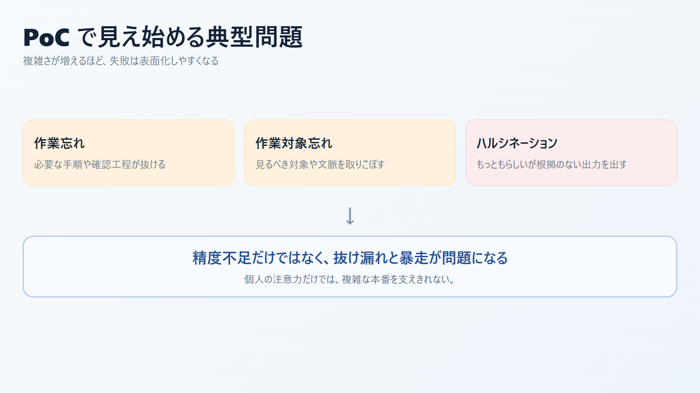
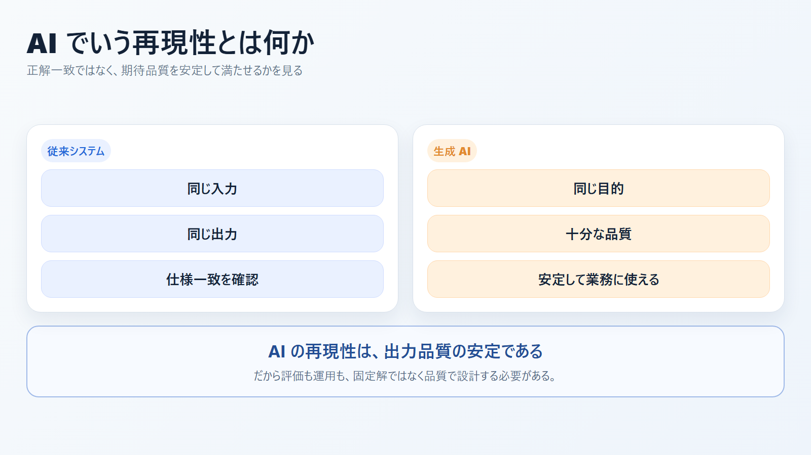
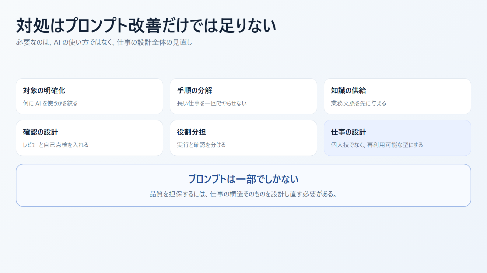
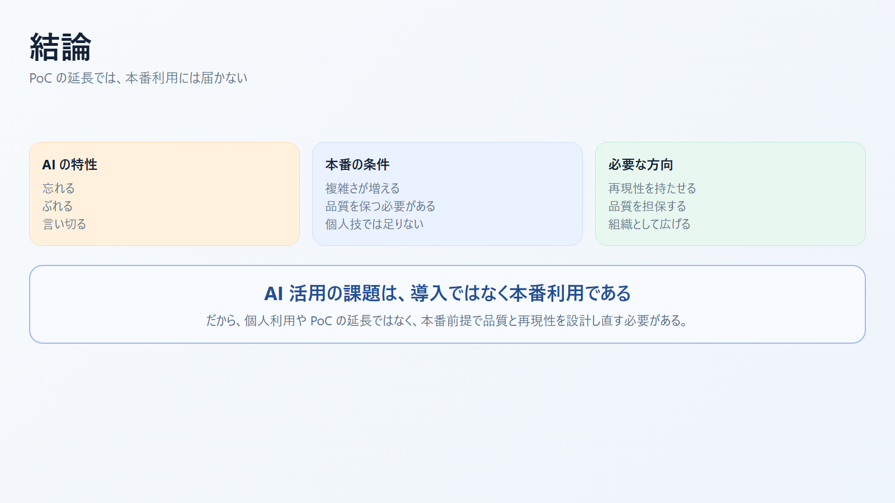

# AI を本番利用するための論点 スライド案

- 想定時間: 8-12 分
- 想定読者: AI 活用を検討しているが、まだ個人利用や PoC 段階にある組織
- 目的: AI の特性、PoC の限界、再現性と品質担保の観点から、AI を本番利用する際の論点を整理する
- 構成: 特性 -> PoC の限界 -> 再現性 -> 品質担保
- 形式: 画像ベース

---

発表メモ:
AI を使った効率化の情報は増えていますが、PoC から本番へ進めるのは簡単ではありません。この資料では、その背景にある問題点と、どう考えるべきかを整理します。

---

発表メモ:
この資料では、AI を本番利用するときに何が論点になるのかを整理します。

---

発表メモ:
AI は強力ですが、忘れる、ぶれる、もっともらしく間違う、文脈がなければ外すという特性があります。ここが従来システムとの大きな違いです。

---

発表メモ:
成功事例を読んでも再現しにくいのは、表に出ている手法だけではなく、裏側に判断基準と業務文脈があるからです。

---

発表メモ:
PoC は比較的単純な仕事で成立しやすい一方、本番では例外、長い手順、対象増加、部門連携といった複雑さに対処しなければなりません。

---

発表メモ:
PoC では精度不足だけでなく、作業忘れ、作業対象忘れ、ハルシネーションが問題になります。複雑さが増えると、これらはさらに表面化します。

---

発表メモ:
AI の再現性は、同じ答えを返すことではありません。期待する品質を安定して満たせることです。

---

発表メモ:
対処はプロンプト改善だけでは足りません。仕事の分解、知識供給、確認設計、役割分担まで含めて考える必要があります。

---

最後の一言:
AI 活用の本質的な課題は、使えるかどうかではなく、品質を担保しながら本番利用できるかです。PoC の延長ではなく、本番前提で設計し直す必要があります。
