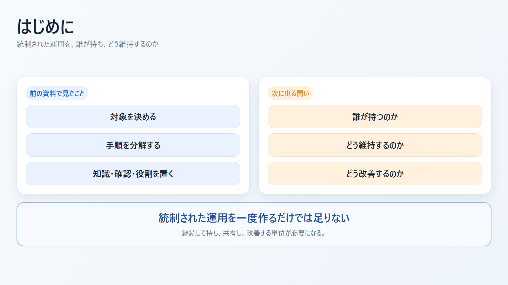
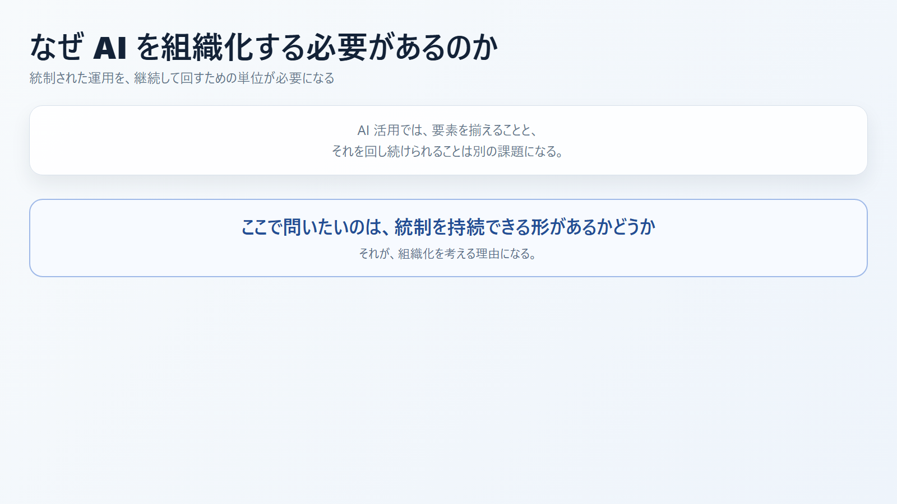
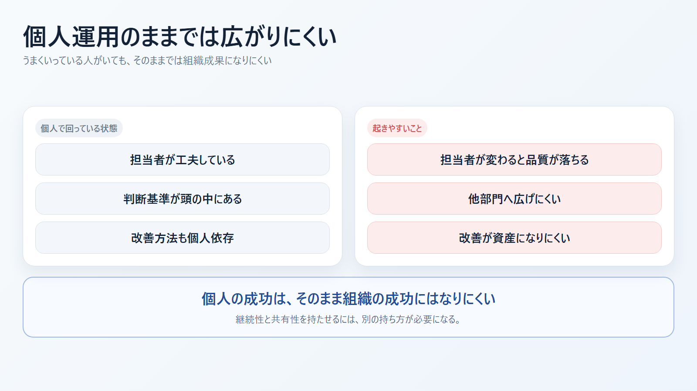
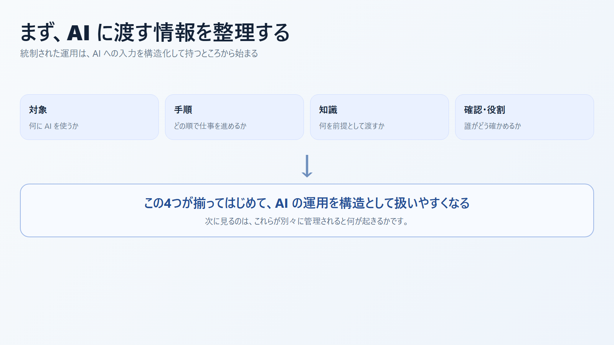
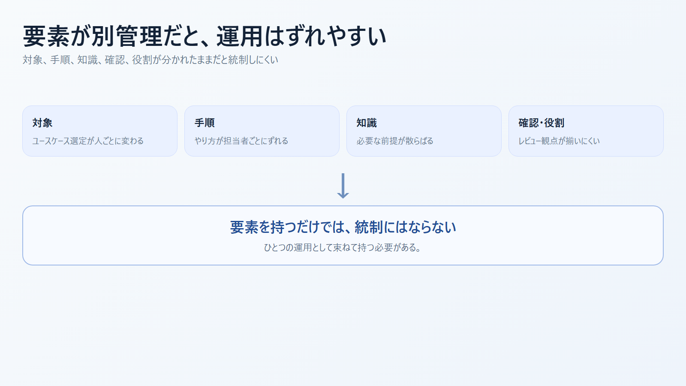
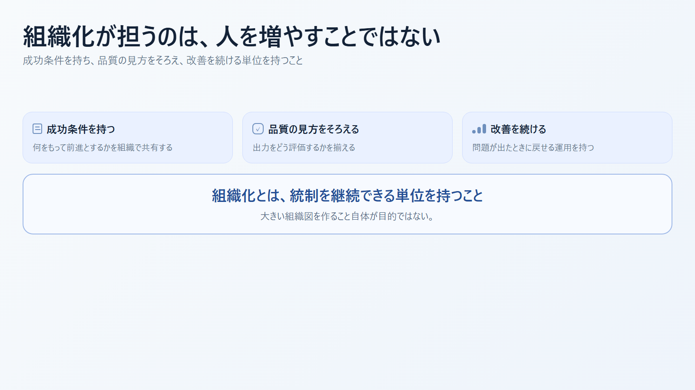
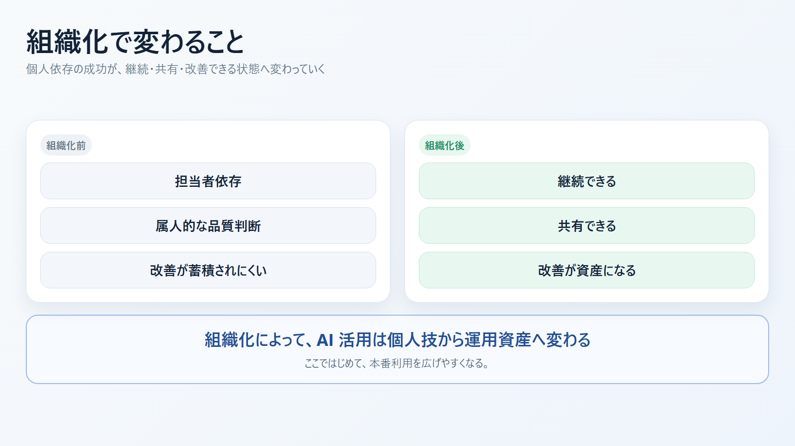
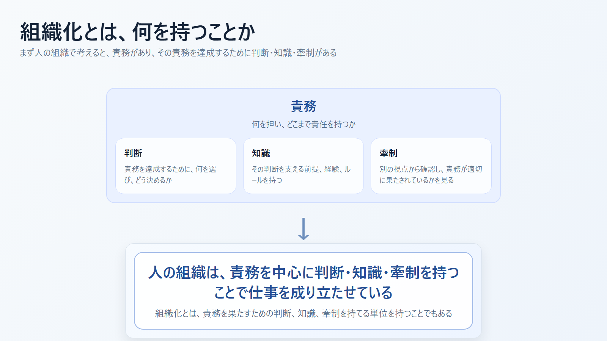
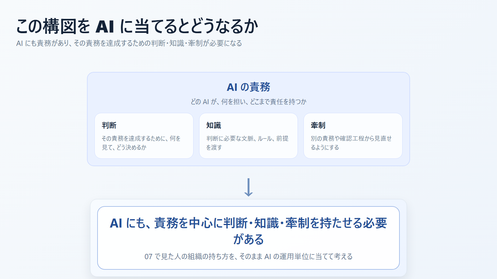
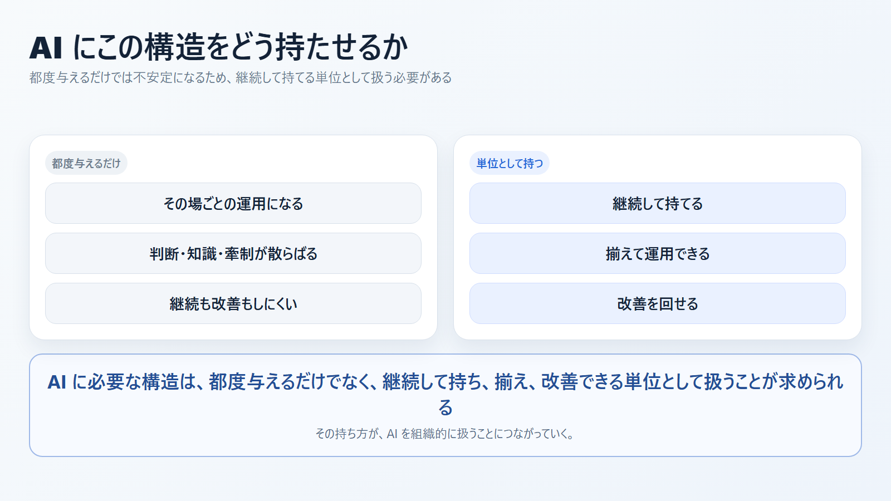

# なぜ AI を組織化する必要があるのか スライド案

- 想定時間: 8-12 分
- 想定読者: AI 活用を PoC や個人利用から本番利用へ進めたい組織
- 目的: 統制された運用を継続・共有・改善するために、なぜ AI を組織的に扱う必要があるのかを説明する
- 構成: 前提 -> 個人運用の限界 -> 組織化の役割 -> 次資料への接続
- 形式: 画像ベース

---

発表メモ:
前の資料では、AI を本番利用するには複数の要素を束ねた統制された運用が必要だと整理しました。ここでは、その運用を継続的に回すにはなぜ組織化が必要になるのかを見ていきます。

---

発表メモ:
問いはシンプルです。統制された運用が必要だとすると、それを誰が持ち、どう維持するのかが次の論点になります。

---

発表メモ:
個人でうまく回っている状態は出発点にはなりますが、そのままでは継続性も共有性も弱く、担当者が変わると品質が落ちやすくなります。

---

発表メモ:
統制された運用を考えるときは、まず AI に何を渡しているかを分けて見る必要があります。ここでは、その整理が対象、手順、知識、確認・役割につながることを示します。

---

発表メモ:
対象、手順、知識、確認、役割がそれぞれ別管理になると、運用のズレや抜け漏れが起きやすくなります。統制が必要なのは、ここをバラバラのままにしないためです。

---

発表メモ:
組織化は人を増やす話というより、成功条件を持ち、品質の見方をそろえ、改善を継続できる単位を持つことだと捉えられます。

---

発表メモ:
組織化によって、個人依存の成功が、継続、共有、改善しやすい状態へ変わっていきます。

---

発表メモ:
ここでいう組織化は、AI に限った話ではありません。まず人の組織でも、責務があり、その責務を達成するために判断と知識があることを確認しておきます。

---

発表メモ:
ここでは 07 の構図をそのまま AI に当てます。AI にも責務があり、その責務を達成するための判断・知識・牽制が必要になる、と整理できます。

---

最後の一言:
AI にも、責務ごとに判断・知識・牽制が必要になります。問題は、それを都度与えるだけでは不安定になりやすいことです。継続して持ち、揃え、改善できる単位として扱うことが、AI を組織的に扱うことにつながっていくと考えられます。
