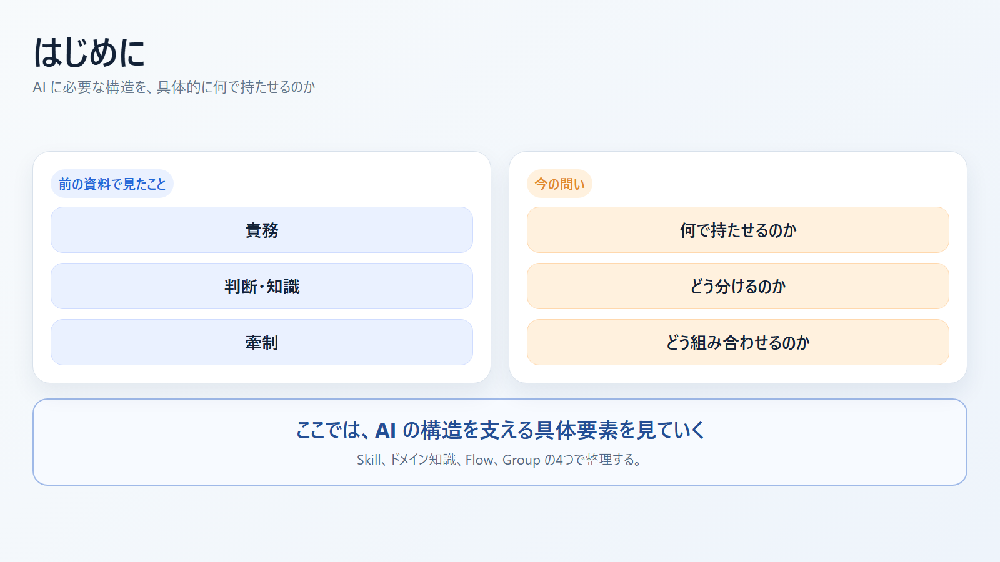
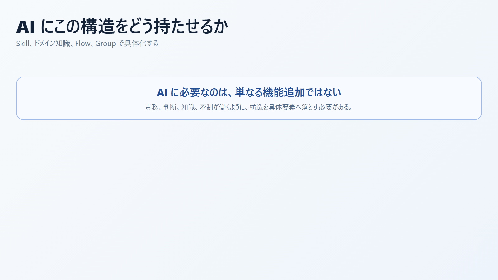
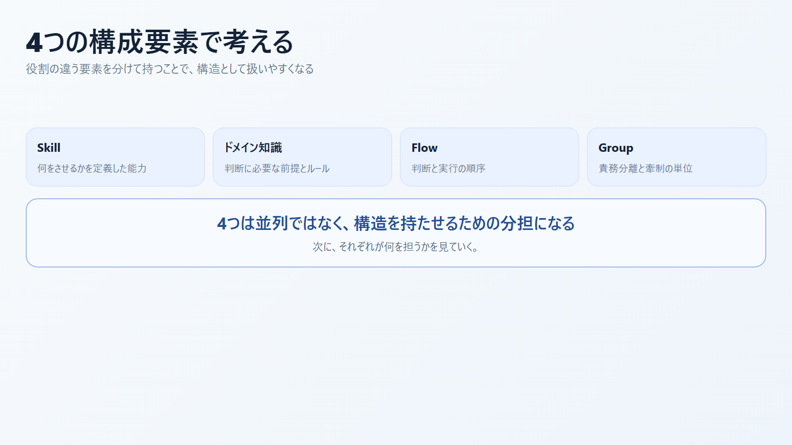
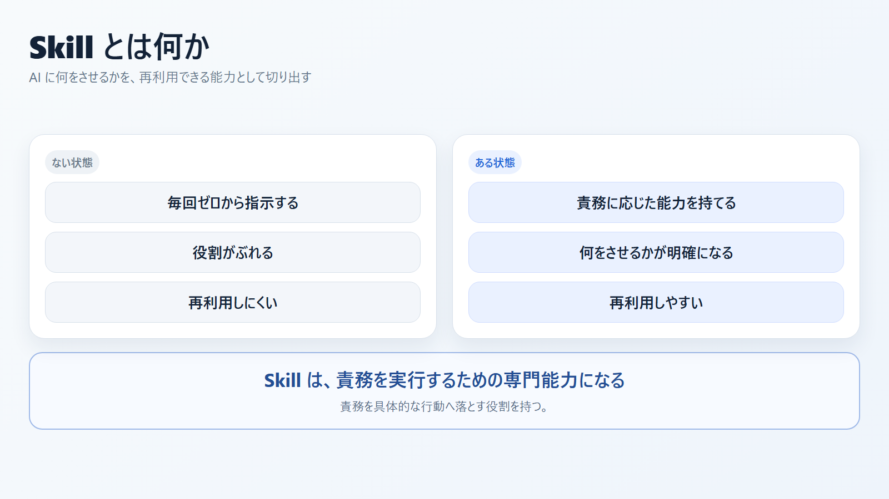
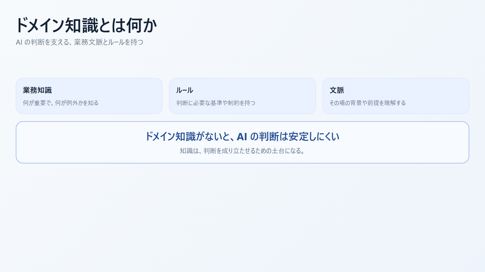
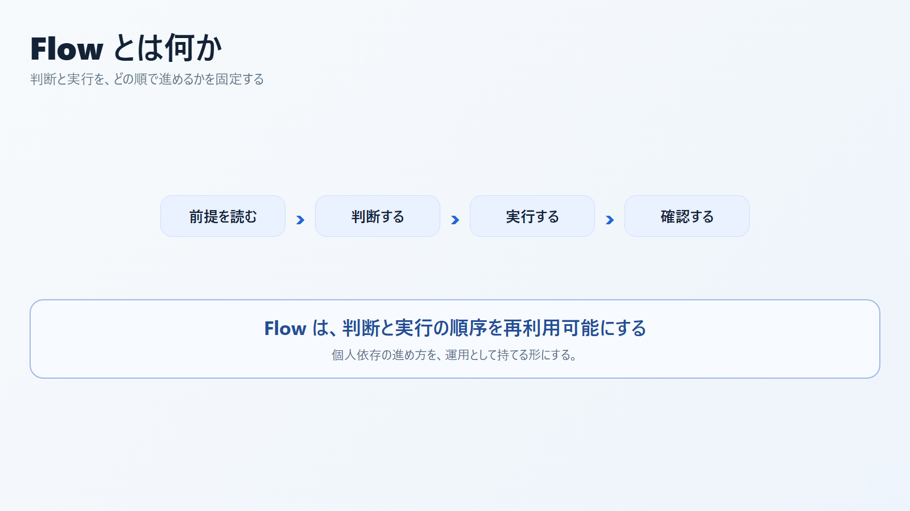
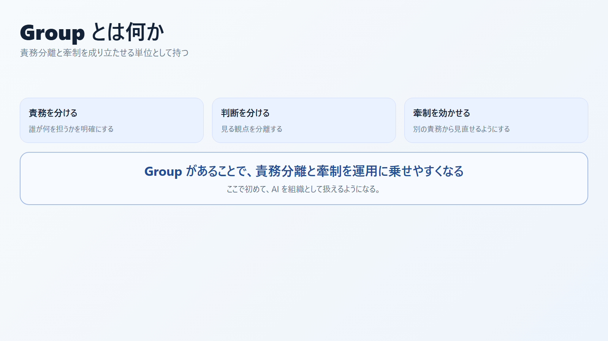
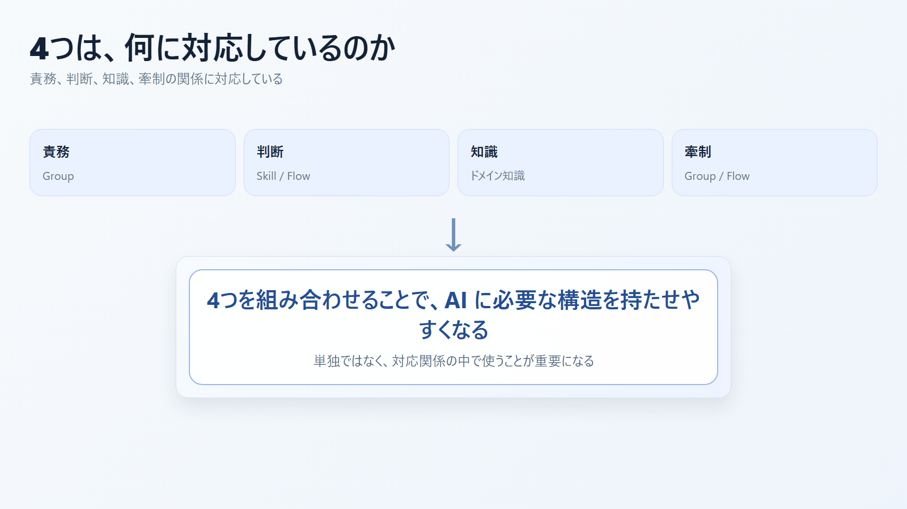
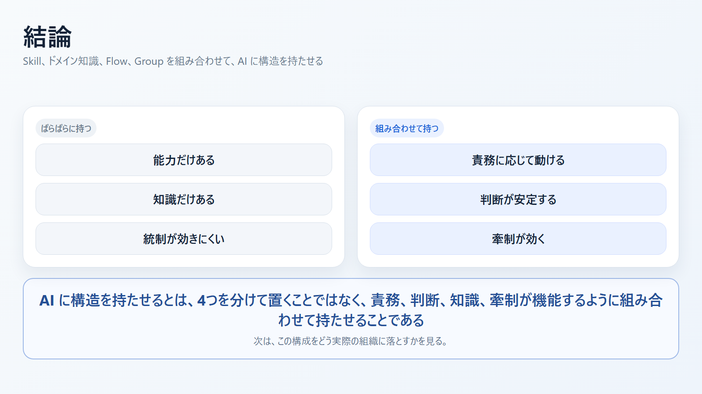

# AI にこの構造をどう持たせるか スライド案

- 想定時間: 8-12 分
- 想定読者: AI 組織を設計したいチーム、または AI 運用構造を説明したい関係者
- 目的: `責務 / 判断 / 知識 / 牽制` を AI に持たせる具体要素として `Skill / ドメイン知識 / Flow / Group` を説明する
- 構成: 問い -> 4要素 -> 対応関係 -> まとめ
- 形式: 画像ベース

---

発表メモ:
前の資料では、AI にも責務、判断、知識、牽制を持たせる必要があると整理しました。ここでは、その構造を具体的にどう持たせるかを見ていきます。

---

発表メモ:
問いは、AI に必要な構造を何で実装するかです。ここでは Skill、ドメイン知識、Flow、Group という4つで整理していきます。

---

発表メモ:
4つは役割が違います。Skill は能力、ドメイン知識は判断材料、Flow は進め方、Group は責務と牽制の単位として捉えられます。

---

発表メモ:
Skill は、AI に何をさせるかを限定し、専門能力として再利用できる形にしたものです。

---

発表メモ:
ドメイン知識は、判断に必要な前提やルールです。AI の判断は、ここがないと安定しにくくなります。

---

発表メモ:
Flow は、判断と実行をどの順序で進めるかを決めるものです。個人依存の手順を、再利用しやすい進め方へ変える役割を持ちます。

---

発表メモ:
Group は、責務分離と牽制を成り立たせる単位です。ここで初めて、AI を組織として扱いやすくなります。

---

発表メモ:
この4つは独立ではなく、責務、判断、知識、牽制の関係に対応しています。

---

最後の一言:
AI に構造を持たせるとは、Skill、ドメイン知識、Flow、Group を分けて置くことではありません。責務、判断、知識、牽制が機能するように、この4つを組み合わせて持たせることが重要になります。
