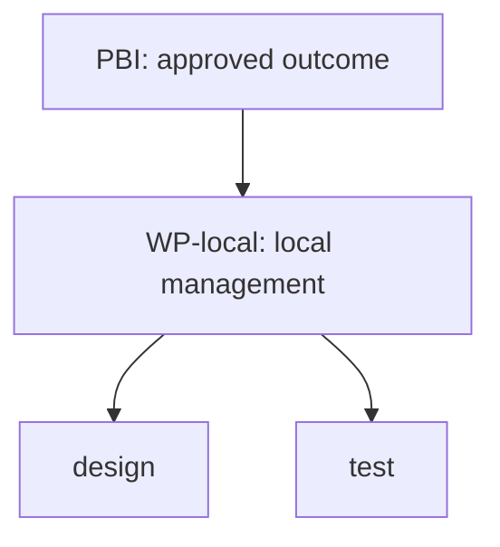

<!-- xid: D6B2E491F730 -->
<a id="xid-D6B2E491F730"></a>

# Inert local work-management examples

Replace ROOT_REPLACE_BEFORE_USE with the selected runtime root in a working copy;
create source.md from actual approved input. Do not submit these fictional steps
as approval or completion proof. Runtime absolute roots belong in local working
inputs, never environment-specific public examples.

## Workspace input

```json
{
  "schema_version": 1,
  "workspace_id": "local-example",
  "title": "Local example",
  "workspace_root": "."
}
```

## Initial plan input

```json
{
  "schema_version": 2,
  "workspace_id": "local-example",
  "repository_root": "ROOT_REPLACE_BEFORE_USE",
  "plan_id": "example",
  "plan_revision": "v1",
  "title": "Example plan",
  "source": "source.md",
  "report_id": "example-report-1",
  "recorded_at": "2026-10-11T00:00:00+09:00",
  "project": {
    "project_id": "example",
    "title": "Example"
  },
  "change": {
    "change_id": "example",
    "title": "Example"
  },
  "baseline": {
    "baseline_id": "before",
    "code_revision": "explicit-baseline"
  },
  "stages": [
    {
      "stage_id": "design",
      "title": "Design"
    },
    {
      "stage_id": "test",
      "title": "Test"
    }
  ],
  "steps": [
    {
      "step_id": "design",
      "title": "Design",
      "stage_id": "design",
      "dependencies": [],
      "status": "pending",
      "completion_criterion": "Reviewed design evidence",
      "outputs": [],
      "runs": [],
      "pbi_ids": [
        "local-pbi"
      ]
    },
    {
      "step_id": "test",
      "title": "Test",
      "stage_id": "test",
      "dependencies": [
        {
          "step_id": "design",
          "kind": "mandatory"
        }
      ],
      "status": "pending",
      "completion_criterion": "Recorded validation evidence",
      "outputs": [],
      "runs": [],
      "pbi_ids": [
        "local-pbi"
      ]
    }
  ],
  "pbis": [
    {
      "pbi_id": "local-pbi",
      "title": "Local PBI"
    }
  ],
  "confirmations": [],
  "external_refs": [],
  "initial_task_ids": [
    "design",
    "test"
  ]
}
```

For an actual new observation, preserve definition fields, use a new report_id,
recorded_at, verified status/evidence and the current expected revision. Submit
only actual evidence; render uses the stored JSON path returned by record.

## Supplemental approved source layout

Author this separately as source.md from actual approved input; this fictional
layout is not a PLAN.json schema extension or recorded completion evidence.

| Package ID | Title / purpose / output | Task IDs | Completion criterion | Dependencies | Confirmation owner |
| --- | --- | --- | --- | --- | --- |
| WP-local | Local management / persist and inspect local work / local plan and view | design, test | Local save and view verified against approved criteria | None recorded | Designated reviewer |

Record task completion and package criterion verification as separate indicators
with evidence references. The IDs must match the actual saved plan; this example
must be adapted rather than submitted unchanged.



Arrows above show membership only, not execution order. Real task dependencies
remain the recorded dependency graph. The current automatic projection does not
consume this table or generate this package hierarchy.
